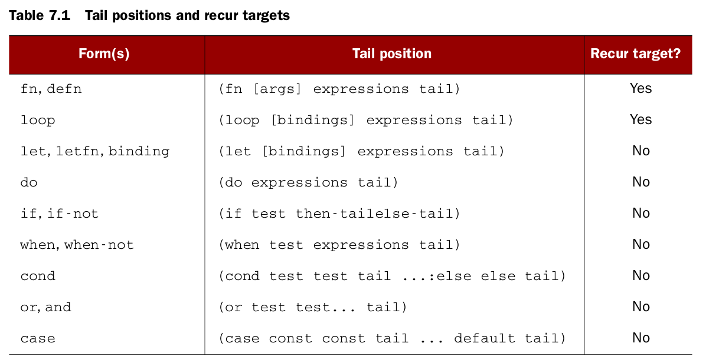
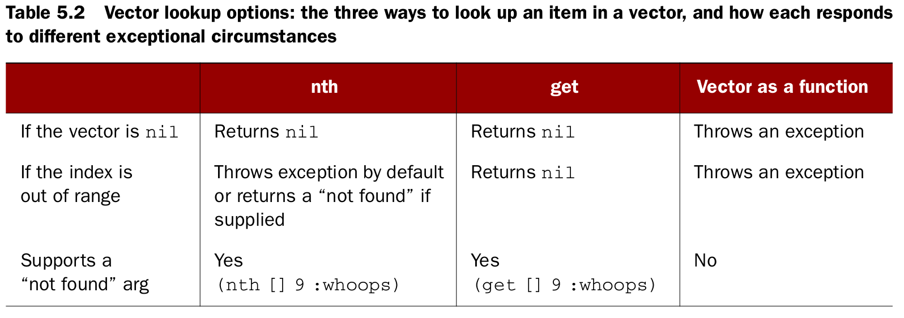
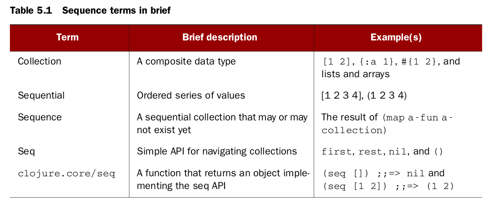
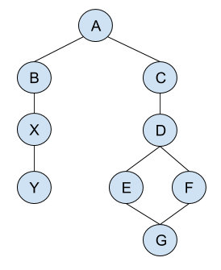

class: center, up

# CAP - Clojure: Introducció


**Jordi Delgado**, **Gerard Escudero**,

.large[**Curs 2024-25**: <ins>Tema 1</ins>]


---

## Clojure: Introducció

### Expressions, avaluació, valors

Un programa funcional (no trivial) està format d'**_expressions_**, que s'**_avaluen_**, i retornen un **_valor_**.

Si aquest programa està escrit en un llenguatge funcional _pur_ (p.ex. Haskell), això és tot. En canvi
si el llenguatge de programació no és funcional pur (p.ex. Clojure), aquestes expressions poden tenir
_side effects_.

Hi ha expressions que es poden considerar **_constants_**, és a dir, valors l'avaluació dels quals 
és precisament ells mateixos:

.cols5050[
.col1[
```Clojure
$ clj
Clojure 1.11.4
user=> "hola món"
"hola món"
user=> 235678587432035784084032475857N
235678587432035784084032475857N
user=> 3.141592653589793
3.141592653589793
user=> 1e-23
1.0E-23
```
]
.col2[
```Clojure
user=> 1567843
1567843
user=> \t
\t
user=> :clau
:clau
user=> true
true
user=> 5/2
5/2
```
]]

---

## Clojure: Introducció

### Expressions, avaluació, valors

En general, però, una **_expressió_** en Clojure o bé és un **_símbol_**, o be té la forma d'una **_llista_**.red[*] `(f e1 e2 ... eN)`,  on:

* Si és un **_símbol_**, s'avalua i es retorna el valor al que està lligat (_bound_). Error si no està lligat a cap valor.

* Si és una **_llista_**, l'expressió `f` és una **_funció_**, un **_símbol_** que s'avalui en una funció, 
  una [**_special form_**](https://clojure.org/reference/special_forms) o el nom d'una **_macro_**.
  
* Si l'expressió `f` és una **_funció_** o un **_símbol_** que
  s'avalua en una funció, el resultat d'aquesta avaluació és un
  **_valor-funció_**, que anomenarem `fv`. Les expressions `e1 e2 ...
  eN` s'avaluen i resulten en valors `v1 v2 ... vN`. En aquest cas, el
  resultat de l'expressió és l'aplicació del valor-funció sobre els valors que es passen com a arguments:
  `fv(v1 v2 ... vN)`.

* Si l'expressió `f` és una [**_special
  form_**](https://clojure.org/reference/special_forms) o el nom d'una
  **_macro_**, els arguments no tenen per què avaluar-se i cal veure com es defineix
  l'**_special form_** o la macro en qüestió.
  
.footnote[.red[*] Veurem les llistes de seguida, de moment penseu-hi com un contenidor d'elements entre parèntesi]

---

## Clojure: Introducció

### Expressions, avaluació, valors

* Si l'expressió `f` és una **_funció_** o un **_símbol_** que
  s'avalua en una funció, el resultat d'aquesta avaluació és un
  **_valor-funció_**, que anomenarem `fv`. Les expressions `e1 e2 ...
  eN` s'avaluen i resulten en valors `v1 v2 ... vN`. En aquest cas, el
  resultat de l'expressió és l'aplicació del valor-funció sobre els valors que es passen com a arguments:
  `fv(v1 v2 ... vN)`.

Per exemple,

```Clojure
$ clj
Clojure 1.11.4 
user=> (+ 10 20 30 40) ;; el símbol '+' s'avalua en el valor-funció de la suma
100
user=> (+ 1)
1
user=> (+)
0
user=> (max (+ 3 4) (* (- 4 2) (+ 8 10)) 10) ;; altres expressions com a arguments
36
user=> 
```

---

## Clojure: Introducció

### Expressions, avaluació, valors

* Si l'expressió `f` és una [**_special
  form_**](https://clojure.org/reference/special_forms) o el nom d'una
  **_macro_**, els arguments no tenen per què avaluar-se i cal veure com es defineix
  l'**_special form_** o la macro en qüestió.

Exemple: La **_special form_** `def`. 

Per lligar (_bind_) valors a noms (símbols) fem servir la _special form_ `def`.

`(def s (max (+ 23 10) (- 100 85)))` lliga el símbol `s` al valor `33`. Podem veure que 
`def` avalua el seu segon argument, però <ins>NO</ins> avalua el primer argument, 
que ha de ser un símbol.

Està pensat per modificar símbols _globals_, i usualment no modificarem un lligam creat amb `def`.

Al símbol creat amb `def` se'l coneix com a **var**, i _no és el mateix que una variable_ (tal i com 
les entenem en altres llenguatges de programació).

---

## Clojure: Introducció

### Expressions, avaluació, valors

A Clojure tenim **Nombres** (enters, reals, també tenim fraccions), **Caràcters** (notació `\a`), **Booleans**,
**_keywords_** (notació `:s`), **símbols** i **_strings_** (que també són col·leccions).

Operacions _habituals_ on la seva funcionalitat és (més o menys) òbvia: `+`, `-`, `*`, `/`, `quot`, `rem`, `mod`, `inc`, `dec`,
 `=`, `not=`, `<`, `<=`, `>`, `>=`, `zero?`, `pos?`, `neg?`, `number?`, `min`, `max`, `not`, `and`, `or`, `print`,
 `println`, `char`, `keyword`, `keyword?`, `str`, `subs`, `string?`

.small[**Exercici**: Obriu un _repl_ de Clojure i feu-les servir. Exploreu.]

.cols5050[
.col1[
```Clojure
$ clj
Clojure 1.11.4
user=> (- 10 9 8)
-7
user=> (/ 100 10 2)
5
user=> (number? "no")
false
user=> 
```
]
.col2[
```Clojure
$ clj
Clojure 1.11.4
user=> (def v 7)
#'user/v
user=> (inc v)
8
user=> v
7
user=>
```
]]

---

## Clojure: Introducció

### Llistes (I)

Hem vist que les expressions són llistes, però les llistes són un dels contenidors de dades que podem fer servir
a Clojure. La **_Llista_** no és més que una col·lecció d'elements en un ordre determinat, delimitada entre parèntesi:

.cols5050[
.col1[
`(1 2 3 4)` -- Llista amb `1`, `2`, `3`, `4`

`(\a "pep" 2 3.141592)` -- Elements de diferents tipus

`()` -- Llista buida
]
.col2[
`(def tt 2.781)` -- Una expressió és una llista

`(max 34 -23 1)` -- Una expressió és una llista

]]

**Homoiconicitat**: Un programa Clojure és una expressió a avaluar
**i** una llista, per tant és també un valor, o una dada, de Clojure.
_Code is Data_

---

## Clojure: Introducció

### Llistes (II)

Aleshores, **com distingeix Clojure entre una llista que només conté dades i una expressió?**

```Clojure
(def x (\a "pep" 2 3.141592)) 👉 Execution error
(max 34 -23 1)                👉 34
```
Quan Clojure troba una llista (o, ja que hi som, un símbol) **sempre l'avalua com si fos una expressió**. Si volem que una llista 
(o un símbol) no s'avalui com una expressió **cal dir-ho explícitament** amb `quote`:

```Clojure
(def x (quote (\a "pep" 2 3.141592))) 
x  👉 (\a "pep" 2 3.141592)
```

Com que `quote` es fa servir molt sovint, tenim una manera d'abreujar-ho:

```Clojure
(def x '(\a "pep" 2 3.141592)) 
x  👉 (\a "pep" 2 3.141592)
```

El caràcter `'` fa el mateix paper que la _special form_ `quote`

---

## Clojure: Introducció

### Llistes (III): Operacions sobre llistes:

Suposem que hem fet `(def lst '(\a "c" 20 :k))`

.cols5050[
.col1[
`first` - `(first lst) 👉 \a`

`cons` - `(cons 'a lst)`👉<br>
&emsp;&emsp;&emsp;&emsp;&emsp;&emsp;&emsp;&emsp;&emsp;`(a \a "c" 20 :k)`

`rest` - `(rest lst) 👉 ("c" 20 :k)`

`next` - `(next lst) 👉 ("c" 20 :k)`

però

`rest` - `(rest '()) 👉 ()`

`next` - `(next '()) 👉 nil`

]
.col2[
`conj` - `(conj lst 'a)`👉<br>
&emsp;&emsp;&emsp;&emsp;&emsp;&emsp;&emsp;&emsp;&emsp;`(a \a "c" 20 :k)`

`peek` - `(peek lst) 👉 \a`

`pop` - `(pop lst) 👉 ("c" 20 :k)`

`list` - `(list \a "c" 20 :k)` 👉 
&emsp;&emsp;&emsp;&emsp;&emsp;&emsp;&emsp;&emsp;&emsp;`(\a "c" 20 :k)` 

`list?` - `(list? lst) 👉 true`

`count` - `(count lst) 👉 4`

`empty?` - `(empty? lst) 👉 false`
]]

---

## Clojure: Introducció

### Estructures de Control Condicionals

**Important!**: <ins>**Les estructures de control també són expressions**</ins> 

En el cas de les estructures de control condicionals, tenim:

* `(if bool-expr  expr-true   expr-false)` -- `if` és una _special form_ (també existeix la macro `if-not`).

* `(when bool-expr expr)` -- `when` i `when-not` són macros definides en termes d'`if`.

* Les macros `when-let` i `if-let` (en parlarem més endavant).

* L'expressió condicional més general és la macro `cond`:
    ```Clojure
    (cond 
       bool-expr expr 
       bool-expr expr 
       ... 
       bool-expr expr)
    ```

**Important!**: Només `false` i `nil` són _falsy_. La resta de valors són _truthy_.

---

## Clojure: Introducció

### Funcions: Funcions anònimes, l'_special form_ `fn`

Fem servir l'_special form_ `fn` per definir funcions anònimes:

```Clojure
;;   paràmetres   cos de la funció
;;   ----------   ----------------  
(fn [p1 p2 ... pN] expr1 ... exprM)
```
Poden haver $M$ expressions, però **el valor de retorn de la funció és la darrera expressió avaluada** 
(no hi ha `return`).

Per exemple:

```Clojure
(def valor_absolut (fn [x] ((if (> x 0) + -) x)))
(valor_absolut 234)  👉 234
(valor_absolut -234) 👉 234

(def que-fer (fn [temp] (cond
                          (> temp 30) "Em quedo a casa amb l'aire acondicionat"
                          (> temp 15) "Me'n vaig a fer un café"
                          :else "Em quedo al llit")))            
(que-fer 31) 👉 "Em quedo a casa amb l'aire acondicionat"
(que-fer 25) 👉 "Me'n vaig a fer un café"
(que-fer 10) 👉 "Em quedo al llit"
```
---

## Clojure: Introducció

### Funcions: Funcions anònimes, notació abreujada `#(...)`

Podem escriure les funcions anònimes amb una notació molt més còmode d'utilitzar. De fet, ho farem servir sovint: 

`#(cos de la funció)`

I els paràmetres? Dins el cos de la funció podem fer referència als arguments que passem a la crida a la funció amb la notació:
`%1`, `%2`, etc.  Si només hi ha un paràmetre podem fer servir `%`

Per exemple:

```Clojure
(def valor_absolut #((if (> % 0) + -) %) )
(valor_absolut 234)  👉 234
(valor_absolut -234) 👉 234

(def que-fer #(cond (> % 30) "Em quedo a casa amb l'aire acondicionat"
                    (> % 15) "Me'n vaig a fer un café"
                    :else "Em quedo al llit") )
(que-fer 31) 👉 "Em quedo a casa amb l'aire acondicionat"
(que-fer 25) 👉 "Me'n vaig a fer un café"
(que-fer 10) 👉 "Em quedo al llit"
```
---

## Clojure: Introducció

### Funcions: La macro `defn` (I)

Existeix una macro, `defn` amb la que podem definir funcions de manera més compacta:

```Clojure
;;                                       paràmetres     cos de la funció
;;                                       ----------     ----------------
(defn nom-de-funció "Comentari textual" [p1 p2 ... pN]   expr1 ... exprM )
```

Aquesta és la manera en que habitualment definirem funcions. Per exemple:

```Clojure
(defn valor_absolut "Calcula |x|" [x] ((if (> x 0) + -) x))

(valor_absolut 234)  👉 234
(valor_absolut -234) 👉 234

(defn que-fer [temp] (cond
                       (> temp 30) "Em quedo a casa amb l'aire acondicionat"
                       (> temp 15) "Me'n vaig a fer un café"
                       :else "Em quedo al llit"))
                       
(que-fer 31) 👉 "Em quedo a casa amb l'aire acondicionat"
(que-fer 25) 👉 "Me'n vaig a fer un café"
(que-fer 10) 👉 "Em quedo al llit"
```


---

## Clojure: Introducció

### Funcions: La macro `defn` (II)

Amb `defn` també podem definir funcions d'_aritats múltiples_, és a dir, funcions amb diferent nombre de paràmetres.

Per exemple:

```Clojure
(defn producte
   "Retorna 1, el paràmetre o el producte depenent del nombre de paràmetres"
   ([] 1)
   ([x] x)
   ([x y] (* x y)))
   
(producte)            👉 1                                 ;; cap argument
(producte 129)        👉 129                               ;; un argument
(producte 23 34)      👉 782                               ;; dos arguments
(producte 231 134 23) 👉 Execution error (ArityException)  ;; no més

```

---

## Clojure: Introducció

### Funcions: Els paràmetres (I)

Els paràmetres formals de les funcions (excepte en les funcions anònimes en notació abreujada) s'especifiquen amb un _vector_.red[*]
de símbols. Clojure permet _definir funcions amb un nombre <ins>variable</ins> de paràmetres_.

La manera de fer-ho és fent servir el símbol especial `&`.

Suposem que definim una funció amb paràmetres formals `[p1...pN & p]`. Aquesta funció requereix que la crida es faci amb un mínim
de $N$ arguments, però tots els arguments a partir de l'$N+1$ apareixeran dins una seqüència.red[*] lligada al símbol `p`. 

El símbol que segueix a `&` "_recull_" en una seqüència tots
els arguments que es passin a la funció (més enllà dels obligatoris) i
la lliga a aquest símbol (dins de la funció).

.footnote[.red[*] Veurem els vectors i les seqüències ben aviat. Ara penseu les seqüències com una mena de llista.]

---

## Clojure: Introducció

### Funcions: Els paràmetres (II)

Per exemple:

```Clojure
(defn producte
   "Retorna 1, el paràmetre o el producte depenent del nombre de paràmetres"
   ([] 1)
   ([x] x)
   ([x y & z] (apply * x y z)))  ;; z - seqüència amb el 3r, 4t, etc. arguments
   
(producte)            👉 1                                 ;; cap argument
(producte 129)        👉 129                               ;; un argument
(producte 23 34)      👉 782                               ;; dos arguments
(producte 231 134 23) 👉 711942                            ;; tres arguments
```

on `(apply f e1 e2 '(v3 ... vN)) = (f e1 e2 v3 ... vN)`<br> (`e` són expressions, `v` són valors) 

```Clojure
(apply + 1 2 3 '(4 5 6 7))        👉 28
(apply * (- 4 3) 2 3 '())         👉 6
(apply producte 1 2 3 '(4 5 6 7)) 👉 5040
(apply max 10 20 30)              👉 Execution error (IllegalArgumentException)
(apply max 10 20 30 '())          👉 30
```
---

## Clojure: Introducció

### La recursivitat (_naïve_) 

Òbviament les funcions en Clojure poden ser recursives. Una funció pot fer servir el seu nom per invocar-se ella mateixa.
De moment farem servir la recursivitat d'aquesta manera. Més endavant hi tornarem...

### La _special form_ `do` 

La _special form_ `do` serveix per avaluar expressions una darrera l'altra, seqüencialment: `(do expr1 expr2 ... exprN)`. Aquesta
expressió **retorna el valor resultant de l'avaluació de la darrera expressió**.

I què passa amb els valors retornats per l'avaluació de les altres expressions? **Es perden**. Usualment, es fan servir pels seus
efectes colaterals (_side effects_).

El cos d'una funció té una estructura similar. Direm que **_el cos d'una funció és dins d'un `do` implícit_**.

---

## Clojure: Introducció

### La _special form_ `do` 

```Clojure
(do 
   (println "Efecte colateral: escrivim un missatge") ;; S'escriu el missatge
   (* 5 4 3 2 1)                      ;; Aquest valor, 120, es perd 
   (quot 343 5))                      ;; Aquest valor és el retorn del do
👉 68
👁️ Efecte colateral: escrivim un missatge
```
Les funcions tenen un `do` implícit:

```Clojure
(defn foo [x y & z]
    (println "Els dos primers arguments són:",x,y)
    (println "La resta d'arguments:",z)
    :ok)    ;; la funció retorna un keyword

(foo 1 2) 👉 :ok
👁️ Els dos primers arguments són: 1 2
👁️ La resta d'arguments: nil

(foo 1 2 3 4 5 6) 👉 :ok
👁️ Els dos primers arguments són: 1 2
👁️ La resta d'arguments: (3 4 5 6)
```

---

## Clojure: Introducció

### Lligams locals: La _special form_ `let` (I)

Sovint voldrem lligar localment valors a símbols dins una expressió. Això ho farem amb el `let`:

```Clojure
;;          binding-forms            cos del let
;;    -------------------------    ---------------
(let [s1 ex1  s2 ex2 ... sN exN]   expr1 ... exprM )
```
Les **_binding forms_** que farem servir de moment són símbols `s1`,`s2`,...,`sN`. Més endavant veurem la seva forma general.

S'avaluen, en l'ordre que apareixen, les expressions i es lliguen als símbols corresponents: S'avalua `ex1` i es lliga el resultat
al símbol `s1`, després s'avalua `ex2` i es lliga el resultat al símbol `s2`, etc. A una expressió `exj` podem fer servir qualsevol
símbol `sk` (amb k < j) que s'hagi lligat abans.

El cos del `let` té un `do` implícit, per tant es retorna la darrera expressió avaluada.

Els lligams locals només són visibles dins el cos del `let` (**_lexical scope_**) i **_no es poden modificar_** dins el cos del `let`. 
Un cop més, no estem parlant de variables.

---

## Clojure: Introducció

### Lligams locals: La _special form_ `let` (II)

```Clojure
(defn segons-a-setmanes
    "Converteix un cert nombre de segons a setmanes"
    [segons]
    (let [minuts    (/ segons 60)
          hores     (/ minuts 60)
          dies      (/ hores 24)
          setmanes  (/ dies 7) ]
      setmanes))
      
(segons-a-setmanes 0)            👉 0
(segons-a-setmanes 604800)       👉 1
(segons-a-setmanes (* 4 604800)) 👉 4
(segons-a-setmanes 60483)        👉 20161/201600
```
```Clojure
(defn foo
    "Forma molt tonta de multiplicar per 3 un nombre"
    [n]
    (let [x n
          y x
          z y]
      (+ x y z)))

(foo 9) 👉 27
```
---

## Clojure: Introducció

### Exemple: Aproximació de l'arrel quadrada

```Clojure
(def valor-absolut #((if (> % 0) + -) %))

(def mitjana #(/ (+ %1 %2) 2))

(defn prou-bo? 
    "Retorna si l'aproximació és prou bona" 
    [x aprox]
    (let [diff (- (* aprox aprox) x)]
       (< (valor-absolut diff) 0.001)))

(defn arrel
    "Retorna l'arrel quadrada aproximada d'un nombre positiu"
    ([x] (arrel x 1.0))
    ([x aprox] 
       (if (prou-bo? x aprox)
          aprox
          (arrel x (mitjana aprox (/ x aprox))))))

(arrel 25)  👉  5.000023178253949
(arrel 36)  👉  6.000000005333189
(arrel 100) 👉 10.000000000139897
```
---

## Clojure: Introducció

### Lligams locals: La _special form_ `letfn`

És similar al `let`, però permet definir **_funcions locals_**. Dins les funcions definides amb el `letfn`,
qualsevol funció pot referenciar qualsevol altre.

```Clojure
(defn arrel
    "Retorna l'arrel quadrada aproximada d'un nombre positiu"
    ([x] (arrel x 1.0))
    ([x aprox] 
       (letfn [(prou-bo? [x aprox]
                    (let [diff (- (* aprox aprox) x)]
                        (< (valor-absolut diff) 0.001)))
               (valor-absolut [x] ((if (> x 0) + -) x))
               (mitjana [x y] (/ (+ x y) 2))]
           (if (prou-bo? x aprox)
              aprox
              (arrel x (mitjana aprox (/ x aprox)))))))

(arrel 25)  👉  5.000023178253949
(arrel 36)  👉  6.000000005333189
(arrel 100) 👉 10.000000000139897
```

.small[**Exercici**: Per quina raó cal el `letfn`? No en tenim prou amb el `let` per definir funcions locals?
O, dit d'una altra manera, què puc fer amb el `letfn` que no puc fer amb el `let`? Investigueu.]

---

## Clojure: Introducció

### Bucles: Las _special forms_ `loop`/`recur` (I)

`loop` és similar a un `let`, establint al principi el lligam entre símbols i els seus _valors inicials_. `loop` estableix
un _punt de retorn_. Tot seguit trobem un `do` implícit dins el que podem fer servir `recur`. La _special form_ `recur`
fa dues coses: Una és donar nous valors als símbols definits amb `loop`, i una altra és transferir el control al punt
de retorn definit per `loop`.

```Clojure
(loop [result '(), x 5]
    (if (zero? x)
       result
       (recur (conj result x) (dec x))))
       
👉 (1 2 3 4 5)
```

```Clojure
(defn arrel-loop
    "Retorna l'arrel quadrada aproximada d'un nombre positiu"
    [x]
    (loop [aprox 1.0]
       (if (prou-bo? x aprox)  ;; prou-bo? i mitjana ja definides
          aprox
          (recur (mitjana aprox (/ x aprox))))))
          
(arrel-loop 36)  👉  6.000000005333189
```

---

## Clojure: Introducció

### Bucles: Las _special forms_ `loop`/`recur` (II)

Un `factorial` iteratiu:

```Clojure
(defn factorial 
    "calcula el factorial d'un nombre enter positiu o zero"
    [n]
    (loop [i n, r 1]  ;; el valor inicial d'i és n i el d'r és 1
       (if (<= i 1)
          r
          (recur (dec i) (* r i)))))
          
(factorial 0) 👉 1
(factorial 1) 👉 1
(factorial 4) 👉 24
(factorial 5) 👉 120
(factorial 6) 👉 720
(factorial 1000)  👉 Execution error (ArithmeticException)
(factorial 1000N) 👉 4023872600...00000N  (2568 dígits!)
        
```

Tornarem a trobar `recur` més endavant en un context més general i entendrem el per què d'aquesta manera 
tan _estranya_ de definir els bucles.

---

## Clojure: Introducció

Definim la funció _subfactorial_ d'un nombre enter no negatiu:

$$!0 = 1$$ 
$$!1 = 0$$
$$!2 = 1$$
$$!n = (n-1)*(!(n-1) + !(n-2)) \text{  si $n > 2$}$$

Solució recursiva (múltiple, dues crides), ineficient<sup>.red[1]</sup>:

```Clojure
(defn subfact_recursiva [n]
   (cond
      (or (= n 0)  (= n 2))   1
      (= n 1)                 0
      :else (*' (dec n) (+' (subfact_recursiva (dec n)) (subfact_recursiva (- n 2))))))

(subfact_recursiva     0) 👉 1
(subfact_recursiva    10) 👉 1334961
(subfact_recursiva    23) 👉 9510425471055777937262N
(subfact_recursiva 10000) 👉 Execution error (StackOverflowError)
```

.footnote[.red[1] Les operacions `+'` i `*'` són per treballar amb nombres enters molt grans. Les operacions `+`
i `*` generen _overflow_.]

---

## Clojure: Introducció

Provem de fer-ne una versió recursiva final:

```Clojure
(defn subfact_final 
    ([n]  (cond
              (or (= n 0)  (= n 2))   1
              (= n 1)                 0
              :else  (subfact_final n 2 0 1)))
    ([n k nm1 nm2]  (if (> k n)
                       nm1
                       (subfact_final n (inc k) (*' (dec k) (+' nm1 nm2)) nm1))))

(subfact_final     2) 👉 1
(subfact_final    10) 👉 1334961
(subfact_final    23) 👉 9510425471055777937262N
(subfact_final 10000) 👉 Execution error (StackOverflowError)
```

No sembla que les coses hagin millorat gaire, _però podrien haver-ho fet_!. 

Quan hi ha una crida a funció en **_tail position_** no cal crear cap estructura addicional 
(_stack frame_) per a aquella crida, i així no es consumeix espai. D'això se'n diu **_tail call optimization_** (TCO).
Una funció recursiva final té la crida recursiva en _tail position_ (és essencialment una **_iteració_**), 
i hi ha llenguatges de programació que optimitzen aquest fet amb TCO. 

Clojure **no té TCO** en general, per raons que tenen a veure amb l'arquitectura de la JVM.

---

## Clojure: Introducció

### La _special form_ `recur`

Podem dir-li a Clojure explícitament que una crida recursiva està en _tail position_ (una funció és recursiva final
si totes les crides recursives estan en _tail position_) fent servir `recur`:

```Clojure
(defn subfact_recur 
    ([n]  (cond
              (or (= n 0)  (= n 2))   1
              (= n 1)                 0
              :else  (subfact_recur n 2 0 1)))
    ([n k nm1 nm2]  (if (> k n)
                       nm1
                       (recur n (inc k) (*' (dec k) (+' nm1 nm2)) nm1))))

(subfact_recur     2) 👉 1
(subfact_recur    10) 👉 1334961
(subfact_recur    23) 👉 9510425471055777937262N
(subfact_recur 10000) 👉 10470804208445737513419...39696860001N (35660 dígits!)
```

Ara evitem l'`StackOverflowError`, ja que l'avaluació de `subfact_recur` no consumeix espai addicional. `recur`
serveix per dir-li a Clojure que faci TCO.

---

## Clojure: Introducció

### _Tail Position_

 Ara bé, `recur` _només es pot fer servir en tail position i fent referència a una crida recursiva_. `recur`
 no serveix per fer TCO en general:

.center[]

.tiny[.red[Font]: _The Joy of Clojure_, p. 160]

---

## Clojure: Introducció

### La _special form_ `recur`

Finalment, podem fer una versió _iterativa_:

```Clojure
(defn subfact_iter
    [n]
    (cond
       (or (= n 0)  (= n 2))   1
       (= n 1)                 0
       :else (loop [k 2, nm1 0, nm2 1]
                 (if (> k n)
                    nm1
                    (recur (inc k) (*' (dec k) (+' nm1 nm2)) nm1)))))

(subfact_iter     2) 👉 1
(subfact_iter    10) 👉 1334961
(subfact_iter    23) 👉 9510425471055777937262N
(subfact_iter 10000) 👉 10470804208445737513419...39696860001N (35660 dígits!)
```

.small[Ara podem entendre millor el sentit de `recur`. En realitat el que fa és 
considerar un bucle com una mena de funció recursiva final _implícita_. O bé, també podríem entendre que els paràmetres 
d'una funció defineixen un _loop implícit_, fent d'una funció recursiva final un bucle. Sigui com sigui,
l'ús de `recur` és _equivalent_ en tots dos casos.]


.small[**Exercici**: Compareu la versió iterativa amb la recursiva final.]

---

## Clojure: Introducció

### Les col·leccions: Vectors

Són col·leccions d'elements en un ordre determinat, similars a les llistes, però són **_molt més eficients_**. 
Els preferirem a les llistes, ja que l'accés a un element via un **_índex_** té un cost quasi-constant, i no són
expressions, per tant no cal fer servir `quote`.

Un vector literal té la notació `[1 2 \t "hi" :k]`, és a dir, elements entre claudàtors. El primer element té índex 0.

```Clojure
[1 2 (+ 1 2)] 👉 [1 2 3]

(def nums (vec '(1 2 3 4 5))) 👉 #'user/nums  ;; convertim llista en vector`
nums 👉 [1 2 3 4 5]
(get nums 3) 👉 4
(nums 3)     👉 4
(nth nums 3) 👉 4

(nth nums 10 :no-hi-soc) 👉 :no-hi-soc  ;; nth - argument per si l'índex no hi és
(get nums 10 :no-hi-soc) 👉 :no-hi-soc  ;; get - argument per si l'índex no hi és

(conj nums 6 7) 👉 [1 2 3 4 5 6 7]
(conj '(1 2 3 4 5) 6 7) 👉 (7 6 1 2 3 4 5) ;; ep!!
```
---

## Clojure: Introducció

### Les col·leccions: Accés als elements dels vectors




.tiny[.red[Font]: _The Joy of Clojure_, p. 93]

---

## Clojure: Introducció

### Les col·leccions:  Operacions sobre Vectors

Suposem que hem fet `(def v [\a "c" 20 :k])`

.cols5050[
.col1[
`first` - `(first v) 👉 \a`

`cons` - `(cons 'a v)`👉<br>
&emsp;&emsp;&emsp;&emsp;&emsp;`(a \a "c" 20 :k)` .red[**(!)**]

`rest` - `(rest v) 👉 ("c" 20 :k)` .red[**(!)**]

`next` - `(next v) 👉 ("c" 20 :k)` .red[**(!)**]

però

`rest` - `(rest []) 👉 ()` .red[**(!)**]

`next` - `(next []) 👉 nil`

`conj` - `(conj v 'a)`👉<br>
&emsp;&emsp;&emsp;&emsp;&emsp;`[\a "c" 20 :k a]`
]
.col2[
`peek` - `(peek v) 👉 :k`

`pop` - `(pop v) 👉 [\a "c" 20]`

`vector` - `(vector \a "c" 20 :k)` 👉 
&emsp;&emsp;&emsp;&emsp;&emsp;&emsp;&emsp;&emsp;&emsp;`[\a "c" 20 :k]` 

`vector?` - `(vector? v) 👉 true`

`count` - `(count v) 👉 4`

`empty?` - `(empty? v) 👉 false`

`subvec` - `(subvec v 2 4) 👉 [20 :k]`

`assoc` - `(assoc v 1 -100) 👉 `
&emsp;&emsp;&emsp;&emsp;&emsp;&emsp;&emsp;&emsp;&emsp;`[\a -100 20 :k]`
]]

---

## Clojure: Introducció

### Les col·leccions:  Misteri (I)

Hem vist que hi ha operacions que _aparentment_ retornen una llista, ja operin sobre llistes o vectors:

```Clojure
(def lst '(:a :b :c))      👉 #'user/lst
(def vct  [:a :b :c])      👉 #'user/vct

(list? lst)                👉 true
(vector? vct)              👉 true

(rest lst)                 👉 (:b :c)
(rest vct)                 👉 (:b :c)

(= (rest lst) (rest vct))  👉 true
```

Fins aquí tot s'entén. Però...

```Clojure
(list? (rest lst))         👉 true
(list? (rest vct))         👉 false
(vector? (rest vct))       👉 false
```

Si `(rest lst)` és una llista i `(rest vct)` no ho és, **com poden ser `=`?**

---

## Clojure: Introducció

### Les col·leccions:  Maps (diccionaris) (I)

Un diccionari, **_map_** és com els anomena Clojure, és una col·lecció de parelles clau-valor entre _tirants_
(_curly braces_):

```Clojure
(def my-array-map (array-map :dos 2 :tres 3 :un 1)) ;; array-map, ordre d'inserció

(def my-hash-map {:un 1 :tres 3 :dos 2})  ;; també (hash-map :un 1 :tres 3 :dos 2)

(def my-sorted-map (sorted-map :un 1 :dos 2 :tres 3)) ;; sorted-map segons claus

(my-array-map :dos)     👉 2
(get my-array-map :dos) 👉 2
(:dos my-array-map)     👉 2  ;; només si les claus són keywords
(my-hash-map :tres)     👉 3
(get my-hash-map :tres) 👉 3
(:tres my-hash-map)     👉 3  ;; només si les claus són keywords
(my-sorted-map :un)     👉 1
(get my-sorted-map :un) 👉 1
(:un my-sorted-map)     👉 1  ;; només si les claus són keywords
(my-sorted-map :zero)   👉 nil
(get my-hash-map :zero) 👉 nil
```

Les claus i els valors poden ser qualsevol objecte de Clojure, però és habitual fer servir _keywords_ per
a les claus, tal i com hem fet a l'exemple.

---

## Clojure: Introducció

### Les col·leccions:  Maps (diccionaris) (II)

Veiem algunes de les operacions més bàsiques:

```Clojure
(assoc my-hash-map :quatre 4)   👉 {:un 1, :tres 3, :dos 2, :quatre 4}
(assoc my-sorted-map :quatre 4) 👉 {:dos 2, :quatre 4, :tres 3, :un 1} 
;; també
(assoc my-hash-map "a" \a "b" \b)   👉 {:un 1, :tres 3, :dos 2, "a" \a, "b" \b}
(assoc my-sorted-map "a" \a "b" \b) 👉 Execution error (ClassCastException)

(dissoc my-array-map :un :tres) 👉 {:dos 2}
(dissoc my-array-map :zero)     👉 {:dos 2, :tres 3, :un 1}

(conj my-hash-map {:quatre 4})  👉 {:un 1, :tres 3, :dos 2, :quatre 4}
(conj my-hash-map [:quatre 4])  👉 {:un 1, :tres 3, :dos 2, :quatre 4}

(keys my-hash-map)  👉 (:un :tres :dos)  ;; què retorna keys?
(vals my-array-map) 👉 (2 3 1)           ;; què retorna vals?

(contains? my-sorted-map :un)   👉 true
(contains? my-sorted-map :zero) 👉 false

(empty? my-hash-map) 👉 false
(empty? {})          👉 true
``` 

---

## Clojure: Introducció

### Les col·leccions:  Maps (diccionaris) (III)

Veiem exemples més enrevessats:

```Clojure
(let [m {:a 1, 1 :b, [1 2 3] "4 5 6"}]
    [(m :a) (m [1 2 3])])
👉 [1 "4 5 6"]

(into (sorted-map) [ [:a 1] [:c 3] [:b 2] ] ) 👉 {:a 1, :b 2, :c 3}
(into (hash-map)   [ [:a 1] [:c 3] [:b 2] ] ) 👉 {:a 1, :c 3, :b 2}

(zipmap [:a :b :c :d :e] [1 2 3 4 5]) 👉 {:a 1, :b 2, :c 3, :d 4, :e 5}

;; Les claus són nombres i els valors keywords! 🤯, cap problema
(assoc {1 :int} 1.0 :float)            👉 {1 :int, 1.0 :float}
(assoc (sorted-map 1 :int) 1.0 :float) 👉 {1 :float}  ;; (== 1 1.0) 👉 true

(assoc (array-map :a 1 :c 3 :b 2) :e 5 :d 4)  👉 {:a 1, :c 3, :b 2, :e 5, :d 4}
(assoc (sorted-map :a 1 :c 3 :b 2) :e 5 :d 4) 👉 {:a 1, :b 2, :c 3, :d 4, :e 5}
```

.small[**Exercici:** Mirar [**into**](https://clojuredocs.org/clojure.core/into) i
[**zipmap**](https://clojuredocs.org/clojure.core/zipmap) amb una mica de detall.]

---

## Clojure: Introducció

### Les col·leccions:  Sets (conjunts) (I)

Els conjunts són col·leccions d'elements únics (no poden haver elements repetits, és a dir, que
siguin `=`). Es corresponen força bé a la intuició que ja teniu del concepte de conjunt en 
matemàtiques. Els conjunts es defineixen literalment amb `#{ ... }` o amb `(sorted-set ...)` (i en aquest
cas els seus elements han de ser comparables).

```Clojure
(def s #{\a 3 "foo"})                👉 #'user/s
s                                    👉 #{"foo" \a 3}
(def ss (sorted-set \a 3 "foo"))     👉 Execution error (ClassCastException)
(def ss (sorted-set \k \l \a \d \v)) 👉 #'user/ss
ss                                   👉 #{\a \d \k \l \v}

#{:a :b :c :b}                   👉 (...) Duplicate key: :b
(sorted-set :a :b :c :b)         👉 #{:a :b :c}

(conj s  :nou)                   👉 #{"foo" \a :nou 3}
(conj ss \y)                     👉 #{\a \d \k \l \v \y}
 
(disj s "foo")                   👉 #{\a 3}
(disj ss \k)                     👉 #{\a \d \l \v}
(disj ss \m)                     👉 #{\a \d \k \l \v}
```
---

## Clojure: Introducció

### Les col·leccions:  Sets (conjunts) (II)

Les operacions matemàtiques típiques dels conjunts requereixen un afegit:

```Clojure
(require 'clojure.set)

(clojure.set/intersection #{:a :b :c} #{:c :d :e}) 👉 #{:c}
(clojure.set/union #{:a :b :c} #{:c :d :e})        👉 #{:e :c :b :d :a}
(clojure.set/difference #{:a :b :c} #{:c :d :e})   👉 #{:b :a}

(def s1 (sorted-set :a :b :c))  👉  #'user/s1
(def s2 (sorted-set :c :e :d))  👉  #'user/s2

(clojure.set/intersection s1 s2) 👉 #{:c}
(clojure.set/union s1 s2)        👉 #{:a :b :c :d :e}
(clojure.set/difference s1 s2)   👉 #{:a :b}
```
---

## Clojure: Introducció

### Les col·leccions:  Misteri (II)

```Clojure
(def lst '(:a 1 :b 2 :c 3 :d 4))        lst  👉 (:a 1 :b 2 :c 3 :d 4)
(def vct [:a 1 :b 2 :c 3 :d 4])         vct  👉 [:a 1 :b 2 :c 3 :d 4]
(def dic {:a 1 :b 2 :c 3 :d 4})         dic  👉 {:a 1, :b 2, :c 3, :d 4}
(def con #{:a 1 :b 2 :c 3 :d 4})        con  👉 #{1 4 :c 3 2 :b :d :a}

(first lst)  👉 :a
(first vct)  👉 :a
(first dic)  👉 [:a 1]
(first con)  👉 1

(rest lst)  👉 (1 :b 2 :c 3 :d 4)
(rest vct)  👉 (1 :b 2 :c 3 :d 4)
(rest dic)  👉 ([:b 2] [:c 3] [:d 4])
(rest con)  👉 (4 :c 3 2 :b :d :a)

(list? (rest lst))   👉 true
(vector? (rest vct)) 👉 false   ;; però (list? (rest vct))   👉 false
(map? (rest dic))    👉 false   ;; però (list? (rest dic))   👉 false
(set? (rest con))    👉 false   ;; però (list? (rest con))   👉 false
```

**Solució:** _La propera plana_ 😄

---

## Clojure: Introducció

### Les Seqüències (I):

Clojure posa a disposició del programador una _abstracció_ que permet tractar de
manera similar diferents col·leccions: **La Seqüència**.

Totes les col·leccions de Clojure que hem vist (llistes, vectors, diccionaris, conjunts, _strings_) són
el que s'anomena **_seqable_**, és a dir, podem utilitzar amb aquestes estructures
les funcions que defineixen l'API de les seqüències.

Resolguem els misteris:

```Clojure
(list? (rest lst))   👉 true
(vector? (rest vct)) 👉 false   ;; però (list? (rest vct))   👉 false
(map? (rest dic))    👉 false   ;; però (list? (rest dic))   👉 false
(set? (rest con))    👉 false   ;; però (list? (rest con))   👉 false

;; En realitat, rest, next, cons retornen seqüències

(seq? (rest lst))   👉 true
(seq? (rest vct))   👉 true
(seq? (rest dic))   👉 true
(seq? (rest con))   👉 true
```
---

## Clojure: Introducció

### Les Seqüències (II):

Les operacions principals sobre seqüències són:

`first`: Obtenir el primer element d'una seqüència

`rest`: Obtenir una seqüència nova amb els mateixos elements que la seqüència original, 
menys el primer element. Retorna `()` (seqüència buida) si no hi ha més elements

`cons`: Obtenir una seqüència nova amb un element afegit al davant dels elements de la seqüència original.

```Clojure
;;; continuant amb l'exemple dels misteris...
(cons :u lst) 👉 (:u :a 1 :b 2 :c 3 :d 4)
(cons :u vct) 👉 (:u :a 1 :b 2 :c 3 :d 4)
(cons :u dic) 👉 (:u [:a 1] [:b 2] [:c 3] [:d 4])
(cons :u con) 👉 (:u 1 4 :c 3 2 :b :d :a)
```

`seq`: retorna la seqüència corresponent a la col·lecció que rep com a argument.

`next`: el mateix que `rest`, excepte que si no hi ha més elements retorna `nil`. Si `s` és una seqüència,
`(next s) = (seq (rest s))`

---

## Clojure: Introducció

### Les Seqüències (III):

```Clojure
;;; continuant amb l'exemple dels misteris...

(seq lst) 👉 (:a 1 :b 2 :c 3 :d 4)
(seq vct) 👉 (:a 1 :b 2 :c 3 :d 4)
(seq dic) 👉 ([:a 1] [:b 2] [:c 3] [:d 4])
(seq con) 👉 (1 4 :c 3 2 :b :d :a)
```
La _Clojure sequence library_ és una col·lecció de funcions que operen sobre qualsevol
seqüència. Vegem-ne alguns exemples:

```Clojure
;; (range start? end? step?)
(range 10)      👉 (0 1 2 3 4 5 6 7 8 9)
(range 5 10)    👉 (5 6 7 8 9)
(range 10 0 -2) 👉 (10 8 6 4 2)

;; (repeat n x)
(repeat 5 :abc) 👉 (:abc :abc :abc :abc :abc)

;; (take n sequence)
(take 3 (range 100)) 👉 (0 1 2)

;; etc. Anirem veient aquestes funcions durant el curs...
```
---

## Clojure: Introducció

### Les Seqüències (IV):

El que és interessant és que qualsevol estructura de dades que sigui susceptible de
ser argument de `first`/`rest`/`cons` (i totes les que hem vist ho són) pot fer
servir la _Clojure sequence library_.

De fet, això ens permet crear funcions molt generals, que treballin sobre qualsevol 
seqüència.

```Clojure
(defn nombre-elements
    "compta quants elements té la seqüència"
    [sequencia]
    (loop [c 0, s sequencia]
       (if (not (seq s))
           c
           (recur (inc c) (rest s)))))

(nombre-elements '(1 2 3 4))             👉 4
(nombre-elements [1 2 3 4])              👉 4
(nombre-elements {:a 1 :b 2 :c 3 :d 4})  👉 4
(nombre-elements #{:a 1 :b 2 :c 3 :d 4}) 👉 8
```

---

## Clojure: Introducció

### Les Seqüències (V): Aclarint terminologia...



.tiny[.red[Font]: _The Joy of Clojure_, p. 87]

---

## Clojure: Introducció

### Les Seqüències (VI): Exemples (amb el que sabem fins ara.red[*]!)

Fusionar (_merge_) dues seqüències ordenades:

```Clojure
(defn fusiona
    "Fusiona (merge) dues seqüències que suposem ordenades"
    [s1 s2]
    (loop [seq1 s1, seq2 s2, resultat ()]
       (let [p1 (first seq1) p2 (first seq2)]
         (cond
           (nil? p1)   (concat resultat seq2)
           (nil? p2)   (concat resultat seq1)
           (= p1 p2)   (recur (rest seq1) (rest seq2) (concat resultat [p1] [p2]))
           (< p1 p2)   (recur (rest seq1) seq2 (concat resultat [p1]))
           :else       (recur seq1 (rest seq2) (concat resultat [p2]))))))

(fusiona (range 1 20 4) (range 1 20 3)) 👉 (1 1 4 5 7 9 10 13 13 16 17 19)
(fusiona [1 3 5 7 9] [2 4 6]) 👉 (1 2 3 4 5 6 7 9)
(fusiona {:a 1 :b 2} [10 20 30]) 👉 Execution error (ClassCastException)
(fusiona (sorted-set 100 2 200 3 300) [10 20 30]) 👉 (2 3 10 20 30 100 200 300)
```

Si volguéssim fusionar _vectors_ en lloc de seqüències generals, podríem fer més eficient aquesta
funció fent servir `conj` en lloc de `concat`.

.footnote[.red[*] No faríem aquests exemples d'aquesta manera si sabéssim més Clojure.]

---

## Clojure: Introducció

### Les Seqüències (VII): Exemples (amb el que sabem fins ara!)

Comprovar si una seqüència de caràcters `(,),[,]` està ben balancejada.

```Clojure
(defn balancejat
    [sequencia]
    (let [obrir #{ \[ \( } ]
       (loop [s sequencia, pila []]   ;; fem servir un vector com a pila
          (if (empty? s)
             (empty? pila)
             (let [c (first s)]
                (cond
                   (obrir c)       (recur (rest s) (conj pila c))
                   (empty? pila)   false
                   :else           (let [t (peek pila)]
                                      (if (or (and (= t \[) (= c \]))
                                              (and (= t \() (= c \))))
                                         (recur (rest s) (pop pila))
                                         false))))))))
(balancejat "()") 👉 true
(balancejat "[](") 👉 false
(balancejat "([()][()()[]])") 👉 true
(balancejat "[]()[(())]([]") 👉 false
(balancejat '(\[ \( \) \( \) \])) 👉 true
```
---

## Clojure: Introducció

### Més Exemples (amb el que sabem fins ara!):

Suposem que representem grafs amb llistes d'adjacència de la següent manera:


.cols5050[
.col1[
```Clojure
(def G {:A [:B :C]
        :B [:A :X]
        :X [:B :Y]
        :Y [:X]
        :C [:A :D]
        :D [:C :E :F]
        :E [:D :G]
        :F [:D :G]
        :G [:E :F]})
```
]
.col2[

]]
Podem fer servir com a exemples alguns algorismes que haurien de ser vells coneguts...
<br>
<br>
.tiny[[.red[Font]](https://dnaeon.github.io/graphs-and-clojure/)]

---

## Clojure: Introducció

### Més Exemples (amb el que sabem fins ara!):

.small[Recorregut en profunditat des d'un node inicial. Retorna els nodes visitats, accessibles des del node inicial, en
l'ordre en que han estat visitats.]

```Clojure
(defn recorregut-profunditat
  "graf és un graf representat com hem vist a la transparència anterior"
  "primer és el node del que es parteix per fer el recorregut"
  [graf primer]
  (loop [pendents   [primer]  ;; vector amb conj/pop/peek = Pila
         visitats   #{}
         recorregut []]
    (cond
      (empty? pendents)          recorregut
      (visitats (peek pendents)) (recur (pop pendents) visitats recorregut)
      :else (let [actual     (peek pendents)
                  pendents   (into (pop pendents) (actual graf)) ;; Apila veïns
                  visitats   (conj visitats actual)
                  recorregut (conj recorregut actual)]
              (recur pendents visitats recorregut)))))
              
(recorregut-profunditat G :A) 👉 [:A :C :D :F :G :E :B :X :Y]

```

.tiny[Estem acostumats a veure versions recursives del recorregut en profunditat. Aquesta versió, en ser iterativa,
necessita una pila auxiliar. Aquest és el paper del vector `pendents`. En ser un vector sobre el que només
farem servir les operacions `conj`/`peek`/`pop`/`into`, es comporta com una pila on el cim és el _final_ del
vector (el cim és l'element amb l'índex més gran).]
