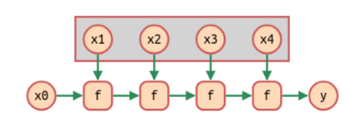
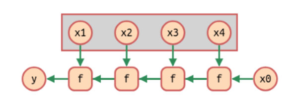

class: center, up

# CAP - Funcions _First Class_


**Jordi Delgado**, **Gerard Escudero**,

.large[**Curs 2024-25**: <ins>Tema 2</ins>]


---

## Funcions _First Class_

<br>

_In computer science, a programming language is said to have
**first-class functions** if it treats functions as first-class citizens.
This means **the language supports passing functions as arguments to
other functions, returning them as the values from other functions,
and assigning them to variables or storing them in data structures**.
Some programming language theorists require **support for anonymous
functions (function literals) as well**_. 

_In languages with first-class functions, the names of functions do not
have any special status; they are treated like ordinary variables with
a function type. The term was coined by Christopher Strachey in the
context of "functions as first-class citizens" in the mid-1960s._

.tiny[[.red[Font: Wikipedia]](https://en.wikipedia.org/wiki/First-class_function)]

---

## Funcions _First Class_

<br>

_In computer programming, a **pure function** is a function that has the following properties:_

* _the function **return values are identical for identical arguments** (no variation with local static variables, non-local variables, mutable reference arguments or input streams, i.e., referential transparency),_

* _the function has **no side effects** (no mutation of local static variables, non-local variables, mutable reference arguments or input/output streams)._

.tiny[[.red[Font: Wikipedia]](https://en.wikipedia.org/wiki/Pure_function)]

<br>

**NOTA**: Quan parlem de composició de funcions, en general, sempre
estarem suposant que la composició _té sentit_, i <ins>no ho farem
explícit</ins>. És a dir, si en algun moment parlem de `(comp f g)` (o, en
altre notació, `f·g`) estarem suposant que **el rang de `g` està inclòs
en el domini d'`f`**. Com Clojure no és un llenguatge _tipat_, hem
d'expressar aquest requeriment textualment, en lloc de formar part de
les definicions formals de `f` i `g`.

---

## Funcions _First Class_

Ja hem vist "_dissimuladament_" alguns exemples:

* L'expressió `(if (> x 0) + -)` retorna el valor-funció lligat al símbol `+` o al símbol `-`, depén del valor d'`x`.

* La funció `apply` requeria una funció com a paràmetre

* Igual que fem `(def s 345)` podem fer `(def quadrat (fn [x] (* x x)))`, és a dir, podem lligar funcions 
a noms per fer-les servir després: `(quadrat 7) 👉 49`

El fet de tractar les funcions com a valors qualsevol, que poden passar-se com a argument a una funcio,
que poden retornar-se com a funcions i que poden vincular-se a un nom és _fonamental_ en les tècniques associades
a la programació funcional.

Avui dia hi ha molt pocs llenguatges de programació que no donin suport a les funcions com a _first class citizens_.
Les darreres versions de Java i de C++ han mirat d'afegir funcions de primera clase,
sense resoldre-ho satisfactòriament en comparació amb Clojure, Common Lisp, Smalltalk, Javascript, Python, etc.red[*]

.footnote[.red[*] Opinió parcialment subjectiva, que quedi clar]

---

## _Higher Order Functions_

La _Clojure sequence library_ està composada, sobre tot, de funcions que requereixen funcions com a paràmetre, és
a dir, de **_funcions d'ordre superior_** (_Higher Order Functions_)

Així doncs, una petita mostra de les funcions d'aquesta _library_ poden ser (algunes les veurem amb una mica de detall):

.cols5050[
.col1[
* `map`

* `filter`

* `remove`

* `drop-while`

* `take-while`

* `every?`

* `some?`

]
.col2[
* `repeatedly`

* `reduce`

* `iterate`

* `apply`

* `partial`

* `comp`

* `sort-by`
]]

.small[**Exercici**: Hi ha més funcions a la _Seq library_. Feu-ne una ullada 
[aquí](https://clojure.org/reference/sequences#_the_seq_library).]

---

## Funcions d'ordre superior habituals

### `map`

Aplica una funció a tots els elements d'una seqüència.

**Exemples**:

```clojure
(map inc '(1 2 3))  👉  (2 3 4)
```

```clojure
(map + '(1 2 3) '(4 5 6 7))  👉  (5 7 9)
```

### `filter`

Obté els elements d'una seqüència que satisfan un predicat.

**Exemple**:

```clojure
(filter even? '(2 1 4 6 7))  👉  (2 4 6)
```

---

## Funcions d'ordre superior habituals

### `drop-while`

Elimina els primers elements consecutius d'una seqüència que satisfan un predicat.

**Exemple**:

```clojure
(drop-while even? '(2 4 6 7 8))  👉  (7 8)
```

### `take-while`

Obté els primers elements consecutius d'una seqüència que satisfan un predicat.

**Exemple**:

```clojure
(take-while even? '(2 4 6 7 8))  👉  (2 4 6)
```
---

## Funcions d'ordre superior habituals

### `reduce`

Desplega un operador `⊕` a una seqüència $(x_1 x_2 ... x_n)$ donant el resultat $((x1 ⊕ x2) ⊕ ...) ⊕ xn$.

**Exemples**:

```clojure
(reduce + '(2 4 6))  👉  12
```

```clojure
(reduce * 1 '(2 3 4))  👉  24
```

### `iterate`

`(iterate f x)` retorna la seqüència "_infinita_" `'(x (f x) (f (f x))...)`.

**Exemple**:

```clojure
(take 5 (iterate inc 1))  👉  (1 2 3 4 5)

```

---

## Funcions d'ordre superior habituals

### `apply`

Aplica una funció a una seqüència.

**Exemple**:

```clojure
(apply + 1 '(2 3))  👉  6`           ; equivalent a (+ 1 2 3)
```

### `partial` 

Torna una funció derivada de fixar paràmetres d'una altra funció que rep com a paràmetre. Està relacionada amb la *currificació*.

**Exemple**:

```clojure
((partial + 2) 4)  👉  6`
```

```clojure
(def f (partial #(str %1 %2 "!") "Hola ")) 
(f "Gerard")  👉  "Hola Gerard!"
```

---

## Funcions d'ordre superior habituals

### `comp` 

Composició de funcions.

**Exemple**:

```clojure
((comp reverse sort) '(3 1 5))  👉  (5 3 1)
```

```clojure
(def tres-mes-grans (comp (partial take 3) reverse sort))  ;; point-free style

(tres-mes-grans '(3 1 2 6 7))  👉  (7 6 3)
```

.small[Sobre el _point-free style_, o _Tacit Programming_, podeu mirar la [Wikipedia](https://en.wikipedia.org/wiki/Tacit_programming)]

### `every?`

Mira si un predicat es satisfà per tots els elements d'una seqüència.

**Exemple**:

```clojure
(every? even? '(2 4 6))  👉  true
```

---

## Funcions d'ordre superior

L'ús d'aquestes funcions d'ordre superior permet fer programes més petits, ja que
augmenten considerablement l'expressivitat del llenguatge.

Compareu:

```Clojure
(defn prime? [n]    ;; sense funcions d'ordre superior
  (letfn [(find-divisor [i n]
            (cond
              (> i (inc (quot n 2)))   false
              (= (mod n i) 0)          true
              :else                    (recur (inc i) n)))]
    (if (< n 2) false
      (not (find-divisor 2 n)))))
```

amb

```Clojure
(defn prime? [n]    ;; amb funcions d'ordre superior
  (cond 
    (< n 2) false 
    :else (not-any? zero? (map #(rem n %) (range 2 (inc (quot n 2)))))))
```

però...

---

## Funcions d'ordre superior

L'ús d'aquestes funcions d'ordre superior permet fer programes més petits, ja que
augmenten considerablement l'expressivitat del llenguatge.

Compareu:

```Clojure
(defn prime? [n]    ;; sense funcions d'ordre superior
  (letfn [(find-divisor [i n]
            (cond
              (> i (inc (quot n 2)))   false
              (= (mod n i) 0)          true
              :else                    (recur (inc i) n)))]
    (if (< n 2) false
      (not (find-divisor 2 n)))))
```

amb

```Clojure
(defn prime? [n]    ;; amb funcions d'ordre superior
  (cond 
    (< n 2) false 
    :else (not-any? zero? (map #(rem n %) (range 2 (inc (quot n 2)))))))
```

...no són igual d'eficients!!!

---

## Funcions d'ordre superior

L'ús d'aquestes funcions d'ordre superior permet fer programes més petits, ja que
augmenten considerablement l'expressivitat del llenguatge.

Compareu:

```Clojure
(defn prime? [n]    ;; sense funcions d'ordre superior
  (letfn [(find-divisor [i n]
            (cond
              (> i (inc (quot n 2)))   false
              (= (mod n i) 0)          true
              :else                    (recur (inc i) n)))]
    (if (< n 2) false
      (not (find-divisor 2 n)))))
```

amb

```Clojure
(defn prime? [n]    ;; amb funcions d'ordre superior
  (cond 
    (or (< n 2) (and (not= n 2) (zero? (rem n 2))))  false 
    :else   (let [m    (dec (quot n 2))] 
              (= m (count (take-while #(not= 0 (rem n %)) 
                                      (range 2 (inc (quot n 2)))))))))
```

---

## Funcions d'ordre superior

Veiem-ne un exemple una mica més gran: Volem una funció que, donat un element i una col·lecció, retorni
un _índex_ que caracteritzi la posició de l'element (`nil` si no hi és).
(_The Joy of Clojure_ p. 111).

Algú que sap el Clojure que nosaltres sabem (de moment poquet 😄) pot proposar:

```Clojure
(defn pos [e coll]
    (let [cmp (if (map? coll)
                 #(= (second %1) %2)
                 #(= %1 %2))]
       (loop [s coll, idx 0]
           (when (seq s)             ;; (seq nil) 👉 nil
               (if (cmp (first s) e)
                   (if (map? coll)
                       (first (first s))
                       idx)
                   (recur (next s) (inc idx)))))))

(pos 3 [:a 1 :b 2 :c 3 :d 4])    👉 5
(pos :foo [:a 1 :b 2 :c 3 :d 4]) 👉 nil
(pos 3 {:a 1 :b 2 :c 3 :d 4})    👉 :c
(pos \3 ":a 1 :b 2 :c 3 :d 4")   👉 13
```
---

## Funcions d'ordre superior

Aquesta funció no és gens "_clojurian_". No és _idiomàtica_. És essencialment una funció que no té
gens en compte la possibilitat de fer servir funcions d'ordre superior (excepte
a la definició de `cmp`).

Generalitzem el problema mirant de transformar una col·lecció en una seqüència
de parelles (vectors) `[índex element]`:

```Clojure
(defn index [coll]
    (cond
        (map? coll) (seq coll)
        (set? coll) (map vector coll coll)
        :else (map vector (iterate inc 0) coll)))
        
(index [:a 1 :b 2 :c 3 :d 4])  👉 ([0 :a] [1 1] [2 :b] [3 2] [4 :c] [5 3] [6 :d] [7 4])
(index {:a 1 :b 2 :c 3 :d 4})  👉 ([:a 1] [:b 2] [:c 3] [:d 4])
(index ":a 1 :b 2 :c 3 :d 4")  👉 ([0 \:] [1 \a] [2 \space] [3 \1] [4 \space] [5 \:] [6 \b] [7 \space] [8 \2] [9 \space] [10 \:] [11 \c] [12 \space] [13 \3] [14 \space] [15 \:] [16 \d] [17 \space] [18 \4])
(index #{:a 1 :b 2 :c 3 :d 4}) 👉 ([1 1] [4 4] [:c :c] [3 3] [2 2] [:b :b] [:d :d] [:a :a])
```

.tiny[Aplicar `index` a un vector, una llista o una _string_ com a argument
retorna una seqüència de vectors de dos elements on el primer és
l'índex i el segon l'element. Si apliquem `index` a un diccionari
senzillament aparellarà claus i valors, i aplicar la funció a un
conjunt (on el concepte d'índex és _forçat_, ja que no té gaire sentit
en dependre d'un ordre arbitrari) retornarà una seqüència amb els
elements aparellats amb ells mateixos.]

---

## Funcions d'ordre superior

Amb la funció `index` és fàcil fer una versió de `pos` més senzilla:

```Clojure
(defn pos' [e coll]
    (let [element (first (drop-while #(not= (second %) e) (index coll)))]
        (first element)))
        
(pos' 3 [:a 1 :b 2 :c 3 :d 4])    👉 5
(pos' :foo [:a 1 :b 2 :c 3 :d 4]) 👉 nil
(pos' 3 {:a 1 :b 2 :c 3 :d 4})    👉 :c
(pos' \3 ":a 1 :b 2 :c 3 :d 4")   👉 13

;; però

(pos  :d #{:a 1 :b 2 :c 3 :d 4}) 👉 6
(pos' :d #{:a 1 :b 2 :c 3 :d 4}) 👉 :d
```

`pos'` és molt semblant a `pos`, excepte si la col·lecció és un conjunt. En aquest
cas, la decisió que hem pres a la funció `index` fa que el retorn sigui diferent:
`pos` retornarà un índex numèric, reflectint l'ordre (arbitrari) que Clojure ha
donat als elements, i `pos'` retorna l'element en qüestió, si hi és.

Un dels avantatges de la possibilitat de fer servir funcions d'ordre
superior és que ens permet major expressivitat i per tant escriure codi 
més compacte.

---

## Funcions d'ordre superior

Comparem

```Clojure
(defn pos [e coll]
    (let [cmp (if (map? coll)
                 #(= (second %1) %2)
                 #(= %1 %2))]
       (loop [s coll, idx 0]
           (when (seq s)             ;; (seq nil) 👉 nil
               (if (cmp (first s) e)
                   (if (map? coll)
                       (first (first s))
                       idx)
                   (recur (next s) (inc idx)))))))
```
amb
```Clojure
(defn pos' [e coll]
    (letfn [(index [coll]
              (cond
                  (map? coll) (seq coll)
                  (set? coll) (map vector coll coll)
                  :else (map vector (iterate inc 0) coll)))]
       (let [element (first (drop-while #(not= (second %) e) (index coll)))]
           (first element))))
```

---

## Funcions d'ordre superior

### Incís: `reduce`/`reductions`

Hem dit abans que `(reduce ⊕ x0 '(x1 x2 ... xn))` desplega un operador `⊕` a 
una seqüència donant com a resultat `(⊕ (...(⊕ (⊕ x0 x1) x2)...) xn)`.

Veiem-ne exemples:

```Clojure
(reduce + 0 [1 2 3 4 5]) 👉 15

(reduce conj #{} [:a :b :c]) 👉 #{:a :c :b}

```

---

## Funcions d'ordre superior

### Incís: `reduce`/`reductions`

Hem dit abans que `(reduce ⊕ x0 '(x1 x2 ... xn))` desplega un operador `⊕` a 
una seqüència donant com a resultat `(⊕ (...(⊕ (⊕ x0 x1) x2)...) xn)`.

Veiem-ne exemples:

```Clojure
(reduce + 0 [1 2 3 4 5]) 👉 15

(reduce conj #{} [:a :b :c]) 👉 #{:a :c :b}

(reduce       ;; nombres primers fins a 100 
  (fn [primes number]
    (if (some zero? (map (partial mod number) primes))
      primes
      (conj primes number)))
  [2]
  (take 98 (iterate inc 3))) 
👉 [2 3 5 7 11 13 17 19 23 29 31 37 41 43 47 53 59 61 67 71 73 79 83 89 97]

(reduce       ;; primers 20 nombres de Fibonacci
  (fn [a b] (conj a (+' (last a) (last (butlast a)))))
  [0 1]                      
  (repeat 18 1))
👉 [0 1 1 2 3 5 8 13 21 34 55 89 144 233 377 610 987 1597 2584 4181]
```

---

## Funcions d'ordre superior

### Incís: `reduce`/`reductions`

El que fa `reductions` és retornar tots els resultats intermedis de la invocació corresponent
de `reduce`. És a dir, si `(reduce ⊕ x0 '(x1 x2 ... xn))` és `(⊕ (...(⊕ (⊕ x0 x1) x2)...) xn)`,
aleshores:

```Clojure
(reductions ⊕ x0 '(x1 x2 ... xn)) 👉 (x0 (⊕ x0 x1) (⊕ (⊕ x0 x1) x2) ...)
```

Per exemple:

```Clojure
(reductions + 0 [1 2 3 4 5]) 👉 (0 1 3 6 10 15)

(reductions conj #{} [:a :b :c]) 👉 (#{} #{:a} #{:b :a} #{:c :b :a})

(reductions     ;; primers fins a 7 (inclòs)
  (fn [primes number]
    (if (some zero? (map (partial mod number) primes))
      primes
      (conj primes number)))
  [2]
  (take 5 (iterate inc 3)))
👉 ([2] [2 3] [2 3] [2 3 5] [2 3 5] [2 3 5 7])
```
---

## Funcions d'ordre superior

### Incís: `reduce`/`reductions`

Veiem alguns exemples més:

```Clojure
(reduce / 64 [4,2,4]) 👉 2
(reductions / 64 [4,2,4]) 👉 (64 16 8 2)

(reduce #(+ %2 (* 2 %1)) 4 [1 2 3]) 👉 43
(reductions #(+ %2 (* 2 %1)) 4 [1 2 3]) 👉 (4 9 20 43)

(letfn [(flip [ff] (fn [x y] (ff y x)))]
   (reduce (flip cons) '() '(1 2 3 4 5 6))) 👉 (6 5 4 3 2 1)
   
(letfn [(flip [ff] (fn [x y] (ff y x)))]
   (reductions (flip cons) '() '(1 2 3 4 5 6)))
👉(() (1) (2 1) (3 2 1) (4 3 2 1) (5 4 3 2 1) (6 5 4 3 2 1))
```

`reduce` té equivalents en pràcticament tots els llenguatges de programació. 
S'anomena `foldl` a Haskell, `reduce` a Common Lisp, `inject:into:` a Smalltalk,
`iterator.fold` a Rust, `functools.reduce` a Python 3, `Iterable.fold` a Kotlin,
`array.reduce` a Javascript, `lists:foldl` a Erlang, i un molt llarg etc.red[*].

.footnote[.red[*] Si teniu interés mireu la [Wikipedia](https://en.wikipedia.org/wiki/Fold_%28higher-order_function%29)]

---

## Funcions d'ordre superior

### Incís: `reduce`/`reductions`

`reduce`/`reductions` tenen versions simètriques que no estan implementades a Clojure,
que podem anomenar `foldr`/`scanr` (igual que en Haskell, on `reduce` és `foldl` i
`reductions` és `scanl`).

Podríem implementar-les:

```Clojure
(defn foldr
  [f val coll]
  (if (empty? coll) val
      (f (first coll) (foldr f val (rest coll)))))

(defn scanr
  [f e lst]
  (letfn [(flip [ff] (fn [x y] (ff y x)))]
    (let [rlst   (reverse lst)]
      (reverse (reductions (flip f) e rlst)))))
```

on de la definició podem veure que `(foldr ⊕ x0 '(x1 x2 ... xn))` desplega 
l'operador `⊕` a una seqüència calculant `(⊕ x1 (⊕ x2 (...(⊕ xn x0)...)))`.
`scanr` retorna tots els resultats intermedis de la invocació corresponent
de `foldr`.

---

## Funcions d'ordre superior

### Incís: `reduce`/`reductions`

Gràficament:

```Clojure
(def y (reduce f x0 '(x1 x2 x3 x4)))
```
.center[]

```Clojure
(def y (foldr f x0 '(x1 x2 x3 x4)))
```
.center[]

---

## Funcions d'ordre superior

### Incís: `reduce`/`reductions`

Per acabar l'incís, un exemple senzill ens ajudarà a entendre millor les diferències entre
aquestes funcions:

```Clojure
(reduce - 0 '(1 2 3 4 5)) 👉 -15 
;; (- (- (- (- (- 0 1) 2) 3) 4) 5)

(reductions - 0 '(1 2 3 4 5)) 👉 (0 -1 -3 -6 -10 -15)
;; 0 ⇒ 0, (- 0 1) ⇒ -1, (- (- 0 1) 2) ⇒ -3, (- (- (- 0 1) 2) 3) ⇒ -6, 
;; (- (- (- (- 0 1) 2) 3) 4) ⇒ -10, (- (- (- (- (- 0 1) 2) 3) 4) 5) ⇒ -15


(foldr - 0 '(1 2 3 4 5)) 👉 3
;; (- 1 (- 2 (- 3 (- 4 (- 5 0)))))

(scanr - 0 '(1 2 3 4 5)) 👉 (3 -2 4 -1 5 0)
;; (- 1 (- 2 (- 3 (- 4 (- 5 0))))) ⇒ 3, (- 2 (- 3 (- 4 (- 5 0)))) ⇒ -2,
;; (- 3 (- 4 (- 5 0))) ⇒ 4, (- 4 (- 5 0)) ⇒ -1, (- 5 0) ⇒ 5, 0 ⇒ 0
```

---

## Funcions d'ordre superior

Un altre exemple: Recordem l'[algorisme de
Kadane](https://en.wikipedia.org/wiki/Maximum_subarray_problem) per
resoldre el **_Maximum Segment Sum Problem_**: Sigui V un vector de nombres 
i considerem totes els seus subvectors possibles (fins i tot el buit). Volem trobar
quant suma el subvector amb suma màxima. 

Per exemple, si V = [31, -41,
59, 26, -53, 58, 97, -93, -23, 84] el resultat és 187, que correspón al 
subvector [59, 26, -53, 58, 97] (la suma del vector buit és zero).

L'algorisme de Kadane és un algorisme $\mathcal{O}(n)$ (lineal en la mida del vector) que
resol el problema de manera òptima.

Una implementació en Clojure que NO fa servir funcions d'ordre superior:
```Clojure
(defn kadane
  "v és un vector de nombres"
  [v]
  (let [mida (count v)]
    (loop [i 0, resultat 0, actual 0, per-tractar v]
      (if (= mida i)
        resultat
        (let [elem-i   (first per-tractar)
              m        (max (+ actual elem-i) 0)] 
          (recur (inc i) (max resultat m) m (rest per-tractar)))))))
```
---

## Funcions d'ordre superior

Podem fer un algorisme _millor_ (més clar, més curt) fent servir funcions d'ordre superior? Al tanto, 
que volem un algorisme que també sigui lineal $\mathcal{O}(n)$.

```Clojure
(def max0 #(max 0 (+ %1 %2)))

(defn scanr   ;; ja l'hem vist, és la mateixa funció
  [f e lst]
  (letfn [(flip [ff] (fn [x y] (ff y x)))]
    (let [rlst   (reverse lst)]
      (reverse (reductions (flip f) e rlst)))))

(def kadane #(apply max (scanr max0 0 %)))
```

En aquest exemple el paper clau el juga `reductions`, que ens ajuda a definir `scanr`. 

Es pot demostrar que aquest algorisme també és lineal $\mathcal{O}(n)$.

---

## Funcions d'ordre superior

Comparem

```Clojure
(defn kadane
  "v és un vector de nombres"
  [v]
  (let [mida (count v)]
    (loop [i 0, resultat 0, actual 0, per-tractar v]
      (if (= mida i)
        resultat
        (let [elem-i   (first per-tractar)
              m        (max (+ actual elem-i) 0)] 
          (recur (inc i) (max resultat m) m (rest per-tractar)))))))
```

amb 

```Clojure
(defn kadane
  "coll és un vector de nombres"
  [coll]
  (letfn [(max0 [x y] (max 0 (+ x y)))
          (scanr [f e lst] (letfn [(flip [ff] (fn [x y] (ff y x)))]
                             (let [rlst   (reverse lst)]
                               (reverse (reductions (flip f) e rlst)))))]
    (apply max (scanr max0 0 coll))))
```
---

## Funcions d'ordre superior

Veiem un exemple més: [Ordenació per inserció](https://en.wikipedia.org/wiki/Insertion_sort) (_Insertion Sort_)

Recordem el pseudo-codi de l'algorisme.red[*]:

```C
i ← 1
while i < length(A)
    j ← i
    while j > 0 and A[j-1] > A[j]
        swap A[j] and A[j-1]
        j ← j - 1
    end while
    i ← i + 1
end while
```

És un algorisme que depén molt de la _mutabilitat_ de la col·lecció
`A`. A Clojure no és trivial traduir aquest pseudo-codi _literalment_.

Per exemple, donada la col·lecció `A`, fer `swap A[j] and A[j-1]` podria fer-se (suposem que `A`
és un vector): `(assoc (assoc A j (A (dec j))) (dec j) (A j))`,
però no és trivial veure si avaluar aquesta expressió té el mateix cost que `swap A[j] and A[j-1]`, que 
és constant $\mathcal{O}(1)$.


.footnote[.red[*] [Font](https://en.wikipedia.org/wiki/Insertion_sort)]

---

## Funcions d'ordre superior

[Ordenació per inserció](https://en.wikipedia.org/wiki/Insertion_sort) (_Insertion Sort_)

En canvi, des d'un punt de vista _funcional_ l'ordenació per inserció no és complicada:

```Clojure
(defn ordenacio-insercio 
  "Retorna una seqüència amb els elements de la seqüència xs ordenats"
  [xs]
  (letfn [(inserir [col x]
            "suposant que col està ordenada, insereix x tot mantenint l'ordre" 
            (concat (take-while #(<= % x) col) [x] (drop-while #(<= % x) col)))]
    (reduce inserir '() xs)))
    
(let [s  (shuffle (range 20))]
   (println s)
   (ordenacio-insercio s))
👁️ [14 9 16 5 17 1 15 8 10 0 12 3 19 7 4 11 18 6 2 13]
👉 (0 1 2 3 4 5 6 7 8 9 10 11 12 13 14 15 16 17 18 19)

```

Però hem d'adaptar l'algorisme al punt de vista _funcional_. L'algorisme tal com està descrit
en pseudo-codi a la plana anterior no és gaire útil, més que per entendre la idea _general_.

---

## Llistes per Comprensió (_List Comprehension_)

### La macro `for`

En Clojure la macro `for` ens permet processar i generar seqüències de manera alternativa a 
les funcions de la _Clojure Sequence Library_.
No és un `for` com els que coneixem d'altres llenguatges de programació 
(tot i que pot fer-se servir de manera similar en alguns casos).
Les llistes (seqüències, en realitat) generades fent servir `for` 
s'anomenen **_llistes per comprensió_**.

En lloc d'intentar fer una descripció general, veiem alguns exemples:

```Clojure
(for [i [1 2 3 4 5]] (* 2 i)) 👉 (2 4 6 8 10)

(for [i (range 4) j (range 3)] [i j])
👉 ([0 0] [0 1] [0 2] [1 0] [1 1] [1 2] [2 0] [2 1] [2 2] [3 0] [3 1] [3 2])

;; Podem afegir els modificadors :when :while :let

(for [x (range 1 6) :let [y (* x x), z (* x x x)]] [x y z])
👉 ([1 1 1] [2 4 8] [3 9 27] [4 16 64] [5 25 125])

(for [x (range 3) y (range 3) :when (not= x y)] [x y])
👉 ([0 1] [0 2] [1 0] [1 2] [2 0] [2 1])

(for [x (range 3) y (range 3) :while (not= x y)] [x y])  ;; !!!
👉 ([1 0] [2 0] [2 1])
```
---

## Llistes per Comprensió (_List Comprehension_)

### La macro `for`

La diferència entre fer servir `:when` i `:while` és subtil:

```Clojure
;; Suposem que tenim una funció prime? ja definida

(for [x (range 3 33 2) :when (prime? x)] x)  👉 (3 5 7 11 13 17 19 23 29 31)

(for [x (range 3 33 2) :while (prime? x)] x) 👉 (3 5 7)


(for [x (range 3 13 2) :when (prime? x), y (range 3 13 2) :when (prime? y)] 
     [x y])
👉 ([3 3] [3 5] [3 7] [3 11] [5 3] [5 5] [5 7] [5 11] [7 3] 
    [7 5] [7 7] [7 11] [11 3] [11 5] [11 7] [11 11]) 

(for [x (range 3 13 2) :while (prime? x), y (range 3 13 2) :while (prime? y)] 
     [x y])
👉 ([3 3] [3 5] [3 7] [5 3] [5 5] [5 7] [7 3] [7 5] [7 7])

```

És fàcil veure que fent servir `for` podem aconseguir el mateix que aconseguim amb algunes
funcions de la _Clojure Sequence Library_. De fet, precisament això forma
part dels [exercicis](https://gebakx.github.io/cap/problemes/llistes-comprensio.pdf) 
que corresponen a les sessions de laboratori d'aquest tema.

.small[[Font](https://clojuredocs.org/clojure.core/for)]

---

## Funcions d'ordre superior

### `fold`

Ja hem fet servir les funcions `reduce`/`reductions`. Aquestes funcions són fonamentals
en programació funcional.red[*]. Recordem les definicions de `foldl`/`reduce`, `foldr`, `scanl`/`reductions` i 
`scanr`, i definim `fold`:

```Clojure
;; foldl / foldr / fold
(defn foldl [f x0 s]                 (defn foldr [f x0 s]
  (if (empty? s) x0                    (if (empty? s) x0
      (let [[cap & cua] s]                 (let [[cap & cua] s]
        (recur f (f x0 cap) cua))))          (f cap (foldr f x0 cua)))))

(def fold foldr)

;; scanl / scanr
(defn scanl [f x0 s]                  ;; (def scanl reductions)
  (if (empty? s) (list x0)
      (let [[cap & cua] s]
        (cons x0 (scanl f (f x0 cap) cua)))))
        
(defn scanr [f e lst]
  (letfn [(flip [ff] (fn [x y] (ff y x)))]
    (let [rlst   (reverse lst)]
      (reverse (scanl (flip f) e rlst)))))
```

.footnote[.red[*] 
[_A tutorial on the universality and expressiveness of fold_](https://www.cambridge.org/core/journals/journal-of-functional-programming/article/tutorial-on-the-universality-and-expressiveness-of-fold/CDBAA53C7120E23CBBBE206FD47FDBAA)
]

---

## Funcions d'ordre superior

### `fold`: Processar Seqüències

En aquesta sessió ens centrarem sobre tot en la idea de <ins>_processar seqüències_</ins>. 
Molts problemes pràctics es poden pensar en aquests termes,
adequadament combinats amb funcions d'ordre superior.

Ja hem vist exemples de la versatilitat de `reduce`/`foldl`. En aquesta sessió ens concentrarem en
`fold` (`foldr` en realitat.red[*]).

```Clojure
;; Definim funcions conegudes que *només* accepten dos arguments:
(def suma #(+ %1 %2))
(def prod #(* %1 %2))
(def and2 #(and %1 %2))
(def or2  #(or %1 %2))

;; Podem definir les funcions de Clojure a partir d'aquestes fent ús de fold:
(def suma_generalitzada    (partial fold suma 0))
(def producte_generalitzat (partial fold prod 1))
(def and_generalitzat      (partial fold and2 true))
(def or_generalitzat       (partial fold or2 false))

(suma_generalitzada (range 10)) 👉 45
(producte_generalitzat (map inc (range 10))) 👉 3628800 ;; 10!
```

.footnote[.red[*] 
No confondre amb `clojure.core.reducers/fold`, que és _una mena de_
`reduce` paral·lelitzable
]

---

## Funcions d'ordre superior

### `fold`: Processar Seqüències

Però això només és una mostra molt trivial de les capacitats de `fold`.
Mirem de fer funcions una mica més complicades:

```Clojure
(def mida (partial fold #(inc %2)  0))
(mida '()) 👉 0
(mida [])  👉 0
(mida (range 10))       👉 10
(mida (vec (range 10))) 👉 10

(def invertir (partial fold #(concat %2 [%1]) '()))
(invertir '()) 👉 ()
(invertir []) 👉 ()
(invertir (range 10)) 👉 (9 8 7 6 5 4 3 2 1 0)
(invertir (vec (range 10))) 👉 (9 8 7 6 5 4 3 2 1 0)
(apply str (invertir "Hola Món!")) 👉 "!nóM aloH"

(def my-map (fn [f,s] (fold #(cons (f %1) %2) '() s)))
(my-map inc (range 2 15 3)) 👉 (3 6 9 12 15) ;;(range 2 15 3) 👉 (2 5 8 11 14)

(def my-filter (fn [p,s] (fold #(if (p %1) (cons %1 %2) %2) '() s)))
(my-filter even? (range 2 30)) 👉 (2 4 6 8 10 12 14 16 18 20 22 24 26 28)
```

---

## Funcions d'ordre superior

### `fold`: La Propietat Universal

No és casualitat que `fold` sigui capaç d'expressar tantes operacions diferents. En realitat, 
la definició de `(foldr ⊕ x0 '(x1 x2 ... xn))` com a `(⊕ x1 (⊕ x2 (...(⊕ xn x0)...)))`
captura un patró molt freqüent en definicions recursives.

Disposant de funcions d'ordre superior, podem expressar una relació
entre `fold` i aquest patró de funció recursiva:

```Clojure
;; Suposem un valor v i una funció *pura* f, definim la funció recursiva g:
(defn g [s]
  (if (empty? s) v
    (f (first s) (g (rest s)))))
```

Es pot demostrar que.red[*]:

```Clojure
g = (partial fold f v)              ;; g = fold f v
```
Aquesta relació s'anomena **_la propietat universal de fold_**.


.footnote[.red[*] Només per a llistes de mida finita. Aquesta afirmació tindrà més sentit
a final de curs. Els detalls i demostracions els podeu trobar 
a l'[article](https://www.cambridge.org/core/journals/journal-of-functional-programming/article/tutorial-on-the-universality-and-expressiveness-of-fold/CDBAA53C7120E23CBBBE206FD47FDBAA)
que hem citat abans.]

---

## Funcions d'ordre superior

### `fold`: La Propietat Universal

Veiem un exemple d'aplicació d'aquesta propietat:

```Clojure
;; Definició de map, suposant que no tinguéssim map a Clojure (!)
(defn map [ff s]
  (if (empty? s) 
    '()
    (cons (ff (first s)) (map ff (rest s)))))
```
Volem aplicar la propietat universal, caldria trobar quina és la `g` en aquest cas.
Considerant que `g` té com a argument una seqüència `s`, només podem equiparar
`g` a `(partial map ff)`. En aquest cas, la nostra definició recursiva de `(partial map ff)` sí 
que té l'estructura que requerim de la `g` de la definició de la plana anterior (suposant, però, que
`ff` és pura).

Aleshores, trobar la resta d'elements és senzill: El valor `v` seria
`'()`, i la funció `f` seria `#(cons (ff %1) %2)`.

Per tant, segons la propietat universal, podem afirmar que, si `f` és pura:

```Clojure
(partial map f) = (partial fold #(cons (f %1) %2) '()) ;; map f = fold cons·f ()
```
---

## Funcions d'ordre superior

### `fold`: La Propietat de Fusió (_The fusion property of fold_)

Hi ha altres propietats que ens poden ser útils a l'hora de pensar programes
funcionals. La **_Propietat de Fusió_** diu:

Siguin `h`, `g`, i `f` funcions pures i `w` i `v` valors donats. Si es verifica que:

```Clojure
(h w)       = v                       ;;       h w = v
(h (g x y)) = (f x (h y))             ;; h (g x y) = f x (h y)
```
Aleshores tenim que:

```Clojure
(comp h (partial fold g w)) = (partial fold f v)     ;; h · fold g w = fold f v
```

Veiem una aplicació de la propietat de fusió argumentant que, 
donades dues funcions pures `ff` i `gg`:

```Clojure
;; Escrivim en Clojure que: map ff · map gg = map (ff·gg)
(comp (partial map ff) (partial map gg)) = (partial map (comp ff gg))
```

.small[**Exercici**: Per què és interessant aquesta propietat? Què en traiem nosaltres
de saber que `map f · map g = map (f·g)`, per a `f` i `g` pures?]

---

## Funcions d'ordre superior

### `fold`: La Propietat de Fusió (_The fusion property of fold_)

Continuant amb l'exemple de la plana anterior, caldria identificar els
diferents elements de la definició de la propietat general de fusió. 
Per fer això substituirem a la propietat de fusió dos dels `map` per 
la seva expressió en termes de `fold`

```Clojure
(comp (partial map ff) (partial map gg)) = (partial map (comp ff gg))
≡
(comp (partial map ff) (partial fold #(cons (gg %1) %2) '())) = 
                                 (partial fold #(cons ((comp ff gg) %1) %2) '())
```

Aquí és, però, on volem arribar. Aquesta expressió sí que ens permetrà
identificar tots els elements que apareixen a la formulació general de
la propietat:

```Clojure
w ⇒ '()                    v ⇒ '()                    h ⇒ (partial map ff)

g ⇒ #(cons (gg %1) %2)     f ⇒ #(cons ((comp ff gg) %1) %2)
```

Si amb aquestes substitucions es verifica la premisa de la propietat de fusió, aleshores
podrem dir que la igualtat anterior és certa gràcies a aquesta propietat.

---

## Funcions d'ordre superior

### `fold`: La Propietat de Fusió (_The fusion property of fold_)

Per a deduir aquesta igualtat amb la propietat de fusió, caldria que es verifiqués
(ara que podem identificar els diferents elements de la premisa):

```Clojure
;; a/ (h w) = v

;;      h          w     v
;;--------------  ---   ---
((partial map ff) '()) = ()

;; b/ (h (g x y)) = (f x (h y))

;;      h                  g
;;--------------   -----------------
((partial map ff) (#(cons (gg %1) %2) x y)) =
                            (#(cons ((comp ff gg) %1) %2) x ((partial map ff) y))
;;                           ---------------------------     ----------------
;;                                       f                           h

```
L'apartat **a/** és trivial, ja que `(map f '())` és sempre la seqüència buida `()`.

L'apartat **b/**: En aquest cas desplegarem les funcions per a valors genèrics
d'`x` i d'`y`, i argumentarem que la igualtat es verifica. Ho farem a la pissarra.

---

## Funcions d'ordre superior

### `fold`: _The Scan Lemma_

Podem definir `scanl` i `scanr` en termes de `foldl` i `foldr`? Doncs sí!

Definim dues funcions auxiliars `inits` i `tails`:

```Clojure
;; Ténen sentit amb llistes, strings i vectors, no massa amb maps o conjunts

(defn inits
  [coll]
  (if (not (seq coll)) (seq (list '()))   ;; retorna la seqüència (())
    (let [[x & xs] coll]          ;; <=== Heu estudiat el destructuring?
      (concat '(()) (map (partial cons x) (inits xs))))))

(defn tails
  [coll]
  (if (not (seq coll)) (seq (list '()))  ;; retorna la seqüència (())
    (let [[_ & xs :as all] coll]  ;; <=== Heu estudiat el destructuring?
      (cons (seq all) (tails xs)))))

(inits '(1 2 3 4 5)) 👉 (() (1) (1 2) (1 2 3) (1 2 3 4) (1 2 3 4 5))
(tails '(1 2 3 4 5)) 👉 ((1 2 3 4 5) (2 3 4 5) (3 4 5) (4 5) (5) ())

(inits [:a :b :c]) 👉 (() (:a) (:a :b) (:a :b :c))
(tails [:a :b :c]) 👉 ((:a :b :c) (:b :c) (:c) ())
 
(inits []) 👉 (())                            (tails []) 👉 (())
```

---

## Funcions d'ordre superior

### `fold`: _The Scan Lemma_

Aquestes funcions generen una seqüència amb tots els prefixos (`inits`) o tots els 
sufixos (`tails`) d'una seqüència determinada.

Aleshores, només ens cal aplicar `foldl` o `foldr` a cada una de les subseqüències,
i per a això tenim `map`:

```Clojure
;; Recordem que scanl requereix tres arguments (scanl f e s)
(def scanl' #((comp (partial map (partial foldl %1 %2)) inits) %3)) 

(scanl  #(+ %2 (* 2 %1)) 4 [1 2 3]) 👉 (4 9 20 43)
(scanl' #(+ %2 (* 2 %1)) 4 [1 2 3]) 👉 (4 9 20 43)

(scanl  conj #{} [:a :b :c]) 👉 (#{} #{:a} #{:b :a} #{:c :b :a})
(scanl' conj #{} [:a :b :c]) 👉 (#{} #{:a} #{:b :a} #{:c :b :a})

(letfn [(flip [ff] (fn [x y] (ff y x)))]
   (scanl  (flip cons) '() '(1 2 3 4 5 6))) 
👉 (() (1) (2 1) (3 2 1) (4 3 2 1) (5 4 3 2 1) (6 5 4 3 2 1))

(letfn [(flip [ff] (fn [x y] (ff y x)))]
   (scanl' (flip cons) '() '(1 2 3 4 5 6)))
👉 (() (1) (2 1) (3 2 1) (4 3 2 1) (5 4 3 2 1) (6 5 4 3 2 1))
```
---

## Funcions d'ordre superior

### `fold`: _The Scan Lemma_

Aquestes funcions generen una seqüència amb tots els prefixos (`inits`) o tots els 
sufixos (`tails`) d'una seqüència determinada.

Aleshores, només ens cal aplicar `foldl` o `foldr` a cada una de les subseqüències,
i per a això tenim `map`:

```Clojure
;; Recordem que scanr requereix tres arguments (scanr f e s)
(def scanr' #((comp (partial map (partial foldr %1 %2)) tails) %3))

(scanr  - 0 '(1 2 3 4 5)) 👉 (3 -2 4 -1 5 0)
(scanr' - 0 '(1 2 3 4 5)) 👉 (3 -2 4 -1 5 0)

(scanr  / 2 [8,12,24,4]) 👉 (8 1 12 2 2)
(scanr' / 2 [8,12,24,4]) 👉 (8 1 12 2 2)

(scanr  #(/ (+ %1 %2) 2) 54 [12,4,10,6]) 👉 (12 12 20 30 54)
(scanr' #(/ (+ %1 %2) 2) 54 [12,4,10,6]) 👉 (12 12 20 30 54)

```
Encara que hauria de ser obvi, val la pena destacar que, si `f` és pura:

`(= (last (scanl f z x))  (foldl f z x)) 👉 true`

`(= (first (scanr f z x)) (foldr f z x)) 👉 true`

---

## Funcions d'ordre superior

### Exemples

* Podem tornar al recorregut en profunditat d'un graf que vam veure
[anteriorment](https://jdelgadopin.github.io/CAP2024-25/s01_02.html#48). Podem fer-lo més _funcional_ aprofitant 
que era iteratiu (podem convertir-lo fàcilment a recursiu final i aprofitar la TCO que ens proporciona `recur`)
i que ara coneixem la familia `fold`.

---

## Funcions d'ordre superior

### Exemples

* Podem tornar al recorregut en profunditat d'un graf que vam veure
[anteriorment](https://jdelgadopin.github.io/CAP2024-25/s01_02.html#48). Podem fer-lo més _funcional_ aprofitant 
que era iteratiu (podem convertir-lo fàcilment a recursiu final i aprofitar la TCO que ens proporciona `recur`)
i que ara coneixem la familia `fold`:

La solució proposada seria:

```Clojure
(defn recorregut-profunditat
  "graf és un graf representat com hem vist a la transparència anterior"
  "primer és el node del que es parteix per fer el recorregut"
  [graf primer]
  (letfn [(dfs [p vis]
            (cond
              (empty? p)              vis
              (some #{(peek p)} vis)  (recur (pop p) vis)
              :else                   (let [actual (peek p)]
                                        (recur (reduce conj (pop p) (actual graf))
                                               (conj vis actual)))))]
    (dfs [primer] [])))
```

.small[**Exercici**: Compareu aquesta versió amb la versió del 
[Tema 1](https://jdelgadopin.github.io/CAP2024-25/s01_02.html#48).
Veureu que no són tan diferents.]

---

## Funcions d'ordre superior

### Exemples

* Fer una funció `bin2int` que transformi una seqüència de bits (nombres del conjunt {0,1}) en un
nombre enter (el bit de més pes està a l'esquerra de la seqüència):

```Clojure
(bin2int [1,0,1,1]) 👉 11

(bin2int [1,0,0,0]) 👉 8
```

---

## Funcions d'ordre superior

### Exemples

* Fer una funció `bin2int` que transformi una seqüència de bits (nombres del conjunt {0,1}) en un
nombre enter (el bit de més pes està a l'esquerra de la seqüència):

```Clojure
(bin2int [1,0,1,1]) 👉 11

(bin2int [1,0,0,0]) 👉 8
```

* Solució:

```Clojure
;; Farem servir una expressió similar a l'avaluació d'un polinomi amb Horner

(def bin2int (partial reduce #(+ (* 2 %1) %2) 0))
```

El mateix podríem fer per transformar una seqüència de dígits de {0,1,...,9} en un enter (però
fent servir `#(+ (* 10 %1) %2)`).


---

## Funcions d'ordre superior

### Exemples

* Donada una seqüència amb diferents valors, per exemple
`["Vermell", "Blau", "Verd", "Blau", "Blau", "Vermell"]`, feu una funció
que retorni una seqüència amb el nombre de vegades que apareix cada
valor, juntament amb el valor, ordenats creixentment:

```Clojure
(resultat ["Vermell", "Blau", "Verd", "Blau", "Blau", "Vermell"]) 
👉 ([1 "Verd"] [2 "Vermell"] [3 "Blau"])

(resultat [:trump, :trump, :harris, :harris, :harris, :harris, :harris, :trump])
👉 ([3 :trump] [5 :harris])

```
---

## Funcions d'ordre superior

### Exemples

* Donada una seqüència amb diferents valors, per exemple
`["Vermell", "Blau", "Verd", "Blau", "Blau", "Vermell"]`, feu una funció
que retorni una seqüència amb el nombre de vegades que apareix cada
valor, juntament amb el valor, ordenats creixentment:

```Clojure
(resultat ["Vermell", "Blau", "Verd", "Blau", "Blau", "Vermell"]) 
👉 ([1 "Verd"] [2 "Vermell"] [3 "Blau"])

(resultat [:trump, :trump, :harris, :harris, :harris, :harris, :harris, :trump])
👉 ([3 :trump] [5 :harris])
```
Caldrà una funció per comptar quants cops apareix cada valor:

```Clojure
(def comptar (fn [x s] (count (filter (partial = x) s))))

(comptar "Vermell" ["Vermell", "Blau", "Verd", "Blau", "Blau", "Vermell"]) 👉 2

(comptar "Groc" ["Vermell", "Blau", "Verd", "Blau", "Blau", "Vermell"])    👉 0
```
---

## Funcions d'ordre superior

### Exemples

* Donada una seqüència amb diferents valors, per exemple
`["Vermell", "Blau", "Verd", "Blau", "Blau", "Vermell"]`, feu una funció
que retorni una seqüència amb el nombre de vegades que apareix cada
valor, juntament amb el valor, ordenats creixentment:

```Clojure
(resultat ["Vermell", "Blau", "Verd", "Blau", "Blau", "Vermell"]) 
👉 ([1 "Verd"] [2 "Vermell"] [3 "Blau"])

(resultat [:trump, :trump, :harris, :harris, :harris, :harris, :harris, :trump])
👉 ([3 :trump] [5 :harris])

```

Caldrà una altra funció, auxiliar, per eliminar resultats duplicats:

```Clojure
(defn treu-duplicats [s] 
  (if (empty? s) '()
    (let [[cap & cua] s]
      (cons cap (filter (partial not= cap) (treu-duplicats cua))))))
      
(treu-duplicats ["Vermell", "Blau", "Verd", "Blau", "Blau", "Vermell"]) 
👉 ("Vermell" "Blau" "Verd")
```
---

## Funcions d'ordre superior

### Exemples

* Donada una seqüència amb diferents valors, per exemple
`["Vermell", "Blau", "Verd", "Blau", "Blau", "Vermell"]`, feu una funció
que retorni una seqüència amb el nombre de vegades que apareix cada
valor, juntament amb el valor, ordenats creixentment:

```Clojure
(resultat ["Vermell", "Blau", "Verd", "Blau", "Blau", "Vermell"]) 
👉 ([1 "Verd"] [2 "Vermell"] [3 "Blau"])

(resultat [:trump, :trump, :harris, :harris, :harris, :harris, :harris, :trump])
👉 ([3 :trump] [5 :harris])

```

.small[**Exercici**: Fent servir la **propietat universal de `fold`**, demostrar que la funció `treu-duplicats` que
acabem de fer és equivalent a aquesta altra funció `treu-duplicats'`]

```Clojure
(defn treu-duplicats' [s]
  (fold #(cons %1 (filter (partial not= %1) %2)) '() s))
      
(treu-duplicats' ["Vermell", "Blau", "Verd", "Blau", "Blau", "Vermell"]) 
👉 ("Vermell" "Blau" "Verd")
```
---

## Funcions d'ordre superior

### Exemples

* Donada una seqüència amb diferents valors, per exemple
`["Vermell", "Blau", "Verd", "Blau", "Blau", "Vermell"]`, feu una funció
que retorni una seqüència amb el nombre de vegades que apareix cada
valor, juntament amb el valor, ordenats creixentment:

```Clojure
(resultat ["Vermell", "Blau", "Verd", "Blau", "Blau", "Vermell"]) 
👉 ([1 "Verd"] [2 "Vermell"] [3 "Blau"])

(resultat [:trump, :trump, :harris, :harris, :harris, :harris, :harris, :trump])
👉 ([3 :trump] [5 :harris])

```

* Amb aquestes funcions ja podem construir la funció `resultat`:

```Clojure
(defn resultat [s]
  (sort (for [v (treu-duplicats s)] [(comptar v s) v])))
```

En tenim prou ordenant una llista per comprensió que ens doni els resultats desitjats.

---

## Funcions d'ordre superior

### Exemples

* Veiem un exemple una mica més gran: Volem una funció que, donada una seqüència, retorni totes
les **permutacions** possibles d'aquesta seqüència.

L'enfocament que farem és el següent: Suposem que tenim totes les permutacions possibles de la
seqüència donada, _menys el primer element_. Com trobaríem totes les permutacions possibles? La solució
és senzilla: Només cal inserir el primer element a totes les permutacions que tenim, de totes les
maneres possibles.

Per exemple: Volem calcular `(perms [1 2 3])`, el resultat ha de ser `((1 2 3) (2 1 3) (2 3 1) (1 3 2) (3 1 2) (3 2 1))`.

Imaginem que tenim ja calculat `(perms [2 3])`, és a dir, `((2 3) (3 2))`.

Només caldria inserir l'`1` de totes les maneres possibles a `(2 3)`: `((1 2 3) (2 1 3) (2 3 1))`, i també
fer-ho a `(3 2)`: `((1 3 2) (3 1 2) (3 2 1))`. N'hi hauria prou concatenant aquestes dues seqüències
per obtenir el resultat final `((1 2 3) (2 1 3) (2 3 1) (1 3 2) (3 1 2) (3 2 1))`.

---

## Funcions d'ordre superior

### Exemples

* Veiem un exemple una mica més gran: Volem una funció que, donada una seqüència, retorni totes
les **permutacions** possibles d'aquesta seqüència.

Suposem que tenim una funció `(inserts elem seq)` que fa precisament això, inserir `elem` a `seq` de totes
les maneres possibles. En aquest cas n'hi hauria prou fent:

```Clojure
(map (partial inserts 1) (perms [2 3])) 
👉 ( ((1 2 3) (2 1 3) (2 3 1)) ((1 3 2) (3 1 2) (3 2 1)) )

;; i ara fem la concatenació:
(apply concat '( ((1 2 3) (2 1 3) (2 3 1)) ((1 3 2) (3 1 2) (3 2 1)) ))
👉 ((1 2 3) (2 1 3) (2 3 1) (1 3 2) (3 1 2) (3 2 1))
```

Així doncs, definirem primer `inserts`...

---

## Funcions d'ordre superior

### Exemples

* Veiem un exemple una mica més gran: Volem una funció que, donada una seqüència, retorni totes
les **permutacions** possibles d'aquesta seqüència.

La idea és partir d'haver inserit l'element a la cua de la seqüència, i afegir-hi el primer
element de la seqüència després:

```Clojure
(defn inserts
  "Insereix de totes les maneres possibles l'element x a la seqüència s"
  [x s]
  (if (empty? s) (list (list x))
      (let [[cap & cua]          s
            resultat-parcial     (inserts x cua)]
        (cons (cons x s) (map (partial cons cap) resultat-parcial)))))

;;(inserts 0 [1,2,3,4]) 
;;         - ---------
;;         x     s
;; 👉 ((0 1 2 3 4) (1 0 2 3 4) (1 2 0 3 4) (1 2 3 0 4) (1 2 3 4 0))
;;     ----------- -----------------------------------------------
;;     (cons x s)     (map (partial cons cap) resultat-parcial)
;;
;; ja que:
;;(inserts 0 [2,3,4]) 👉 ((0 2 3 4) (2 0 3 4) (2 3 0 4) (2 3 4 0))
;;                        ---------------------------------------
;;                         resultat-parcial = (inserts 0 [2,3,4])
```
---

## Funcions d'ordre superior

### Exemples

* Veiem un exemple una mica més gran: Volem una funció que, donada una seqüència, retorni totes
les **permutacions** possibles d'aquesta seqüència.

Ara ja podem definir `perms` tal com l'hem descrit abans:

```Clojure
(defn perms
  "Calcular una seqüència amb totes les permutacions d's"
  [s]
  (if (empty? s) '(())
    (let [[cap & cua]  s
          perms-cua    (perms cua)]
      (apply concat (map (partial inserts cap) perms-cua)))))
      
;;(perms [1 2 3]) 👉 ((1 2 3) (2 1 3) (2 3 1) (1 3 2) (3 1 2) (3 2 1))
;;
;;com la crida recursiva fa (perms [2 3]) 👉 ((2 3) (3 2))
;;
;; aleshores només ens cal:
;;(map (partial inserts 1) (perms [2 3])) 
;; 👉 ( ((1 2 3) (2 1 3) (2 3 1)) ((1 3 2) (3 1 2) (3 2 1)) )
;;
;; i finalment:
;;(apply concat '( ((1 2 3) (2 1 3) (2 3 1)) ((1 3 2) (3 1 2) (3 2 1)) ))
;; 👉 ((1 2 3) (2 1 3) (2 3 1) (1 3 2) (3 1 2) (3 2 1))
```
---

## Funcions d'ordre superior

### Exemples

* Veiem un exemple una mica més gran: Volem una funció que, donada una seqüència, retorni totes
les **permutacions** possibles d'aquesta seqüència.

Les dues funcions que hem fet, `perms` i l'auxiliar `inserts` **_també_** es poden expressar en termes de
`fold` (😵‍💫🧠!).

Farem servir una funció que resultarà molt útil, no només per a aquest exemple, `concatMap`:

```Clojure
;; Suposem que f és pura, i que el resultat d'aplicar f és una seqüència:
;; concatMap f = concat · (map f)
;;
(def concatMap  #((comp (partial apply concat) (partial map %1)) %2))

(concatMap #(map inc (range %1)) [1 2 3 4]) 👉 (1 1 2 1 2 3 1 2 3 4)

;; ja que (map #(map inc (range %1)) [1 2 3 4]) 👉 ((1) (1 2) (1 2 3) (1 2 3 4))
;; i (apply concat '((1) (1 2) (1 2 3) (1 2 3 4))) 👉 (1 1 2 1 2 3 1 2 3 4)

```
---

## Funcions d'ordre superior

### Exemples

* Veiem un exemple una mica més gran: Volem una funció que, donada una seqüència, retorni totes
les **permutacions** possibles d'aquesta seqüència.

Finalment:

```Clojure
(defn inserts
  "versió d'inserts amb fold"
  [x s]
  (letfn [(step [y yss] ;; depén del fet que (first (inserts x ys)) = (cons x ys)
            (let [ys   (rest (first yss))]
              (cons (cons x (cons y ys)) (map (partial cons y) yss))))]
    (fold step (list (list x)) s)))

(defn perms
  "versió de perms amb fold"
  [s]
  (letfn [(step [x xss]
            (concatMap (partial inserts x) xss))]
    (fold step '(()) s)))
    
(inserts 0 [1 2 3]) 👉 ((0 1 2 3) (1 0 2 3) (1 2 0 3) (1 2 3 0))

(perms [1 2 3]) 👉 ((1 2 3) (2 1 3) (2 3 1) (1 3 2) (3 1 2) (3 2 1))
```
.small[**Exercici**: Analitzeu aquestes funcions fins entendre-les bé]

---

## Funcions d'ordre superior

<br>

Portem algunes classes parlant de Funcions _First Class_ i de *Funcions
d'Ordre Superior*, però només les hem fet servir com a argument
d'altres funcions.


Això ha estat _deliberat_: **Les funcions en Clojure no són _només_ funcions**. Quan definim
funcions amb altres funcions com a paràmetre podem ignorar aquest fet, ja que les funcions amb les 
que hem treballat fins ara són essencialment pures (tret d'algun `println` que hem fet servir).


Sense sortir del tema de _Funcions d'Ordre Superior_, voldrem posar èmfasi ara en el fet que **_les 
funcions poden retornar funcions_**. I aquí ja no podem passar per alt el fet que les funcions són en
realitat _closures_. En el proper tema començarem a parlar de **_Closures_**
