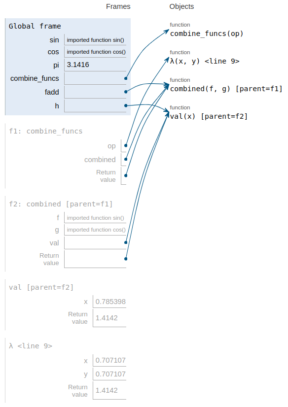
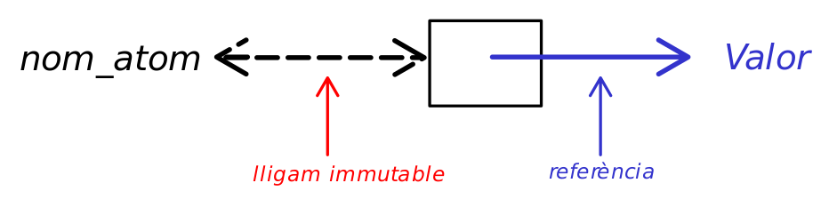

class: center, up

# CAP - _Closures_ - Model d'Entorns


**Jordi Delgado**, **Gerard Escudero**,

.large[**Curs 2024-25**: <ins>Sessions 5 i 6</ins>]


---

class: center, middle

# Sessió 05

---

## _Closures_: Introducció

### Definició

_In programming languages, a **closure**, also lexical closure or function
closure, is a technique for **implementing lexically scoped name binding
in a language with first-class functions**. Operationally, a closure is
a record storing a **function together with an environment**. The
environment is a mapping associating each free variable of the
function (variables that are used locally, but defined in an enclosing
scope) with the value or reference to which the name was bound when
the closure was created. Unlike a plain function, **a closure allows
the function to access those captured variables through the closure's
copies of their values or references, even when the function is
invoked outside their scope**._

.tiny[[.red[Font: Wikipedia]](https://en.wikipedia.org/wiki/Closure_%28computer_programming%29)]

---

## _Closures_: Introducció

Definim una funció `sumador`:

```Clojure
(defn sumador [n] (fn [x] (+ n x)))
```
Invocar aquesta funció implica retornar una funció:
```Clojure
(def suma_5 (sumador 5))
```
Ara `suma_5` està vinculat a una funció `(fn [x] (+ n x))` amb un nom **_lliure_**, `n`, tot i que:
```Clojure
(suma_5 1000) 👉 1005
(suma_5 -5)   👉 0
(suma_5 25)   👉 30
```
és a dir, `n` està vinculat al valor 5. Així, `n` és lliure respecte a la funció `(fn [x] (+ n x))` 
(`n` no és un paràmetre de la funció, tampoc és local), però aquesta funció `suma_5` <ins>_d'alguna manera sap_</ins>
que existeix un lligam entre `n` i el valor `5`.

**D'on treu `suma_5` aquest lligam entre `n` i el valor `5`?**

---

## _Closures_: Introducció

A Clojure la **_visibilitat_** dels diferents símbols ve determinada
pel seu **_context lèxic_** (**_lexical scope_**), que és
fàcilment determinat a partir del _text_ del programa (per això
s'anomena _lèxic_).

En l'exemple de la plana anterior, el context lèxic de `(fn [x] (+ n x))` conté el símbol `n`, i qualsevol
lligam que aquest pugui tenir amb un valor. 

Així, el que ha retornat la funció `sumador` **NO** és _només_ una funció,
és **una funció que ha capturat el seu context lèxic**.

Això és el que anomenarem <ins>**_closure_**</ins>: <ins>_funció que captura el seu context lèxic_</ins>.

Els paràmetres d'una funció formen part del context lèxic del cos de la funció. La definició
de símbols locals fent servir `let` també afegeix símbols al context lèxic del cos del `let`.

```Clojure
(def sumador #(let [n %] (fn [x] (+ n x)))) 👉 #'user/sumador

(def suma_10 (sumador 10)) 👉 #'user/suma_10

(suma_10 50) 👉 60
```

---

## _Closures_: Introducció

Cal entendre bé el concepte de _captura del context lèxic_, ja que una
funció es <ins>**_crea_**</ins> dins un determinat context lèxic i es
pot <ins>**_cridar_**</ins> (<ins>**_invocar_**</ins>) dins d'altres
contextos lèxics. Veiem-ne un exemple senzill: En aquest codi,

```Clojure
(def foo (let [bar 1] 
           (fn [] bar))) 👉 #'user/foo

(foo) 👉 1

(let [bar 5] (foo)) 👉 ???
```

Quin valor retorna `(let [bar 5] (foo))`?

---

## _Closures_: Introducció

Cal entendre bé el concepte de _captura del context lèxic_, ja que una
funció es <ins>**_crea_**</ins> dins un determinat context lèxic i es
pot <ins>**_cridar_**</ins> (<ins>**_invocar_**</ins>) dins d'altres
contextos lèxics. Veiem-ne un exemple senzill: En aquest codi,

```Clojure
(def foo (let [bar 1] 
           (fn [] bar))) 👉 #'user/foo

(foo) 👉 1

(let [bar 5] (foo)) 👉 ???
```

Quin valor retorna `(let [bar 5] (foo))`?

```Clojure
(def foo (let [bar 1] 
           (fn [] bar))) 👉 #'user/foo

(foo) 👉 1

(let [bar 5] (foo)) 👉 1
```
Ja que el nom `bar` (i el corresponent lligam al valor `1`) capturat
per `foo` és el que pertany al **_context lèxic en el moment de
<ins>crear</ins> la funció_**, no al context lèxic en el moment de
<ins>_cridar_</ins> la funció.

---

## _Closures_: Funcions d'ordre superior

Les _closures_ poden **_compartir_** el context lèxic:

```Clojure
(defn sumador_amb_consulta
  "Retorna dues closures que comparteixen el mateix context lèxic"
  [n]
  [#(+ % n), #(identity n)])
  
(let [[suma, què-val-n] (sumador_amb_consulta 100)]
  (println (suma 100))
  (println (suma 10))
  (què-val-n)) 👉 100
👁️ 200
👁️ 110
```
Les dues funcions `suma` i `què-val-n` han capturat el context lèxic del moment en que han estat 
<ins>**_creades_**</ins>, dins la invocació de `sumador_amb_consulta`. Aquest context lèxic, però,
és el **_mateix_** per a les dues funcions.


Fixem-nos que aquest context lèxic capturat prové de paràmetres de
funcions o bé de noms locals que lliguem amb `let`. Això implica que
aquests contextos lèxics són **_immutables_**, és a dir, un cop
lligats els noms a uns valors, no podem modificar aquest lligam. Els
valors lligats als noms capturats estan "_congelats_".

De moment, continuarem explorant les possibilitats de les _closures_
que capturen un context lèxic immutable...

---

## _Closures_: Estructures associatives amb funcions

Si tenim funcions d'ordre superior podem implementar estructures de dades. 
Perdem en eficiència, però aquest és un exercici, un cop més, en expressivitat.

Veiem un exemple: Estructures associatives. Imaginem que volem crear una 
estructura que em permeti associar claus a valors, i fer cerques sobre aquestes
claus per recuperar els valors associats. Operacions que volem sobre aquesta 
estructura: `crear`/`cercar`/`afegir`. 

Volem construir una estructura així fent servir <ins>_només_</ins> funcions.

```Clojure
(defn crear []
    (fn [_] :default)) ;; retornem una funció que retorna un valor per defecte

(defn cercar [estructura clau]
    (estructura clau))
    
(defn afegir [estructura [clau valor]]
    (fn [clau']
        (if (= clau' clau)
            valor
            (cercar estructura clau'))))

(def d (reduce afegir (crear) [[:a 1], [:b 2], [:c 3], [:d 4]]))

(cercar d :b) 👉 2
(cercar d :d) 👉 4
(cercar d :e) 👉 :default
```
---

## _Closures_: Estructures associatives amb funcions

Podem fer quelcom de similar d'una manera més compacta (i més difícil d'entendre 😀)


```Clojure
(defn crear
  ([] (crear (fn [_] :default)))
  ([prev]
   (letfn [(afegir [k v]
             (letfn [(cercar [k2]
                       (if (= k k2) v
                           (prev k2)))]
               [cercar, (crear cercar)]))]
     afegir)))
     
(let [ afegir1 (crear)
      [cercar2, afegir2] (afegir1 :a 1)
      [cercar3, afegir3] (afegir2 :b 2)
      [cercar4, afegir4] (afegir3 :c 3)
      [cercar5, afegir5] (afegir4 :d 4)]
  (println (cercar5 :a))
  (println (cercar5 :c))
  (println (cercar5 :b))
  (println (cercar5 :d))
  (println (cercar3 :c))) 👉 nil
👁️ 1
👁️ 3
👁️ 2
👁️ 4
👁️ :default

```
---

## _Closures_: Un altre exemple

Veiem un altre exemple: Implementeu `repetits`, que és una funció que retorna
una funció per detectar arguments repetits. Com a efecte secundari de
les crides repetides, s'escriu cada argument que s'ha utilitzat abans
en una seqüència de crides repetides. Per tant, si un argument
apareix $n$ vegades, s'escriu $n - 1$ vegades en total, cada cop que
el trobi (diferent del primer cop). La funció `detector` forma part
de la implementació de `repetits`, cal determinar com s'utilitza.red[*].
<ins>Important</ins>: _no podeu utilitzar cap llista, conjunt o
qualsevol altre col·lecció_
 
```Clojure
(defn detector
  [f]
  (letfn [(g [i]
            (when (f i) (println i))
            (detector #(or (= % i) (f %))))]
    g))
(defn repetits
  [k]
  ??)

(def f (((((((((((repetits 1) 7) 7) 3) 4) 2) 5) 1) 6) 5) 1)) 👉 #'user/f
👁️ 7
👁️ 1
👁️ 5
👁️ 1
```
.footnote[.red[*] [Font](https://cs61a.org/exam/fa18/mt1/61a-fa18-mt1_sol.pdf)]

---

## _Closures_: Un altre exemple

Veiem un altre exemple: Implementeu `repetits`, que és una funció que retorna
una funció per detectar arguments repetits. Com a efecte secundari de
les crides repetides, s'escriu cada argument que s'ha utilitzat abans
en una seqüència de crides repetides. Per tant, si un argument
apareix $n$ vegades, s'escriu $n - 1$ vegades en total, cada cop que
el trobi (diferent del primer cop). La funció `detector` forma part
de la implementació de `repetits`, cal determinar com s'utilitza.red[*].
<ins>Important</ins>: _no podeu utilitzar cap llista, conjunt o
qualsevol altre col·lecció_
 
```Clojure
(defn detector
  [f]
  (letfn [(g [i]
            (when (f i) (println i))
            (detector #(or (= % i) (f %))))]
    g))
(defn repetits
  [k]
  ((detector (fn [_] false)) k))
  
(def f (((((((((((repetits 1) 7) 7) 3) 4) 2) 5) 1) 6) 5) 1)) 👉 #'user/f
👁️ 7
👁️ 1
👁️ 5
👁️ 1
```
.footnote[.red[*] [Font](https://cs61a.org/exam/fa18/mt1/61a-fa18-mt1_sol.pdf)]

---

## _Closures_: Un altre exemple

Fixeu-vos que el que retorna la crida repetida a `repetits` té "_memòria_" (‼)

```Clojure
(defn detector
  [f]
  (letfn [(g [i]
            (when (f i) (println i))
            (detector #(or (= % i) (f %))))]
    g))
  
(defn repetits
  [k]
  ((detector (fn [_] false)) k))

(def f (((((((((((repetits 1) 7) 7) 3) 4) 2) 5) 1) 6) 5) 1)) 👉 #'user/f
👁️ 7
👁️ 1
👁️ 5
👁️ 1

(def ff (f 2))     👉 #'user/ff
👁️ 2

(def fff (ff 8))   👉 #'user/fff

(def ffff (fff 8)) 👉 #'user/ffff
👁️ 8

```

---

## _Closures_: Un patró d'ús

Aquests dos darrers exemples, la versió compacta de `crear` i el `repetits`, tenen un _patró
comú_, freqüent en l'ús del retorn de _closures_. Mirem de generalitzar (informalment):

```Clojure
(defn fun 
  [f]
  (letfn [(g [params de g]
            ... crear una nova funció nova_f, que inclogui alguna crida a f
            ... crida a (fun nova_f))]
    g))
```

Això permet anar explotant els diferents contextos lèxics que s'han anat capturant a mida
que es va cridant la funció retornada `g` en diversos estadis del procés a realitzar. Així, podem 
anar _emmagatzemant_ informació, malgrat la immutabilitat dels contextos capturats.

La crida `(fun nova_f)` en realitat només serveix per donar més context a la nova `g` que serà
retornada, a partir de la funció `nova_f` que ja fa servir la `f` que s'ha utilitzat com a argument
en la crida anterior.

Estudiem amb detall l'exemple del `repetits`, per il·lustrar el patró...

---

## _Closures_: Un patró d'ús

```Clojure
;; (repetits 1) en realitat crida a ((detector (fn [_] false)) 1)
;; Pas 1        f1
;;        -------------
(detector (fn [_] false)) ➡️  g1
;; on (g1 1) és
 (when (f1 1) (println 1))
 (detector #(or (= % 1) (f1 %)))

;; Pas 2           f2
;;        --------------------
(detector #(or (= % 1) (f1 %))) ➡️  g2
;; on (g2 7) és (suposem que la següent crida es fa amb 7)
 (when (f2 7) (println 7))
 (detector #(or (= % 7) (f2 %)))
 
;; Pas 3           f3
;;        --------------------
(detector #(or (= % 7) (f2 %))) ➡️  g3
;; on (g3 1) és (suposem que la següent crida es fa amb 1)
 (when (f3 1) (println 1))
 (detector #(or (= % 1) (f3 %)))
 
;; Pas 4           f4
;;        --------------------
(detector #(or (= % 1) (f3 %))) ➡️  g4
;; on (g4 5) és (suposem que la següent crida es fa amb 5)
 (when (f4 5) (println 5))
 (detector #(or (= % 5) (f4 %)))
 
;; ...
```

---

## _Closures_: Un patró d'ús

Fixem-nos què passa en avaluar les diferents `g` que van apareixen, concretament, en les crides a 
`(fk i)` que determinen si un argument `i` s'escriu o no:

```Clojure
;; Pas 1
(f1 1) = ((fn [_] false) 1) = false  ;; per tant l'1 no s'escriu

;; Pas 2
(f2 7) = (#(or (= % 1) (f1 %)) 7) = (f1 7) = 
                                  = ((fn [_] false) 7) = false
;; per tant el 7 no s'escriu

;; Pas 3
(f3 1) = (#(or (= % 7) (f2 %)) 1) = (f2 1) = 
                                  = (#(or (= % 1) (f1 %)) 1) = true 
;; per tant el 1 sí s'escriu

;; Pas 4
(f4 5) = (#(or (= % 1) (f3 %)) 5) = (f3 5) = 
                                  = (#(or (= % 7) (f2 %)) 5) = ... = false
;; per tant el 5 no s'escriu

;; ...

``` 
Com que cada `fk` és un _closure_, ha capturat l'ús de `f{k-1}` i
així, _implícitament_, la invocació de totes les funcions que s'han
definit fins el moment, sent capaç de _memoritzar_ (en els contextos
lèxics capturats) cada un dels elements que han aparegut.

---

## _Closures_: Divideix i venç


Esperem que estigui clar a hores d'ara que la capacitat de fer
servir funcions d'ordre superior ens permet treballar a nivells
d'abstracció més "_alts_" dels que podem assolir si no tenim aquesta
capacitat.

Un dels exemples més clars d'això és la possibilitat d'"_algorismitzar_" esquemes de
disseny algorísmic. Veiem com passar de l'esquema al programa amb l'esquema de **_Dividir i Vèncer_**.red[*].

_In computer science, **divide and conquer** is an **algorithm design
paradigm**. A divide-and-conquer algorithm recursively breaks down a
problem into two or more sub-problems of the same or related type,
until these become simple enough to be solved directly. The solutions
to the sub-problems are then combined to give a solution to the
original problem_.

Exemples coneguts de l'aplicació d'aquest esquema són: la cerca binària, Quicksort,
Mergesort, producte ràpid de Karatsuba, la multiplicació de matrius de Strassen, l'algorisme de
Cooley-Tukey per calcular la transformada ràpida de Fourier, etc.

Anem a veure com transformar aquest esquema, o _design paradigm_, en
un programa. Farem servir el cas més senzill, deixem com a
**exercici** la seva generalització.

.footnote[.red[*] [Font](https://en.wikipedia.org/wiki/Divide-and-conquer_algorithm)]

---

## _Closures_: Divideix i venç

Suposem que els valors sobre els que treballarem són **vectors**. I suposem també que disposem
de les següents quatre funcions: 

* `trivial`: Funció que detecta el cas trivial, o cas base, del problema
* `directe`: Acció a realitzar en el cas base.
* `dividir`: Si no estem en el cas base, cal dividir el problema en dos sub-problemes.
* `vèncer`: Acció a realitzar per composar les solucions dels subproblemes.

Aleshores, donat un problema concret sobre vectors pel que hem
definit les funcions anteriors, i l'esquema en forma de programa `dIv`
(encara per definir), el programa per resoldre el problema seria:

```Clojure
(def solució (dIv trivial directe dividir vèncer))
```
Concretem-ho amb un exemple clàssic: **Quicksort**

---

## _Closures_: Divideix i venç

Les funcions anteriors pel cas particular del _Quicksort_ podrien ser:

```Clojure
(def trivial #(< (count %) 2)) ;; vector buit o amb un sol element

(def directe identity)         ;; no cal fer res en el cas base

(defn dividir
  "vct té més d'un element"
  [vct]
  (let [[x & rstv] vct         ;; el pivot serà el primer element del vector
        menors (filter #(<= % x) rstv)
        majors (filter #(> % x)  rstv)]
    [menors,majors]))          ;; retornem les dos subvectors

(defn vèncer
  "Pel quicksort no ens importa la parella de vectors originals"
  [vct _ [sol1 sol2]]
  (concat sol1 [(first vct)] sol2))  ;; combinem solucions amb el pivot
```
Aleshores...
```Clojure
(def quicksort (dIv trivial directe dividir vèncer))

(let [s  (shuffle (range 20))]
   (println s)
   (quicksort s))
👁️ [9 6 15 3 2 4 13 5 17 7 11 1 14 12 0 16 18 10 19 8]
👉 (0 1 2 3 4 5 6 7 8 9 10 11 12 13 14 15 16 17 18 19)
```

---

## _Closures_: Divideix i venç

Finalment, com és `dIv`? Naturalment és una _closure_ on, donades les
funcions mencionades, es retorna una funció que només requereix
l'entrada del problema (en aquest cas un vector, o seqüència). Com hem
dit abans, aquest és el cas més senzill, on suposem que la
descomposició del problema és en dos subproblemes:

```Clojure
(defn dIv
  [trivial directe dividir vèncer]
  (letfn [(dIv' [vct]
            (if (trivial vct)
              (directe vct)
              (let [[x1 x2] (dividir vct)
                    y1 (dIv' x1)
                    y2 (dIv' x2)]
                (vèncer vct [x1,x2] [y1,y2]))))]
    dIv'))
```
Fixem-nos que és pràcticament una _transcripció literal_ de l'esquema de _dividir i vèncer_ 
que tots coneixem.

Aquest és un gran exemple de fins a quin punt tenir funcions d'ordre superior pot canviar la nostra
manera de programar.

---

## _Closures_: El model d'entorns

Una manera de copsar aquest mecanisme de captura del context lèxic és
mitjançant el **_model d'entorns_**<sup>.red[1]</sup>, que ens permet entendre:
__Què passa quan es crida una funció?__<sup>.red[2]</sup>.

Quan es **_crida_** una funció es **_crea un nou entorn_** on s'aparellen els
paràmetres (formals) i els arguments de la crida a la funció.
L'aparellament és posicional si no hi intervenen mecanismes de
_destructuring_, en altre cas l'aparellament ve determinat per l'esquema
de _destructuring_ proporcionat.

Aquest nou entorn creat en cridar la funció serà l'entorn on s'ubiquen
els noms nous que apareixen en el cos de la funció. Aquest entorn nou
s'ha de vincular a l'**_entorn de <ins>creació</ins> de la funció_** (anomenat
**_entorn pare_** del nou entorn creat), que és on començarà la cerca dels
noms _lliures_ que apareixen en el cos de la funció.

Així es crea una **_cadena d'entorns_** que comença en l'entorn
pare de la funció-_closure_ (l'entorn on s'ha _creat_), i és essencialment
el **_context lèxic_** que la funció-_closure_ captura.

.footnote[.red[1] Cal tenir clar que és un _model_, és a dir, no és
una descripció acurada de com ho implementa Clojure. És
una versió simplificada que ens permet entendre què succeeix, sense
entrar en tot detall. 

.red[2] Veure
[SICP](https://web.mit.edu/6.001/6.037/sicp.pdf), capítol 3 (encara
que s'explica fent servir Scheme) o [Composing
Programs](https://www.composingprograms.com/), seccions 1.3 i 1.6, per
a una explicació fent servir Python (sense mencionar el `let`)]

---

## _Closures_: El model d'entorns

I per què parlem només de les crides a funció? Per què no parlem dels
contextos lèxics que es creen en un `let`?

**_Un `let` és essencialment una sèrie de crides a funció_**.

Fer (ignorem el _destructuring_, per simplificar, però no perdem generalitat)
```Clojure
(let [x1 expr1, x2 expr2, ..., xn exprn] cos-del-let)
```
és el mateix (en el que pertoca el que estem tractant, poden haver diferències en aspectes que no són importants
ara en aquest context) que:
```Clojure
((fn [x1]
     ((fn [x2]
          ...
          ((fn [xn] cos-del-let) exprn)...) expr2) expr1))
```

**Exercici**: Un `let` podria ser equivalent a: 
```Clojure
((fn [x1, x2, ..., xn] cos-del-let) expr1, expr2, ..., exprn)
```
Per quina raó NO ho és?

---

## _Closures_: El model d'entorns

Veiem un exemple no trivial d'aquesta equivalència entre el `let` i
les crides a funcions. Recordeu la plana
[10](https://jdelgadopin.github.io/CAP2024-25/s05_06.html#10)?

Transformem aquell `let` en crides a funcions:

```Clojure
((fn [afegir1]
   ((fn [[cercar2,afegir2]]
      ((fn [[cercar3,afegir3]]
         ((fn [[cercar4,afegir4]]
            ((fn [[cercar5,afegir5]]
               (println (cercar5 :a))
               (println (cercar5 :c))
               (println (cercar5 :b))
               (println (cercar5 :d))
               (println (cercar3 :c)))
             (afegir4 :d 4)))
          (afegir3 :c 3)))
       (afegir2 :b 2)))
    (afegir1 :a 1)))
 (crear)) 👉 nil
👁️ 1
👁️ 3
👁️ 2
👁️ 4
👁️ :default
```
---

## _Closures_: El model d'entorns

Veiem un exemple en Python, fent servir el [Python Tutor](https://pythontutor.com):

.cols5050[
.col1[
```Python
from math import sin, cos, pi
def combine_funcs(op):
    def combined(f,g):
        def val(x):
            return op(f(x),g(x))
        return val
    return combined
    
fadd = combine_funcs(lambda x,y: x + y)
h    = fadd(sin, cos)
print(h(pi / 4))
```
```Clojure
(require '[clojure.math :as m])
(defn combine_funcs [op]
  (letfn [(combined [f g]
            (letfn [(val [x] 
                      (op (f x) (g x)))]
               val))]
    combined))

(let [fadd (combine_funcs #(+ %1 %2))
      h    (fadd m/sin m/cos)]
  (println (h (/ m/PI 4))))
```
]
.col2[

]
]


---

## _Closures_

<br>

I si el context lèxic conté entitats **_<ins>mutables</ins>_**?

<br>

**_One of the conclusions that we reached was that the "object" need not
be a primitive notion in a programming language; one can build
objects and their behaviour from little more than assignable value
cells and good old lambda expressions._**

Guy Steele, comentant el disseny d'Scheme, citat a [Let Over Lambda](https://letoverlambda.com/)

<br>
I sí, efectivament,

(...) **_assignable value cells and good old lambda expressions_** ➡️ **_Closures_**

---

class: center, middle

# Sessió 06

---

## _Closures_: Estat mutable en el context lèxic

Fins ara hem vist _closures_ que capturen un context lèxic format
per noms de paràmetres de funcions i per noms definits per
`let` i/o `letfn`. Aquests noms no admeten cap canvi en el seu lligam
a un valor, per tant el context lèxic està format per
_lligams (entre noms i valors) immutables_.

Clojure, però, no és un llenguatge funcional _pur_, com ho pot ser
Haskell. Així, és possible que una _closure_ tingui i manipuli entitats
**_mutables_**. La diferència amb altres llenguatges és que a
Clojure cal fer-ho **_explícitament_**. Clojure té varies maneres de
manipular i fer mutable l'estat, fent servir `vars`, `atoms`, `refs` o
`agents`.red[*] (anomenats _reference types_).

`refs` i `agents` tenen un paper molt important a l'hora de gestionar
la concurrència a Clojure, tema que nosaltres no tractem. Les `vars`
també tenen algunes propietats interessants que nosaltres tampoc
veurem en detall, com el fet de tenir _abast dinàmic_
(_dynamic scoping_).

El mecanisme que nosaltres farem servir per treballar amb estat
mutable seran els `atoms`. Així podrem tenir les _assignable value
cells_ que menciona la cita de Guy Steele a la sessió anterior.

.footnote[.red[*] Vegeu [aquest](https://clojure-doc.org/articles/language/concurrency_and_parallelism/) article o
el capítol 10 de _The Joy of Clojure_]

---

## _Closures_: Atoms

Els `atoms`.red[*] a Clojure són objectes que "_contenen_" _referències_ a valors. Quan 
vinculem un nom a un `atom` estem creant un lligam immutable entre el nom i aquest
objecte. La diferència ara és que _podem accedir a allò referenciat i modificar aquesta 
referència_. Fixem-nos que això no afecta la immutabilitat del lligam entre el nom i
l'objecte que "_conté_" aquesta referència.

Les funcions principals que farem servir són `atom`, la _read-macro_ `@` (alternativa a `deref`),
`swap!`, `reset!`.

```Clojure
(def nom_atom (atom 0)) 👉 #'user/nom_atom

(deref nom_atom ) 👉 0
@nom_atom         👉 0

(swap! nom_atom #(+ % 10)) 👉 10
@nom_atom                  👉 10

(reset! nom_atom 5) 👉 5
@nom_atom           👉 5
```
Els `atoms` poden tenir _validators_ (funcions associades que controlen
que els valors referenciats compleixin uns determinats requeriments), però no en farem
gaire ús.

.footnote[.red[*] Vegeu la secció 10.4 de _The Joy of Clojure_ ]

---

## _Closures_: Atoms

.cols5050[
.col1[Gràficament:]
.col2[

]]

* `(atom valor)` - crea un `atom` amb una referència al `valor` proporcionat

* `(deref nom_atom)` - retorna el valor referenciat per l'objecte vinculat a `nom_atom` (`@nom_atom` és el mateix que `(deref nom_atom)`)

* `(reset! nom_atom valor)` - fa que `valor` sigui referenciat per l'objecte vinculat a `nom_atom`

* `(swap! nom_atom f x y & args)` - `f` ha de ser <ins>_pura_</ins>. Retorna el nou valor.

|        versió de `swap!`        | fa que el nou valor de `nom_atom` sigui |
|---------------------------------|-----------------------------------------| 
| `(swap! nom_atom f)`            | `(apply f ( @nom_atom ))`
| `(swap! nom_atom f x)`          | `(apply f @nom_atom ( x ))`
| `(swap! nom_atom f x y)`        | `(apply f @nom_atom x ( y ))`
| `(swap! nom_atom f x y & args)` | `(apply f @nom_atom x y args)`

---

## _Closures_: Objectes

Tornem a les _closures_...

En el moment que podem tenir `atoms` com a part del context lèxic capturat per una
_closure_ ja podem tenir un "_estat intern_" mutable del que treure'n profit:

```Clojure
(def comptador-funcs (let [comptador (atom 0)] [#(identity @comptador)
                                                #(reset! comptador 0)
                                                #(swap! comptador + %) 
                                                #(swap! comptador - %)]))
(def consulta   (get comptador-funcs 0)) 👉 #'user/consulta
(def reset      (get comptador-funcs 1)) 👉 #'user/reset
(def incrementa (get comptador-funcs 2)) 👉 #'user/incrementa
(def decrementa (get comptador-funcs 3)) 👉 #'user/decrementa

(reset)        👉 0
(incrementa 3) 👉 3
(incrementa 3) 👉 6
(incrementa 5) 👉 11
(consulta)     👉 11
(decrementa 9) 👉 2
(consulta)     👉 2
```
Vinculem a `comptador-funcs` un vector amb quatre _closures_. Les quatre _closures_ han capturat
el **mateix** context lèxic, en aquest cas l'`atom` anomenat `comptador`.

---

## _Closures_: Objectes

**Exercici**: Donades aquestes dues funcions, expliqueu per què s'observa el que s'observa en executar-les:
.cols5050[
.col1[
```Clojure
(defn codi-a []
 (let [res (atom [])
       estat (atom 0)]
   (loop [i 1]
     (if (> i 3)  @res
       (do
         (swap! estat (fn [_] i))
         (swap! res
          #(conj % 
            (fn [] (println @estat))))
         (recur (inc i)))))))
```
]
.col2[
```Clojure
(defn codi-b []
 (let [res (atom [])]
   (loop [i 1]
     (let [estat (atom 0)]
       (if (> i 3)  @res
         (do
           (swap! estat (fn [_] i))
           (swap! res
            #(conj % 
              (fn [] (println @estat))))
           (recur (inc i))))))))
```
]]

```Clojure
(def c-a (codi-a)) 👉  #'user/c-a             (def c-b (codi-b)) 👉  #'user/c-b

;; Executem c-a...              ...i c-b

((c-a 0)) 👉 nil                  ((c-b 0)) 👉 nil
👁️ 3                              👁️ 1
((c-a 1)) 👉 nil                  ((c-b 1)) 👉 nil
👁️ 3                              👁️ 2
((c-a 2)) 👉 nil                  ((c-b 2)) 👉 nil
👁️ 3                              👁️ 3
```


---

## _Closures_: Estructures de dades

Que diverses _closures_ puguin capturar i compartir entitats mutables és una idea molt potent. De fet,
res ens allunya del concepte clàssic d'_objecte_, no en el sentit d'_instància d'una classe_, sinò en el sentit
d'un _estat_ mutable i **_privat_** al que només es pot accedir via uns "_mètodes_" (les _closures_ que comparteixen
aquest _estat_).

Veiem-ne un exemple:

```Clojure
(defn generador_piles
  []
  (let [ed  (let [pila (atom []),
                  mida (atom 0)]
              {:reset    #(do (swap! pila (fn [_] [])) (swap! mida (fn [_] 0))),
               :push     #(do (swap! pila conj %) (swap! mida inc)),
               :top      #(when (> (count @pila) 0) (peek @pila)),
               :pop      #(when (> (count @pila) 0) 
                             (let [r (peek @pila)] 
                               (swap! pila pop) (swap! mida dec) r)),
               :empty?   #(= (count @pila) 0),
               :size     #(identity @mida)
               })]
    (fn [& cmd]
      (let [instr (keyword (first cmd)),
            argum (rest cmd)
            f     (instr ed)]
        (apply f argum)))))
```
---

## _Closures_: Estructures de dades

`generador_piles` retorna una funció per manipular un `map` de
parelles _keyword_-_closure_, que alhora capturen i comparteixen dos `atoms`, amb valors
un vector i un enter, per tal de manipular-los amb les
operacions que caracteritzen una pila.

```Clojure
(def p (generador_piles)) 👉 #'user/p
(p 'reset) 👉 0

(p 'push 2) 👉 1
(p 'push \t) 👉 2
(p 'push "hello") 👉 3

(p 'size) 👉 3
(p 'empty?) 👉 false 

(p 'top) 👉 "hello"
(p 'pop) 👉 "hello"

(p 'top) 👉 \t
(p 'pop) 👉 \t

(p 'top) 👉 2
(p 'pop) 👉 2

(p 'empty?) 👉 true

```
---

class: center, middle

# _Closures_: Altres exemples

---

## _Closures_: Composició de funcions

Tot i que tenim `comp` a Clojure, tenint _closures_ en realitat no ens
cal. 

Veiem un exemple senzill, on fem una funció `my-comp` per
composar funcions amb una seqüència com a paràmetre i que retornen una
seqüència:

```Clojure
(defn my-comp [& funcs]
  "funcs és una col·lecció de funcions f tals que f: seqüència -> seqüència"
  (fn [arg] (fold #(%1 %2) arg funcs)))  ;; recordeu el fold?
        
(def foo (my-comp reverse sort (partial map #(* 2 %)) (partial filter even?))) 
👉 #'user/foo
(foo (range 20)) 👉 (36 32 28 24 20 16 12 8 4 0)

((my-comp reverse) (range 10)) 👉 (9 8 7 6 5 4 3 2 1 0)

((my-comp) (range 20)) 👉 (0 1 2 3 4 5 6 7 8 9 10 11 12 13 14 15 16 17 18 19)

```

Òbviament un `my-comp` general requeriria una implementació més sofisticada.

---

## _Closures_: Iteradors

```Clojure

```

---

## _Closures_: Decoradors

```Clojure

```

---

## _Closures_

<br>

I fins aquí. 

Teniu més exemples com a [exercicis](https://gebakx.github.io/cap/clausures.html#1) de laboratori.


