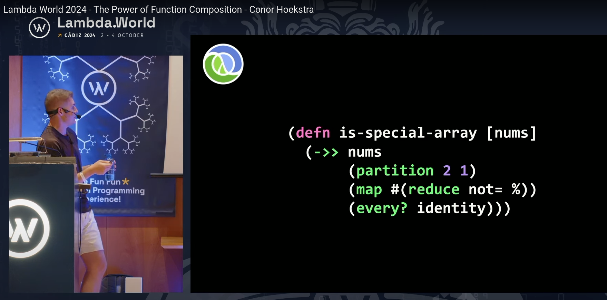
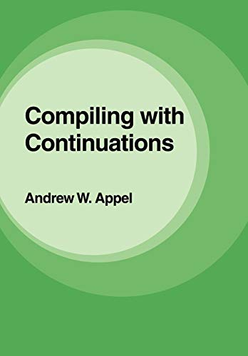
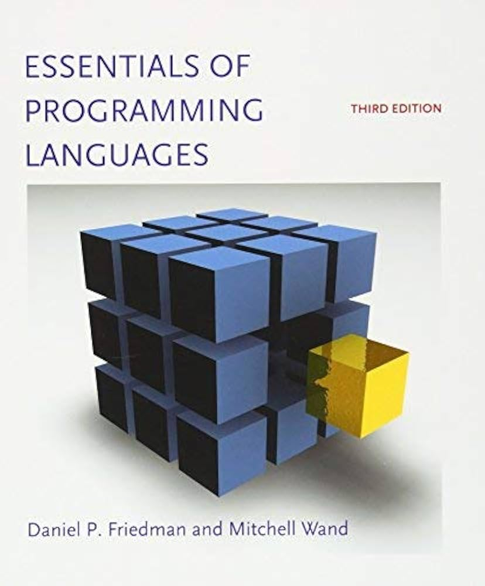

class: center, up

# CAP - Tècniques de Programació amb FOS


**Jordi Delgado**, **Gerard Escudero**,

.large[**Curs 2024-25**: <ins>Tema 4</ins>]


---

## Tècniques de Programació amb FOS

En aquest tema veurem tècniques de programació fortament lligades al fet de tenir _Funcions d'Ordre 
Superior_ (FOS). En alguns casos seran tècniques noves, que encara no hem vist, i en alguns casos ens
limitarem a posar nom a tècniques que ja hem fet servir en posar exemples dins els dos temes anteriors.

Començarem per una tècnica que ja hem vist quan hem insistit en fer servir el _point-free style_ 
o _Tacit programming_, és a dir, en definir funcions a partir de la composició d'altres funcions. 
En fer servir aquest estil sovint no cal fer explícits els paràmetres (d'aquí l'expressió _point-free_).

Definir funcions fent servir la composició de funcions s'anomena **_pipelining_**. A Clojure, la funció
`comp`, juntament amb la possibilitat de definir funcions _parcials_ fent servir `partial`, ens 
permet fer servir molt fàcilment aquesta tècnica.

Al [laboratori](https://gebakx.github.io/cap/problemes/first-class.pdf) heu tingut ocasió de 
practicar el _pipelining_, per exemple:

```Clojure
(def prod-of-evens (comp (partial apply *) (partial filter even?)))

(def scalar-product (comp (partial apply +) (partial map *)))
```


---

## _Pipelining_

Un altre exemple, l'[exercici 4](https://gebakx.github.io/cap/firstClass.html#18) de la sessió de 
[Funcions _First-Class_](https://gebakx.github.io/cap/firstClass.html) podríem haver-lo resolt
així:

```Clojure
;; Escriu una funció que, donat un vector de maps amb les claus :preu i 
;; :quantitat, calculi el total per cada element (preu * quantitat), elimini 
;; els que tinguin un valor total inferior a 100 i sumi tots els totals.

(def exercici4 (comp (partial apply +) 
                     (partial filter #(< 100 %)) 
                     (partial map #(* (:preu %) (:quantitat %)))))
```


De vegades, però, tot i tenint ocasió de fer servir el _pipelining_ no l'hem utilitzat. Si
recordeu la versió funcional de l'[algorisme de Kadane](https://jdelgadopin.github.io/CAP2024-25/s03_04.html#27):
```Clojure
(def kadane #(apply max (scanr max0 0 %)))
```
podríem haver-ho definit:
```Clojure
(def kadane (comp (partial apply max) (partial scanr max0 0)))
```
---

##_Pipelining_: El Patró

El mateix concepte de _pipeline_ és considerat un patró de disseny.red[*]

_The Pipeline pattern organizes a series of computational steps so
that each step handles a specific aspect of processing. In Clojure,
this translates well due to its functional programming paradigm that
supports higher-order functions and data immutability._

```Clojure
;; Segons el lloc web font d'aquesta transparència...

(defn run-pipeline [data & steps]
  (reduce (fn [d step] (step d)) data steps))
```
Us [sona](https://jdelgadopin.github.io/CAP2024-25/s05_06.html#33)?... És força similar
al `my-comp` que vam definir el tema passat.

```Clojure
(defn my-comp [& funcs]
  "funcs: llista de funcions d'un paràmetre tals que 'té sentit' composar-les"
  (fn [arg] 
      "arg ha de pertànyer al domini de la darrera funció de funcs"
      (fold #(%1 %2) arg funcs)))
```

.footnote[.red[*] [Pipeline in Clojure](https://softwarepatternslexicon.com/patterns-clojure/behavioral/pipeline/)]

---

## _Pipelining_: Les _arrow macros_

Clojure ens proporciona un parell de macros que ens aniran molt bé per
utilitzar _pipelining_ i fer més llegibles les funcions resultants: Les **_arrow macros _** (**->** i
**->>**). La idea és senzilla.red[*]: Convertir una sèrie de crides imbricades a funció en
en un flux lineal de crides a funció.

### La macro _thread-first_ (->)

Suposem que tenim funcions `f1`,`f2`,...,`fn` amb `k1`,`k2`,..., `kn` paràmetres cada una (`ki` > 0).
Per expressar:

```Clojure
(fn ... (f2 (f1 x ...) ...) ...)
```
Podem fer servir `->`, on es passa com a _primer_ argument el resultat de l'aplicació de
la funció anterior:

```Clojure
  (-> x (f1 ...)  ;; on ... representa els k1-1 arguments restants d'f1
        (f2 ...)  ;; on ... representa els k2-1 arguments restants d'f2
        ...
        (fn ...)) ;; on ... representa els kn-1 arguments restants d'fn
```
Si alguna de les funcions `fi` té un sol paràmetre, no cal fer servir parèntesi, només
cal escriure el nom.

.footnote[.red[*][Font](https://clojure.org/guides/threading_macros)]

---

## _Pipelining_: Les _arrow macros_

Clojure ens proporciona un parell de macros que ens aniran molt bé per
utilitzar _pipelining_ i fer més llegibles les funcions resultants: Les **_arrow macros _** (**->** i
**->>**). La idea és senzilla.red[*]: Convertir una sèrie de crides imbricades a funció en
en un flux lineal de crides a funció.

### La macro _thread-first_ (->)

Veiem-ne exemples (fixem-nos que no cal escriure `partial`):

```Clojure
(* (+ (- (/ 2 1) 3) 4 )5)      👉 15
(-> 2 (/ 1) (- 3) (+ 4) (* 5)) 👉 15 

(str (str (str "Això" " " "és" " ") 
          "un" " " "exemple" " " "de") 
     " " "la" " " "macro" " " "->")   👉 "Això és un exemple de la macro ->"
(->
 (str "Això" " " "és" " ")
 (str "un" " " "exemple" " " "de")
 (str " " "la" " " "macro" " " "->")) 👉 "Això és un exemple de la macro ->"
 
(.toUpperCase (first ["pollastre" "xai"]))  👉 "POLLASTRE"
(-> ["pollastre" "xai"] first .toUpperCase) 👉 "POLLASTRE"
```

.footnote[.red[*][Font](https://clojure.org/guides/threading_macros)]

---

## _Pipelining_: Les _arrow macros_

Clojure ens proporciona un parell de macros que ens aniran molt bé per
utilitzar _pipelining_ i fer més llegibles les funcions resultants: Les **_arrow macros _** (**->** i
**->>**). La idea és senzilla.red[*]: Convertir una sèrie de crides imbricades a funció en
en un flux lineal de crides a funció.

### La macro _thread-first_ (->)

Seguim amb exemples:

```Clojure
(assoc (assoc (assoc {} :clau1 24) :clau2 36) :clau3 48) 
👉 {:clau1 24, :clau2 36, :clau3 48}
(-> {}
    (assoc :clau1 24)
    (assoc :clau2 36)
    (assoc :clau3 48)) 👉 {:clau1 24, :clau2 36, :clau3 48}
    
(conj (conj (conj [] 3) 5) 7) 👉 [3 5 7]
(-> []
    (conj 3)
    (conj 5)
    (conj 7)) 👉 [3 5 7]
```

.footnote[.red[*][Font](https://clojure.org/guides/threading_macros)]

---

## _Pipelining_: Les _arrow macros_

Clojure ens proporciona un parell de macros que ens aniran molt bé per
utilitzar _pipelining_ i fer més llegibles les funcions resultants: Les **_arrow macros _** (**->** i
**->>**). La idea és senzilla.red[*]: Convertir una sèrie de crides imbricades a funció en
en un flux lineal de crides a funció.

### La macro _thread-last_ (->>)

Suposem que tenim funcions `f1`,`f2`,...,`fn` amb `k1`,`k2`,..., `kn` paràmetres cada una (`ki` > 0).
Per expressar:

```Clojure
(fn ... (f2 ... (f1 ... x)))
```
Podem fer servir `->>`, on es passa com a _darrer_ argument el resultat de l'aplicació de
la funció anterior:

```Clojure
  (->> x (f1 ...)  ;; on ... representa els k1-1 arguments restants d'f1
         (f2 ...)  ;; on ... representa els k2-1 arguments restants d'f2
         ...
         (fn ...)) ;; on ... representa els kn-1 arguments restants d'fn
```
Si alguna de les funcions `fi` té un sol paràmetre, no cal fer servir parèntesi, només
cal escriure el nom.

.footnote[.red[*][Font](https://clojure.org/guides/threading_macros)]

---

## _Pipelining_: Les _arrow macros_

Clojure ens proporciona un parell de macros que ens aniran molt bé per
utilitzar _pipelining_ i fer més llegibles les funcions resultants: Les **_arrow macros _** (**->** i
**->>**). La idea és senzilla.red[*]: Convertir una sèrie de crides imbricades a funció en
en un flux lineal de crides a funció.

### La macro _thread-last_ (->>)

Veiem-ne exemples (fixem-nos que no cal escriure `partial`):

```Clojure
(reduce + (map #(* % %) (filter odd? (range 10)))) 👉 165
(->> (range 10)
     (filter odd?)
     (map #(* % %))
     (reduce +)) 👉 165
     
(def prod-of-evens (comp (partial apply *) (partial filter even?)))
(defn prod-of-evens' [s]
  (->> s
       (filter even?)
       (apply *)))
(prod-of-evens  (range 1 21)) 👉 3715891200
(prod-of-evens' (range 1 21)) 👉 3715891200
```

.footnote[.red[*][Font](https://clojure.org/guides/threading_macros)]

---

## _Pipelining_: Exercicis Recapitulatoris

* Considereu una seqüència de parells `'[(n1,n2) (n3,n4) ...]` que
  implementa les arestes d'un graf no dirigit (no hi ha arestes
  repetides ni auto-bucles). Feu una funció `grau` que calculi el grau
  d'un vertex donat. Els vertexos es representen amb nombres.

* Sobre la mateixa representació de les arestes d'un graf no dirigit,
  feu ara una funció `veïns` que retorni els veïns d’un vèrtex donat,
  en ordre creixent.

* Donats dos vectors d’enters `x=(x1,...,xn)` i `y=(y1,...,yn)` de la
  mateixa mida, el seu producte escalar és `(apply + (map * x y))`.
  Suposant que podem permutar les coordenades de cada vector de la
  forma que volguem, podem escollir dues permutacions dels dos vectors
  que tinguin producte escalar mínim. Escriviu una funció `minProd`
  que, donats dos vectors de la mateixa mida, retorni el seu producte
  escalar mínim.
  
* Feu una funció `zerosNones` que, donat un `n ≥ 0`,
  retorni totes les combinacions de `z` zeros i `u` uns tals que `z + u = n`

* Els divisors propis d’un nombre `n` són tots els divisors positius de `n` més petits que `n`.
  Feu una funció `divisors` _eficient_ que retorni tots els divisors propis d'un nombre `n`
  ordenats decreixentment.

---

## _Pipelining_

Finalment, feu una ullada a aquest video: **The Power of Function
Composition**, per Conor Hoekstra al congrés _Lambda World 2024_, com a mínim fins
el minut **27:30**. 

Tot i que el podeu veure tot, ja que és força
interessant i veureu _en acció_ llenguatges de programació que
segurament no coneixeu.

.center[]

El podeu trobar a [youtube.com/watch?v=W7fjzdEJnvY](https://www.youtube.com/watch?v=W7fjzdEJnvY)

---

## _Continuation-Passing Style_ (CPS)

A la [Wikipedia](https://en.wikipedia.org/wiki/Continuation-passing_style) diu:

_In functional programming, **continuation-passing style** (CPS) is a
style of programming **in which control is passed explicitly in the form
of a continuation**. This is contrasted with direct style, which is the
usual style of programming. Gerald Jay Sussman and Guy L. Steele, Jr.
coined the phrase in AI Memo 349 (1975)_

Una funció escrita en CPS requereix un paràmetre addicional: Una
**_continuació_ explícita**, que és una funció d'un paràmetre.red[*].

Les funcions en CPS <ins>_no retornen mai_</ins>. Un cop han acabat de calcular el que sigui
que calculin, <ins>_cal invocar la continuació amb aquest resultat_</ins>. Per exemple:

```Clojure
;; La funció identitat, en CPS
(defn identity-cps [x,cont]
  (cont x))
  
(identity-cps "Hola Món!", identity) 👉 "Hola Món!"
(identity-cps "Hola Món!", #(apply str (concat % " Josep"))) 👉 "Hola Món! Josep"
```
.footnote[.red[*Font]: _The Joy of Clojure_, secció 7.3.4, p. 163]

---

## _Continuation-Passing Style_: Exemples

Veiem alguns exemples una miqueta més interessants que la `identity-cps`:

El factorial:
```Clojure
(defn fact-cps [n cont]
  (if (< n 2)
    (cont 1)
    (recur (dec n) (fn [m]
                     (cont (* n m))))))

(fact-cps  5 identity) 👉 120
(fact-cps 10 identity) 👉 3628800
(fact-cps 10 #(/ % 2)) 👉 1814400
```
El coeficient binomial $\binom{n}{k} = \frac{n!}{k!(n-k)!}$
```Clojure
(defn binomial-coef-cps [n k cont]
  (fact-cps n (fn [factn]
                (fact-cps k 
                    (fn [factk]
                      (fact-cps (- n k) 
                          (fn [factnk] (cont (/ factn (* factk factnk))))))))))
                    
(binomial-coef-cps 7 4 identity) 👉 35
(binomial-coef-cps 6 3 identity) 👉 20
```
---

## _Continuation-Passing Style_: Exemples

Sigui $n$ qualsevol natural estrictament positiu. Considereu el procés
següent: Si $n$ és parell, dividiu-lo per dos. Altrament,
multipliqueu-lo per 3 i sumeu-li 1. Quan arribeu a 1, pareu.

Per exemple, començant en $n=3$, s’obté la seqüència de Collatz $S(3):
3,10,5,16,8,4,2,1$. La mida d’aquesta seqüència és 7. Des de l’any 1937 es conjectura que aquest procés acaba per a
qualsevol $n$ inicial, encara que no ho ha sabut demostrar ningú. En
aquest problema suposarem que la conjectura és certa.

Escriu una funció `mida-collatz` que, donat un natural $n > 0$, retorni
la mida de la seqüència de Collatz corresponent a $n$, és a dir, quantes
iteracions del procés descrit més amunt calen per arribar a 1.

.cols5050[
.col1[
```Clojure
(defn mida-collatz [n]
  (if (== n 1) 0
    (let [nxt (if (zero? (mod n 2)) 
                (quot n 2) 
                (inc (* 3 n)))]
      (inc (mida-collatz nxt)))))

(mida-collatz 97)  👉 118
(mida-collatz 871) 👉 178
```
]
.col2[
```Clojure
(defn mida-collatz-cps [n cont]
  (if (== n 1) (cont 0)
    (let [nxt (if (zero? (mod n 2)) 
                (quot n 2) 
                (inc (* 3 n)))]
      (recur nxt (fn [v] 
                   (cont (inc v)))))))

(mida-collatz-cps 97 identity)  👉 118
(mida-collatz-cps 871 identity) 👉 178
```
]]

---

## _Continuation-Passing Style_: Exemples

El CPS pot ser útil en cas de voler interrompre l'execució d'una funció. 

Veiem un exemple:
Suposem seqüències "_multi-nivell_" amb nombres. Per exemple: 
`'(((1)) 2 ((3 4) (5 6) ((((7)))) (((8)) 9) 10))`. Volem fer una funció que multipliqui
tots els nombres d'aquestes seqüències.

Aquesta pot ser una solució:

```Clojure
(defn producte-seq
  "s és una seqüència 'multi-nivell' de nombres, o un nombre"
  [s]
  (cond
    (number? s) s
    :else (if (empty? s) 1
              (let [[cap & cua] s
                    prod-cap    (producte-seq cap)
                    prod-cua    (producte-seq cua)]
                (* prod-cap prod-cua)))))
                
(producte-seq '(((1)) 2 ((3 4) (5 6) ((((7)))) (((8)) 9) 10))) 👉 3628800
(producte-seq '())   👉 1
(producte-seq  3 )   👉 3
(producte-seq '(10)) 👉 10
```
Si un dels nombres és `0` podríem retornar immediatament, sense procedir amb el
que queda de càlcul. Aquesta solució, però, no ho fa.

---

## _Continuation-Passing Style_: Exemples

Podem passar aquesta funció a CPS:

```Clojure
(defn producte-seq-cps
  "s és una seqüència multi-nivell de nombres, o un nombre"
  [s cont]
  (cond
    (number? s) (cont s)
    :else (if (empty? s) (cont 1)
              (let [[cap & cua] s]
                (recur cap (fn [v]
                             (producte-seq-cps cua (fn [w]
                                                     (cont (* v w))))))))))
                                                     
(producte-seq-cps '(((1)) 2 ((3 4) (5 6) ((((7)))) (((8)) 9) 10)) identity)
👉 3628800
(producte-seq-cps '() identity)   👉 1
(producte-seq-cps  3  identity)   👉 3
(producte-seq-cps '(10) identity) 👉 10
```
Aquesta funció no fa el que volem, no interromp el càlcul si troba un `0`. En canvi, en veiem
la possibilitat, ja que podem invocar la continuació `cont` original, la que
es passa en la crida a `producte-seq-cps`, en trobar un `0`, o continuar
l'execució en altre cas. En aquest cas no fem distinció...

---

## _Continuation-Passing Style_: Exemples

Hauríem de diferenciar aquestes continuacions, l'original i les que continuen el càlcul.
Per a això, fem una funció auxiliar `go`:

```Clojure
(defn producte-seq-cps
  "s és una seqüència multi-nivell de nombres, o un nombre"
  [s cont]
  (letfn [(go [s cont']
             (cond
               (number? s) (if (zero? s)
                             (cont 0)    ;; <-- Atenció
                             (cont' s))  ;; <-- Atenció
               :else (if (empty? s) (cont' 1)
                         (let [[cap & cua] s]
                           (recur cap (fn [v]
                                        (go cua (fn [w]
                                                  (cont' (* v w))))))))))]
    (go s cont)))
    
(producte-seq-cps '(((1)) 2 ((3 4) (5 6) ((((7)))) (((8)) 9) 10)) identity)
👉 3628800
```

Quan trobem un nombre, si és `0` invoquem la continuació original, la que fem
servir a la crida original a la funció `producte-seq-cps`, en altre cas invoquem
la continuació de la crida a `go`. Quan fem servir la continuació original, tot allò
que està pendent de resoldre deixa d'estar-ho, senzillament no es fa.

---

## _Continuation-Passing Style_: Exemples

Ara modifiquem les funcions per afegir un `println` cada cop que trobem un nombre:

.cols5050[
.col1[
```Clojure
(producte-seq 
   '(((1)) 2 ((3 4) (5 6) (((7))))))
👁️ 1
👁️ 2
👁️ 3
👁️ 4
👁️ 5
👁️ 6
👁️ 7
👉 5040

(producte-seq 
   '(((1)) 2 ((3 0) (5 6) (((7))))))
👁️ 1
👁️ 2
👁️ 3
👁️ 0
👁️ 5
👁️ 6
👁️ 7
👉 0
```
]
.col2[
```Clojure
(producte-seq-cps 
   '(((1)) 2 ((3 4) (5 6) (((7)))))
    identity)
👁️ 1
👁️ 2
👁️ 3
👁️ 4
👁️ 5
👁️ 6
👁️ 7
👉 5040

(producte-seq-cps 
   '(((1)) 2 ((3 0) (5 6) (((7)))))
    identity)
👁️ 1
👁️ 2
👁️ 3
👉 0
```
]]

---

## _Continuation-Passing Style_: Exemples

.cols5050[
.col1[
```Clojure
(defn fibonacci [n]
  (if (< n 2) n
    (+ (fibonacci (dec n)) 
       (fibonacci (- n 2)))))

(fibonacci 10) 👉 55
(fibonacci 40) 👉 102334155
```
]
.col2[
```Clojure
(defn fibonacci-cps [n cont]
  (if (< n 2) (cont n)
    (recur (dec n) 
       (fn [fn1] 
         (fibonacci-cps (- n 2) 
            (fn [fn2] 
              (cont (+ fn1 fn2))))))))
               
(fibonacci-cps 10 identity) 👉 55
(fibonacci-cps 40 identity)
👉 Execution error (StackOverflowError)
```
]]

Així doncs, després de veure aquests exemples la idea hauria d'estar clara: Fer
explícit el "_lloc_" on aniran a parar els resultats de tot allò que
es calcula, és a dir, en realitat **_fem explícit el flux de
control del programa_**. Allò que anomenem **_continuació_** no és més
que la funció que rebrà el resultat del que sigui que calculi la
funció en qüestió, aquella a la que se li ha passat la continuació com
a argument.

Cal fixar-se en el detall que **_en CPS totes les invocacions de la continuació sempre es
fan en tail position_**. Això és precisament perquè la continuació rep el valor final
d'allò que es vol calcular, no cal fer cap procés posterior.

---

## _Continuation-Passing Style_: _Tail Call Optimization_

Aquest estil de programar és poc llegible, farragós i per tant els
programadors _humans_ no l'acostumen a fer servir. El quid de la
qüestió, però, és que la conversió de codi _normal_ a codi en CPS es
pot programar, és a dir, automatitzar. Això fa que el CPS s'hagi fet servir
sobre tot com a representació intermèdia per a eines que han de
manipular codi de manera automàtica, p.ex. compiladors.

Malgrat tot, en Clojure tenim un problema... la relació entre CPS & TCO.red[*]:

_Every call in CPS is a tail call, and the continuation is explicitly
passed. **Using CPS without tail call optimization (TCO) will cause not
only the constructed continuation to potentially grow during
recursion, but also the call stack. This is usually undesirable**, but
has been used in interesting ways -see the Chicken Scheme compiler. As
CPS and TCO eliminate the concept of an implicit function return,
their combined use can eliminate the need for a run-time stack._

A Clojure podem resoldre-ho quan la crida és recursiva final, aleshores podem fer
servir `recur`. Tot i això, no hi ha manera d'aplicar TCO a la crida a la continuació,
i ens podem trobar amb un `StackOverflowError`.

.footnote[.red[*] [Font](https://en.wikipedia.org/wiki/Continuation-passing_style)]

---

## _Continuation-Passing Style_: Exercicis Recapitulatoris

* Feu versions CPS de `my-map`, `my-filter`, i `my-reduce`:

```Clojure
(defn my-map [f s]
  (if (empty? s) '()
      (let [[cap & cua] s]
        (cons (f cap) (my-map f cua)))))

(defn my-filter [p s]
  (if (empty? s) '()
      (let [[cap & cua] s]
        (if (p cap)
          (cons cap (my-filter p cua))
          (my-filter p cua)))))

(defn my-reduce [f x0 s]
  (if (empty? s) x0
      (let [[cap & cua] s]
        (recur f (f x0 cap) cua))))
```

fixem-nos, però, que:

```Clojure
(my-reduce     +' 0 (range 1 100000)) 👉 4999950000
(my-reduce-cps +' 0 (range 1 100000) identity) 
👉 Execution error (StackOverflowError)
```

---

## _Continuation-Passing Style_

Alguns enllaços interessants:

* [pulley.cps](https://github.com/positronic-solutions/pulley.cps)
  _is part of the pulley collection of libraries. It
  provides a source-to-source compiler for **transforming normal Clojure
  code to Clojure code in Continuation Passing Style (CPS)**, as well as
  runtime support for executing the transformed code._
  
* [Cascade](https://github.com/lilactown/cascade) _is a library of
  continuation-passing, thunk producing versions of many Clojure core
  functions. The goal is to allow essentially unbounded recursion and
  mutual recursion of seq operations. This means that the seq
  operations in this library must not use the call stack. Instead,
  **they use a combination of continuation-passing to ensure that
  operations can always be in the tail position** and trampolining to
  ensure that operations do not use the call stack._
  
* [Rama on Clojure’s terms, and the magic of continuation-passing style](https://blog.redplanetlabs.com/2024/10/10/rama-on-clojures-terms-and-the-magic-of-continuation-passing-style/)
  (10 d'octubre de 2024) Nathan Marz, Blog Red Planet Labs.

---

## _Continuation-Passing Style_

Si voleu llegir més sobre el _Continuation-Passing Style_ (però no en Clojure):

.cols5050[
.col1[


.small[[Compiling with Continuations](https://doi.org/10.1017/CBO9780511609619)]
]
.col2[


.small[[Essentials of Programming Languages 3rd.ed.](https://eopl3.com/) Una de les principals
diferències entre les tres edicions és precisament l'algorisme per transformar codi a CPS]
]
]

---

## Trampolins

Si alguna cosa està clara a aquestes alçades de curs és com d'important es la recursivitat en
la programació funcional, i per tant com d'important és fer alguna cosa respecte al problema
de l'`StackOverflowError`.

Si tinguéssim TCO general, el problema està resolt. Fent servir CPS puc passar qualsevol
funció a una funció on totes les crides estan en _tail position_. Però a Clojure no tenim
TCO general.

La possibilitat de fer servir funcions d'ordre superior ens permet afrontar aquest problema
des d'un altre punt de vista: El **_trampolining_**.red[*].

A grans trets, la idea és que les funcions no retornin valors, sinò _funcions que retornen valors_.
Així no acumulem informació a la pila, a canvi de requerir, _grosso modo_, dues crides a funció
per cada crida a funció que cal fer.

Clojure té `trampoline`.red[*]

* Vegeu documentació [clojuredocs.org/clojure.core/trampoline](https://clojuredocs.org/clojure.core/trampoline)

* Codi font: [Línia 6730 del codi font de Clojure](https://github.com/clojure/clojure/blob/master/src/clj/clojure/core.clj)

.footnote[.red[*Font]: _The Joy of Clojure_, secció 7.3.3, p. 161] 

---

## Trampolins

El codi font de la funció Clojure és:

```Clojure
(defn trampoline
  "trampoline can be used to convert algorithms requiring mutual
  recursion without stack consumption. Calls f with supplied args, if
  any. If f returns a fn, calls that fn with no arguments, and
  continues to repeat, until the return value is not a fn, then
  returns that non-fn value. Note that if you want to return a fn as a
  final value, you must wrap it in some data structure and unpack it
  after trampoline returns."
  {:added "1.0"
   :static true}
  ([f]
     (let [ret (f)]
       (if (fn? ret)
         (recur ret)
         ret)))
  ([f & args]
     (trampoline #(apply f args))))
```

---

## Trampolins

