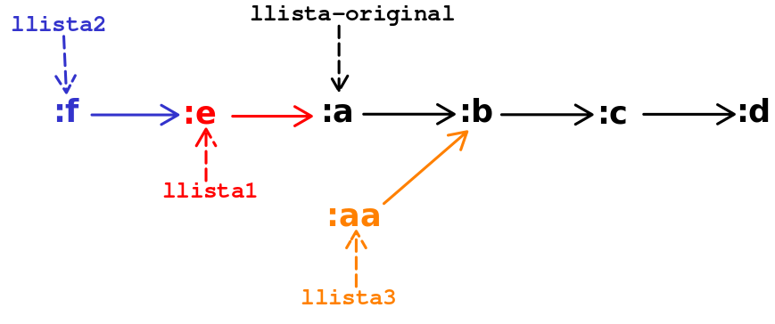
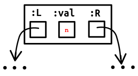
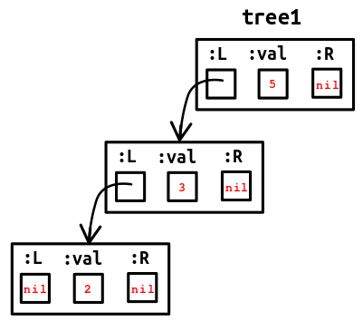
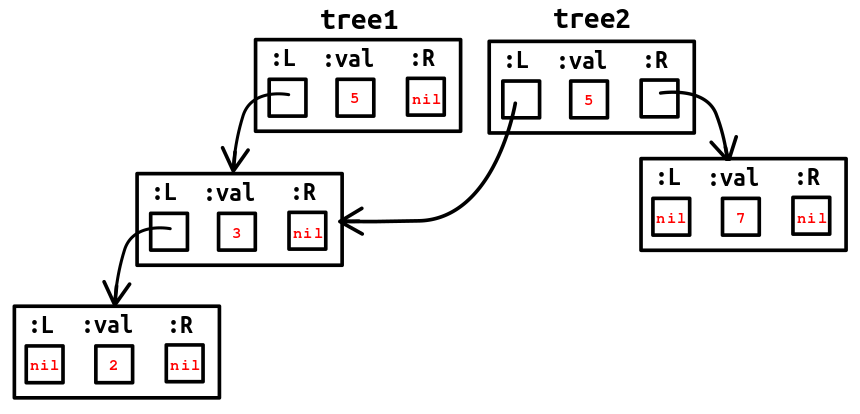
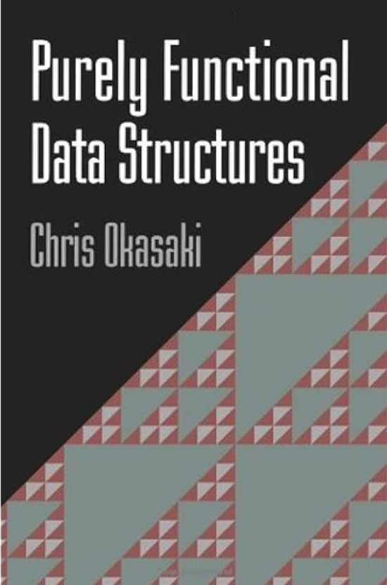

class: center, up

# CAP - Immutabilitat d'Estructures de Dades


**Jordi Delgado**, **Gerard Escudero**,

.large[**Curs 2024-25**: <ins>Tema 5</ins>]


---

## Immutabilitat d'Estructures de Dades: Per què?

_Immutability refers to the **inability to change an object after it has
been created. In an immutable system, any modification to data results
in the creation of a new object, leaving the original unchanged**. This
concept might initially seem inefficient, especially to developers
accustomed to mutable state in languages like Java. However,
immutability offers several advantages.red[*]:_

* _**Predictability**: Immutable data structures eliminate side effects,
making functions more predictable and easier to reason about. Since
data cannot change unexpectedly, the behavior of functions remains
consistent._

* _**Concurrency**: Immutability naturally supports concurrent programming.
Since data cannot be altered, there is no risk of race conditions or
the need for complex locking mechanisms._

* _**Simplified Debugging**: With immutable data, the state of the system at
any point in time is clear and unambiguous, simplifying debugging and
testing._

* _**Enhanced Reusability**: Functions operating on immutable data are
inherently more reusable, as they do not depend on or alter external
state._

.footnote[.red[*] [Font: clojureforjava.com](https://clojureforjava.com/3/1/1/3/)]

---

## Immutabilitat d'Estructures de Dades: _Structural Sharing_

A Clojure, hem dit des del principi de curs que les col·leccions que
hem treballat (llistes, vectors, conjunts, diccionaris) són
_**immutables**_, és a dir, sempre preserven una versió d'elles
mateixes quan les modifiquem. 

En realitat, la immutabilitat és conseqüència d'una característica
fonamental d'aquestes estructures de dades: Són estructures de dades
**persistents**.

Però... _A natural concern when confronted with this picture of
persistence is that a naive implementation would copy the entire
collection on each change, leading to slow operations and poor use of
memory. Clojure’s implementations (Bagwell 2001.red[*]) are instead efficient
by sharing structural elements from one version of a persistent
structure to another._<br> (_The Joy of Clojure_ p.86)

Aquí està el quid de la qüestió: el que s'anomena **_efficient structural sharing_**.

En aquest tema mirarem d'explicar, sense entrar en massa detalls, com la persistència pot
fer-se eficient (basant-nos sobre tot en la secció 6.2, p. 120, de _The Joy of Clojure_)

.footnote[.red[*] [_Ideal Hash Trees_](https://lampwww.epfl.ch/papers/idealhashtrees.pdf), Phil Bagwell, Programming Methods Laboratory (EPFL) technical report, 2001.]

---

## Immutabilitat d'Estructures de Dades: Llistes

Les col·leccions a Clojure estan implementades de manera que
l'_structural sharing_ sigui eficient. Les llistes estan implementades
com a llistes enllaçades (_linked lists_) i vectors i diccionaris
estan implementats amb variants de
[Trie](https://en.wikipedia.org/wiki/Trie). Els conjunts són una
variant dels diccionaris i s'implementen essencialment igual.

Comencem per les llistes:

```Clojure
(def llista-original '(:a :b :c :d))

(def llista-1 (cons :e llista-original))
(def llista-2 (cons :f llista-1))
(def llista-3 (cons :aa (rest llista-original)))

llista-original 👉 (:a :b :c :d)
llista-1 👉 (:e :a :b :c :d)
llista-2 👉 (:f :e :a :b :c :d)
llista-3 👉 (:aa :b :c :d)
```
---

## Immutabilitat d'Estructures de Dades: Llistes

Fem algunes "preguntes" per mirar de trobar com estan construïdes aquestes llistes:

```Clojure
(= (rest llista-original) (rest (rest llista-1))) 👉 true
(= llista-original (rest (rest llista-2)))        👉 true
(= (rest llista-original) (rest llista-3))        👉 true
(= (rest llista-original) '(:b :c :d))            👉 true
```
Això no ens hauria de sorprendre. Anem, però, una mica més enllà i siguem
més exigents amb el que preguntem (és el primer cop que apareix `identical?` però hauria
de ser prou obvi què fa):

```Clojure
(identical? (rest llista-original) (rest (rest llista-1))) 👉 true
(identical? llista-original (rest (rest llista-2)))        👉 true
(identical? (rest llista-original) (rest llista-3))        👉 true
(identical? (rest llista-original) '(:b :c :d))            👉 false ;; (!!)
```
Podem explicar aquests resultats?

---

## Immutabilitat d'Estructures de Dades: Llistes

La manera d'entendre per quina ráo hem obtingut les respostes de la transparència anterior
és entenent que les llistes s'implementen de manera que:

* La modificació d'una llista NO altera la llista original.

* Es mantenen totes les propietats d'una llista, independentment de les operacions que
fem amb ella (cost d'accés, espai que ocupa, etc.).

No es copien (íntegrament) les llistes per tal de fer-les persistents. 
Es comparteix la seva estructura, creant els nodes nous estrictament necessaris. 

Gràficament:

.center[]

---

## Immutabilitat d'Estructures de Dades: Vectors i Diccionaris

Ja hem vist que a Clojure no es fan servir massa les llistes. Són
importants sobre tot per manipular codi a les macros (cosa que encara
hem d'estudiar). Les col·leccions més utilitzades són els vectors i
els diccionaris.

Vectors i diccionaris no s'implementen amb llistes enllaçades. A més, com que estem parlant
d'implementacions, no té gaire sentit referir-nos a l'interficie abstracta de les seqüències.

El creador de Clojure, Rich Hickey, va inventar versions eficients i persistents
de variants d'una estructura de dades anomenada
[**Trie**](https://en.wikipedia.org/wiki/Trie)  per poder implementar
vectors i diccionaris:

Els vectors s'implementen amb _persistent bit-partitioned vector tries_, a la classe Java
(`clojure.lang.`)`PersistentVector`.

Els diccionaris (`hash-map`) s'implementen amb una versió persistent dels _Hash
Array Mapped Trie_, anomenada (`clojure.lang.`)`PersistentHashMap`.

Lamentablement, l'estudi de l'estructura de dades [Trie](https://en.wikipedia.org/wiki/Trie), i les 
seves variants, no és quelcom que puguem fer en aquest curs.

---

## Immutabilitat d'Estructures de Dades: Vectors i Diccionaris

Aquestes estructures de dades que s'utilitzen per implementar vectors
i diccionaris tenen una propietat molt interessant: Les operacions més
freqüents tenen una complexitat quasi-constant (_effectively constant
time_), fent-les tan eficients, en la pràctica, com les seves
contrapartides no persistents:

_**Effectively constant-time** is a complexity class sometimes used in
computer science to denote algorithms that are not, strictly speaking,
constant-time, but are, for all intents and purposes, constant time._

_For example, accessing the elements of a Clojure vector requires
traversing a tree (actually a trie), the depth of which varies with
the size of the vector. But because the tree has a branching factor of
32, and thus a depth of_ $log\_{32}(n)$ _(where $n$ is the size), for all
practical sizes that fit in memory on modern machines the factor,
though variable, is bounded by a small (approx. 7) constant.red[*]._

Fixem-nos que $32^7 > 10^{10}$, és a dir, podem emmagatzemar en un
arbre amb factor de ramificació $32$ i profunditat $7$ més d'un billió
(americà) d'elements.

.footnote[.red[*] [Font](https://cuddly-octo-palm-tree.com/posts/2022-02-13-opt-clj-5/)]

---

## Immutabilitat d'Estructures de Dades: Vectors i Diccionaris

Els _Tries_ són essencialment arbres. Com que no podem estudiar en
profunditat les estructures de dades reals que es fan servir a Clojure
per implementar vectors i diccionaris, i entendre així el mecanisme
per fer-les persistents de manera eficient, el que farem és centrar la
discussió en arbres binaris de cerca (BST), estructura de dades amb la
que tots estem familiaritzats.

Simplifiquem per poder entendre.red[*].

Representem cada node de l'arbre amb un diccionari amb tres claus `:val`, `:L` i
`:R`: `{:val n, :L <bst esq.>, :R <bst dre.>}`. Ho representarem gràficament
d'aquesta manera:

.center[]

.footnote[.red[*] Ens basem en _The Joy of Clojure_, secció 6.2, p.120.]

---

## Immutabilitat d'Estructures de Dades: Vectors i Diccionaris

Fem servir una funció per construir els nous BSTs:

```Clojure
(defn xconj [t v]
  (cond
    (nil? t)       {:val v, :L nil, :R nil}
    (< v (:val t)) {:val (:val t), :L (xconj (:L t) v), :R (:R t)}
    :else          {:val (:val t), :L (:L t),           :R (xconj (:R t) v)}))
```
.cols5050[
.col1[
Així, podem construir un arbre:
```Clojure
(def tree1 (-> nil
               (xconj 5) 
               (xconj 3)
               (xconj 2)))

tree1 👉 {:val 5, 
          :L {:val 3, 
              :L {:val 2, 
                  :L nil, 
                  :R nil}, 
              :R nil}, 
          :R nil}
```
]
.col2[
.left[]
]]

---

## Immutabilitat d'Estructures de Dades: Vectors i Diccionaris

Ara podem construir un altre arbre, a partir del que ja tenim, i veure com, efectivament, part
de l'estructura del nou arbre és compartida:

```Clojure
(def tree2 (xconj tree1 7))

;; però...

(identical? (:L tree1) (:L tree2)) 👉 true
```

.center[]

---

## Immutabilitat d'EDs: Exercicis Recapitulatoris

.cols5050[
.col1[
Partim de l'arbre: 
```Clojure
(def tree (-> nil
              (xconj 8)
              (xconj 4)
              (xconj 12)
              (xconj 2)
              (xconj 6)
              (xconj 3)
              (xconj 5)
              (xconj 10)
              (xconj 14)))
              
tree 👉 
{:val 8,
 :L {:val 4,
     :L {:val 2,
         :L nil,
         :R {:val 3, :L nil, :R nil}},
     :R {:val 6,
         :L {:val 5, :L nil, :R nil},
         :R nil}},
 :R {:val 12,
     :L {:val 10, :L nil, :R nil},
     :R {:val 14, :L nil, :R nil}}} 
```
]
.col2[
* Dibuixa l'arbre `tree`

* Fes una traça manual de <br> `(xconj tree 7)`<br> i analitza el resultat: Quins nodes comparteixen `tree` i aquest nou arbre? 

* Anomenem `tree2` a l'arbre resultant de l'exercici anterior. Dibuixa `tree` i `tree2`, 
mirant de que quedi clara la compartició de l'estructura en el dibuix.

* Fes <br>`(def tree3 (xconj tree2 11))`<br> i dibuixa `tree3` al costat de `tree` i `tree2`. 

]]

---

## Immutabilitat d'Estructures de Dades: Vectors i Diccionaris

Amb aquesta simplificació pretenem mostrar algunes característiques que aquests arbres
tenen en comú amb les col·leccions persistents de Clojure:

* Cada "_canvi_" crea al menys un node arrel, més nous nodes segons calgui en el camí des de l'arrel
fins el lloc on cal afegir el nou node.

* Valors i branques no alterades no es copien **mai**, tot i que referències a aquests nodes
sí les copiem de nodes de l'arbre original a nodes del nou arbre.

* Cap objecte existent anterior a una crida a `xconj` és modificat de cap manera, i els nodes
que es creen nous ja estan en el seu estat _final_ quan són retornats. Cap funció pot trobar cap
d'aquests objectes en un estat _inconsistent_.

Aquest _toy example_ no té altres característiques interessants dels
_Tries_ amb que s'implementen els vectors i els diccionaris en Clojure
(i a més té molts defectes si es vol fer servir seriosament), però ens
ha servit per veure com el _structural sharing_ pot existir fins i tot
en estructures senzilles i conegudes.


---

## Immutabilitat d'Estructures de Dades

Aquest tema ha estat basat essencialment en:

* _The Joy of Clojure_, secció 5.1, p. 85 i seccions 6.1, p. 117, i 6.2, p.120.

Però si voleu anar més enllà (_bastant_ més enllà!), podeu consultar:

* [_Understanding Clojure's PersistentVector implementation_](https://blog.higher-order.net/2009/02/01/understanding-clojures-persistentvector-implementation.html) i 
  [_Understanding Clojure's PersistentHashMap_](https://blog.higher-order.net/2009/09/08/understanding-clojures-persistenthashmap-deftwice).
  (Entrades del blog _Higher Order_, Karl Krukow, febrer i setembre 2009).

*  [_Ideal Hash Trees_](https://lampwww.epfl.ch/papers/idealhashtrees.pdf), Phil Bagwell, LAML - Programming Methods Laboratory (EPFL) technical report, 2001.

I sobre tot...

.cols5050[
.col1[
.right[]
]
.col2[
.small[[Purely Functional Data Structures](https://www.cambridge.org/in/universitypress/subjects/computer-science/programming-languages-and-applied-logic/purely-functional-data-structures?format=PB&isbn=9780521663502),
<br>Chris Okasaki, <br>Cambridge University Press 1999.]
]]

