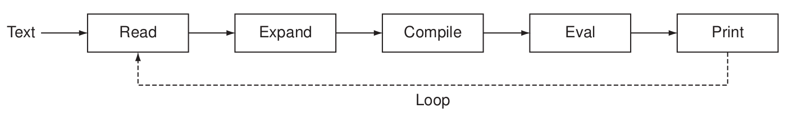
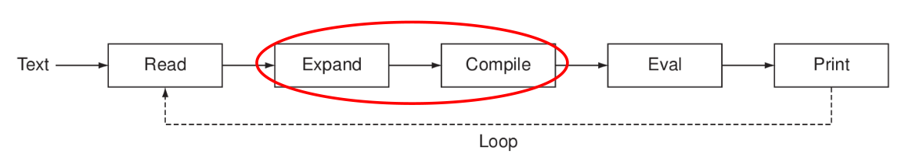
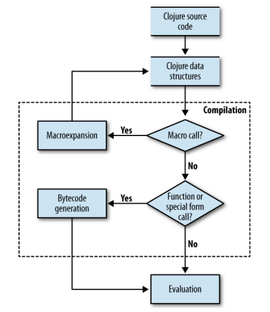
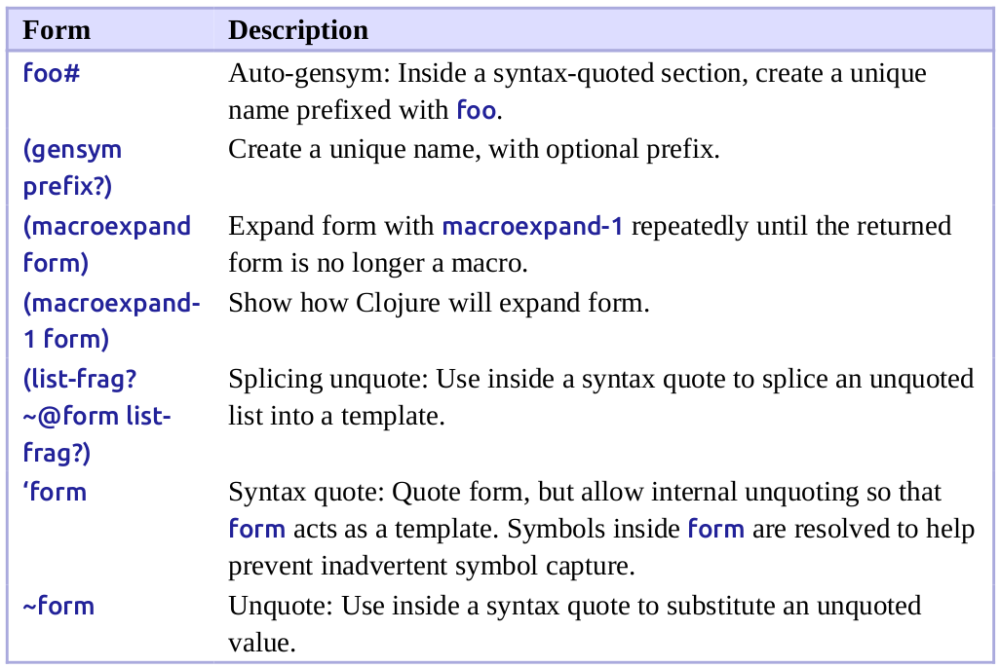

class: center, up

# CAP - Macros


**Jordi Delgado**, **Gerard Escudero**,

.large[**Curs 2024-25**: <ins>Tema 7</ins>]


---

## Macros: Motivació

Les **_Macros de Lisp_** (i les macros de Clojure ho són) neixen l'any
1963 amb l'article de Timothy Hart [_MACRO definitions for
LISP_](http://hdl.handle.net/1721.1/6111). 

Encara avui dia no gaires llenguatges fora dels de la familia de Lisp
(Clojure, Scheme, Common Lisp, Dylan, Racket, etc.) tenen una
capacitat similar. Julia o Elixir en són dos exemples.

El fet que els llenguatges de la familia de Lisp siguin [_homoiconics_](https://en.wikipedia.org/wiki/Homoiconicity)
és el que permet tractar codi com si fossin dades, i transformar programes en programes
(metaprogramació) amb facilitat:

_A language is homoiconic if a program written in it can be
manipulated as data using the language. The program's internal
representation can thus be inferred just by reading the program
itself. This property is often summarized by saying that the language
treats **code as data**._

Aquesta possibilitat de metaprogramació que les macros (de Lisp) ens permeten està
darrera la metodologia de programació associada als programes de la familia de Lisp.
Simplificant, hom resol problemes en Lisp/Clojure creant 
[_Domain-Specific Languages_](https://en.wikipedia.org/wiki/Domain-specific_language) (DSL's)
associats al problema en qüestió, en els que sigui senzill formular (un programa que
porti a) una solució del problema.

---

## Macros: Motivació

Us recordeu del primer dia de classe? Dèiem...

És habitual fer servir el **REPL** (_Read, Eval, Print Loop_) en treballar amb Clojure. Provem les
funcions que definim fent-ne prototipus i les testem. Accedirem al **REPL** via terminal o 
via editor/IDE. Sigui com sigui, nosaltres el farem servir molt.

.center[]

encara que en realitat el que fa és:

.center[]

.tiny[.red[Font]: _The Joy of Clojure_, p. 15]

---

## Macros: Motivació

En aquest tema ens centrarem en el què passa en la part assenyalada...

És habitual fer servir el **REPL** (_Read, Eval, Print Loop_) en treballar amb Clojure. Provem les
funcions que definim fent-ne prototipus i les testem. Accedirem al **REPL** via terminal o 
via editor/IDE. Sigui com sigui, nosaltres el farem servir molt.

.center[]

encara que en realitat el que fa és:

.center[]

.tiny[.red[Font]: _The Joy of Clojure_, p. 15]

---

## Macros: Motivació

Veiem-ho una mica millor representat:

.center[]

.tiny[.red[Font]: _Clojure Programming_, secció _What is a Macro_, figure 5-1, p. 231]


---

## Macros: Motivació

Podem analitzar què passa en les fases de **read** i **eval** que ja coneixem:

En Clojure la instrucció `read-string` permet obtenir una estructura
de dades Clojure a partir d'una _string_ de caràcters:

```Clojure
(read-string "(+ 1 2)") 👉 (+ 1 2)

(read-string "(map inc (range 10))") 👉 (map inc (range 10))
```
i `eval` ens permet avaluar una estructura de dades Clojure (interpretant-la com a codi):

```Clojure
(eval (read-string "(+ 1 2)")) 👉 3

(eval (read-string "(map inc (range 10))")) 👉 (1 2 3 4 5 6 7 8 9 10)

;; però fixem-nos que el pas de read-string és necessari...

(eval "(+ 1 2)") 👉 "(+ 1 2)"
(eval "(map inc (range 10))") 👉 "(map inc (range 10))"
```
---

## Macros: Motivació

_In computer programming, a macro (short for "macro instruction"; from
Greek μακρο- 'long, large') is a rule or pattern that specifies how
a certain input should be mapped to a replacement output. Applying a
macro to an input is known as macro expansion._ .small[([Wikipedia](https://en.wikipedia.org/wiki/Macro_%28computer_science%29))]

Ara bé, a la fase d'**Expansió** de Clojure és on passen 
_coses interessants_. Podem veure-ho amb
`macroexpand` i variants:
```Clojure
(macroexpand (read-string "(+ 1 2)")) 👉 (+ 1 2)

(macroexpand (read-string "(map inc (range 10))")) 👉 (map inc (range 10))
```
però... no sembla que passi res.

Clojure té moltes macros definides. Una d'elles és `cond`:

```Clojure
;; Fem (def x 10) i (def y 15) abans...

(read-string "(cond (> x y) 1000 :else -1000)") 
👉 (cond (> x y) 1000 :else -1000)

(eval (read-string "(cond (> x y) 1000 :else -1000)")) 👉 -1000 
```
Tampoc sembla que passi res d'especial! 

---

## Macros: Motivació

A més de `macroexpand`, podem fer servir `macroexpand-all`:

```Clojure
;; Hem de fer (use 'clojure.walk) abans, que és on està macroexpand-all

(macroexpand-all (read-string "(cond (> x y) 1000 :else -1000)"))

👉 (if (> x y) 1000 (if :else -1000 nil))
```
Ara sí. El resultat de `macroexpand-all` no és el que retorna `read-string`!

S'ha transformat una llista de Clojure (que representa codi) en una altra llista de Clojure
(que també representa codi). 

La _macroexpansió_ és una transformació `Codi font ⇒ Codi font` que té lloc **_abans_** de l'avaluació. 

S'acostuma a dir que la macroexpansió té lloc **_en temps de compilació_**.

Així doncs, l'avaluador de Clojure no "sap" res de cap `cond`, aquest queda transformat
en una sèrie de `if` imbricats _abans que el codi
arribi a l'avaluador_!

---

## Macros: Motivació

La transformació de codi font en codi font que fan les macros té lloc **_abans_** d'avaluar
les expressions que contenen les invocacions a les macros.

En realitat, el que fa Clojure és `(eval (macroexpand-all (read-string "...")))`.red[*]
```Clojure
(eval (macroexpand-all (read-string "(cond (> x y) 1000 :else -1000)"))) 👉 -1000
```
El procés de _macroexpansió_ pot requerir diversos passos. L'exemple que estem
treballant n'és un cas. `macroexpand-1` en fa un d'aquests passos:

```Clojure
(macroexpand-1 (read-string "(cond (> x y) 1000 :else -1000)"))
👉 (if (> x y) 1000 (clojure.core/cond :else -1000))
;;                   ------------------
;;          Aquí hi ha un 'cond' encara per expandir

;; en canvi:
(macroexpand-all (read-string "(cond (> x y) 1000 :else -1000)"))
👉 (if (> x y) 1000 (if :else -1000 nil))
```

És clar, doncs, que la definició de les macros pot ser **_recursiva_**.

.footnote[.red[*] En realitat el comportament intern de _macroexpansió_ no queda fidelment
reproduït per <br>`macroexpand-all` (de `clojure.walk`) al 100%, però és la variant de 
`macroexpand` que més s'hi apropa]

---

## Macros: Motivació

Les macros formen part d'un sistema per ampliar un llenguatge de programació fent
servir el mateix llenguatge de programació. El mateix _core_ de Clojure està ple
de macros. Veiem alguns exemples (del [codi font](https://github.com/clojure/clojure/blob/master/src/clj/clojure/core.clj) de Clojure):

```Clojure
(defmacro when
  "Evaluates test. If logical true, evaluates body in an implicit do."
  {:added "1.0"}
  [test & body]
  (list 'if test (cons 'do body)))

(...)

(defmacro cond
  "Takes a set of test/expr pairs. It evaluates each test one at a
  time.  If a test returns logical true, cond evaluates and returns
  the value of the corresponding expr and doesn't evaluate any of the
  other tests or exprs. (cond) returns nil."
  {:added "1.0"}
  [& clauses]
    (when clauses
      (list 'if (first clauses)
            (if (next clauses)
                (second clauses)
                (throw (IllegalArgumentException.
                         "cond requires an even number of forms")))
            (cons 'clojure.core/cond (next (next clauses))))))
```

---

## Macros

Si ens fixem en `when` i `cond`, són exemples on la transformació de codi
font en codi font es senzillament manipulació de llistes i els seus continguts,
jugant amb `quote` quan cal. **Aquesta transformació es fa en Clojure**.

Hi ha macros una mica més complicades, que fan servir funcions i macros de Clojure que 
encara no hem vist:

```Clojure
;; Ara resulta que a Clojure teníem 'while'!! 😁

(defmacro while
  "Repeatedly executes body while test expression is true. Presumes
  some side-effect will cause test to become false/nil. Returns nil"
  {:added "1.0"}
  [test & body]
  `(loop []
     (when ~test
       ~@body
       (recur))))
```
Què són aquests símbols `~` o `~@`?

El millor de les macros és que **_el programador en pot definir de pròpies_**.

Ara veurem com... ➡️

---

## Macros: `defmacro` i els paràmetres

Per definir macros fem servir `defmacro`. Quan s'invoca una macro cal tenir present una
propietat importantíssima:

<p style="padding: 20px; border: 2px solid red;">.center[**Els paràmetres de la macro NO s'avaluen**]</p>

Cap paràmetre dels que passem a una macro (expressions, llistes, símbols, el que sigui) **NO** s'avalua.

Veiem un exemple. Recordem la definició de `when`:

```Clojure
(defmacro when
  "Evaluates test. If logical true, evaluates body in an implicit do."
  {:added "1.0"}
  [test & body]
  (list 'if test (cons 'do body)))

(macroexpand-all '(when (f x) (map g (h x)) nil)) 
👉 (if (f x) (do (map g (h x)) nil))
```
No s'avalua l'expressió `(f x)`, ni la resta de paràmetres `(map g (h x))` o `nil`. Quan s'invoca
la macro `(when (f x) (map g (h x)) nil)`, aquesta invocació queda _textualment_ substituïda per
`(if (f x) (do (map g (h x)) nil))`.

---

## Macros: `defmacro` i els paràmetres

A l'expressió `(when (f x) (map g (h x)) nil)` es fa el que diu la definició de la macro sense avaluar
els paràmetres, és a dir, els paràmetres són estructures de dades Clojure i es queden com a tals.

Quan executem el cos del `when`: `(list 'if test (cons 'do body))`, `test` és _literalment_ el
que hem passat a la invocació de `when`, és a dir, `(f x)`, i body és la seqüència amb la resta
de paràmetres (com correspón a `&`) sense avaluar: `((map g (h x)) nil)`.

Així, `(list 'if test (cons 'do body))` construeix la llista `(if (f x) (do (map g (h x)) nil))`,
que és el que substitueix `(when (f x) (map g (h x)) nil)` i que serà _posteriorment_ avaluat.

Veiem, doncs, com amb les funcions per manipular llistes de Clojure (aquí `cons` i `list`) més 
`quote` podem manipular i _transformar_ codi font en codi font. El mateix Clojure ens permet
executar una expressió per transformar codi font _abans_ de l'execució/avaluació en sí del codi.

El problema és que amb aquestes funcions no en tenim prou.

---

## Macros: `syntax-quote` _et. al_

Voldríem tenir una mena de `quote` selectiu, on es pogués _triar_ què s'avalua o no. Això és 
precisament el que fa `syntax-quote`, altrament conegut pel _back-tick_ \`. Com diem el que volem 
que sigui avaluat dins un `syntax-quote`? Fent servir l'`unquote`, o `~`. Amb \` i `~` tenim el 
que necessitem:

```Clojure
user=> (def x 1001)
#'user/x

user=> x   ;; avaluació "normal"
1001

user=> `x  ;; amb syntax-quote
user/x

user=> 'x  ;; amb quote
x

user=> `(list :a :b :c x :d)   ;; syntax-quote actua (gairebé) com un quote...
(clojure.core/list :a :b :c user/x :d)

user=> `(list :a :b :c ~x :d)  ;;... però podem fer servir l'unquote
(clojure.core/list :a :b :c 1001 :d)
```
Quan fem servir `syntax-quote` els símbols no avaluats són _namespace-qualified_. Es fa explícita
la seva pertinença a un _namespace_ determinat.

---

## Macros: `syntax-quote` _et. al_

Hi ha una utilitat més que ens farà la vida més fàcil: l'`unquote-splicing`, o `~@`. 

De vegades volem inserir els elements d'una llista en una altra llista:

```Clojure
user=> (def lst '(:e :f :g))
#'user/lst

;; si fem servir unquote...
user=> `(:a :b :c :d ~lst :h)
(:a :b :c :d (:e :f :g) :h)

;; no és això el que volem... però si faig servir l'unquote-splicing
user=> `(:a :b :c :d ~@lst :h)
(:a :b :c :d :e :f :g :h)
```
L'`unquote-splicing` és precisament el que fa, si el resultat de l'avaluació és una llista
insereix els elements de la llista allà on hem fet servir l'`~@`. 

De fet, allò que avaluem amb `~@` ha de resultar obligatòriament en
una llista. En altre cas obtindrem un `Don't know how to create ISeq from:...`

---

## Macros: `syntax-quote` _et. al_

Ara ja podem entendre el `while`:
.cols5050[
.col1[
```Clojure
(defmacro while  ;; sense comentaris
  [test & body]  ;; ni metadades
  `(loop []
     (when ~test
       ~@body
       (recur))))
```
]
.col2[
```Clojure
(let [n (atom 2)]
  (while (not (zero? @n)) 
     (println @n) 
     (swap! n dec))) 👉 nil
👁️ 2
👁️ 1
```
]]

```Clojure
(macroexpand-all 
      '(let [n (atom 2)] (while (not (zero? @n)) (println @n) (swap! n dec))))
      
👉 (let* [n (atom 2)] 
     (loop* [] 
        (if (not (zero? (clojure.core/deref n))) 
          (do 
            (println (clojure.core/deref n)) 
            (swap! n dec) 
            (recur)))))
```

`loop*` i `let*` són versions _internes_ de `loop` i `let` que el programador no hauria de fer servir.
Tot i això, l'expansió de la macro sí les fa servir. Fixem-nos que també s'ha expandit el `when`.

---

## Macros: `syntax-quote` _et. al_

Hem vist l'expansió completa, però podem entendre-la millor per passos
(ignorarem el `loop*` i el `let*`):

```Clojure
;; primer macro-expandim el while:
(let [n (atom 2)]                   (let [n (atom 2)]
  (while (not (zero? @n))  👉👉👉    (loop [] 
    (println @n)                        (when (not (zero? (clojure.core/deref n)))
    (swap! n dec)))                       (println (clojure.core/deref n))
                                          (swap! n dec)
                                          (recur))))
;; ara macro-expandim el when:
(let [n (atom 2)]
  (loop [] 
    (when (not (zero? (clojure.core/deref n)))
      (println (clojure.core/deref n))
      (swap! n dec)
      (recur))))

        👇👇👇

(let [n (atom 2)] 
  (loop [] 
    (if (not (zero? (clojure.core/deref n))) 
      (do 
        (println (clojure.core/deref n)) 
        (swap! n dec) 
        (recur)))))
```
---

## Macros: Captura de símbols

El món de les macros és ple de subtileses, que anirem veient poc a poc. Comencem amb el que s'anomena
**_symbol capture_**.

Comencem pel problema d'escriure símbols en el codi generat per
`syntax-quote`. Suposem que fem la macro `cubs`:

```Clojure
(defmacro cubs [s] `(map (fn [x] (* x x x)) ~s)) 👉 #'user/cubs
(cubs (range 10)) 👉 Error ;; es queixa perquè no sap què és user/x
```
En fer servir `cubs` ens trobem que els símbols que fem servir, `x` en particular, és
interpretat pel `syntax-quote` com a un símbol del _namespace_ _user_, `user/x`, i no ho és. És el
paràmetre d'una funció, i així hauríem d'escriure'l.

Haurem de fer que determinats símbols que ens interessen no siguin processats per 
`syntax-quote`: Si fem `(unquote (quote x))`, és a dir `~'x`, aconseguim que el codi generat escrigui
senzillament `x`:
```Clojure
(defmacro cubs [s] `(map (fn [~'x] (* ~'x ~'x ~'x)) ~s)) 👉 #'user/cubs
(cubs (range 10)) 👉 (0 1 8 27 64 125 216 343 512 729)
```
---

## Macros: Captura de símbols

Ara fem una altra macro: `crea-multiplicador`:
```Clojure
(defmacro crea-multiplicador [x] `(fn [~'y] (* ~'y ~x))) 
👉 #'user/crea-multiplicador
;; (crea-multiplicador x) macorexpandirà a la closure (fn [y] (* x y))
(def per3 (crea-multiplicador 3)) 👉 #'user/per3
;; per3 és en realitat el resultat d'avaluar (fn [y] (* 3 y))
(per3 10) 👉 30
```
Tot sembla correcte. Anem, però, a fer un experiment:
```Clojure
(def y 100) 👉 #'user/y
(def per103 (crea-multiplicador (+ y 3))) 👉 #'user/per103
(per103 10) 👉 130 ;; !!!!
```
Aquest no és el resultat correcte! Esperàvem `1030`. Què ha passat?
Macroexpandim _a mà_...
```Clojure
(crea-multiplicador (+ y 3)) 👉 (fn [y] (* (+ y 3) y))
((fn [y] (* (+ y 3) y)) 10) ≡ (* 13 10) ≡ 130
```
Direm que `y` (és a dir, `user/y`) ha estat **_capturada_** (pel codi generat per la macro).

---

## Macros: Captura de símbols

Així doncs, què podem fer per evitar la captura de símbols (a banda
d'anar amb molt de compte)?

Clojure ens proporciona la funció `gensym`. La seva aplicació ens proporciona un símbol
nou, que no ha estat utilitzat fins el moment. Es pot proporcionar un prefix:
```Clojure
(gensym) 👉 G__3

(gensym "y") 👉 y6

(gensym "nou") 👉 nou9
```
Dins d'una macro podem disposar de l'**_auto-gensym_**. Podem afegir un sufix `#` a un
símbol i es generarà un símbol únic amb el símbol com a prefix:

```Clojure
(defmacro crea-multiplicador [x] `(fn [y#] (* y# ~x)))
👉 #'user/crea-multiplicador

(def y 100) 👉 #'user/y
(def per103 (crea-multiplicador (+ y 3))) 👉 #'user/per103
(per103 10) 👉 1030
```
---

## Macros: Captura de símbols

Ara podem entendre altres macros, per exemple l'`and` i l'`or`, del 
[codi font](https://github.com/clojure/clojure/blob/master/src/clj/clojure/core.clj) 
de Clojure:

```Clojure
(defmacro and
  "Evaluates exprs one at a time, from left to right. If a form
  returns logical false (nil or false), and returns that value and
  doesn't evaluate any of the other expressions, otherwise it returns
  the value of the last expr. (and) returns true."
  {:added "1.0"}
  ([] true)
  ([x] x)
  ([x & next]
   `(let [and# ~x]
      (if and# (and ~@next) and#))))
      
(defmacro or
  "Evaluates exprs one at a time, from left to right. If a form
  returns a logical true value, or returns that value and doesn't
  evaluate any of the other expressions, otherwise it returns the
  value of the last expression. (or) returns nil."
  {:added "1.0"}
  ([] nil)
  ([x] x)
  ([x & next]
      `(let [or# ~x]
         (if or# or# (or ~@next)))))
```
---

## Macros: Captura de símbols

Així doncs, un exemple d'utilització de l'_auto-gensym_:

```Clojure
(macroexpand-all '(and a b))
👉
(let* [and__5579__auto__ a] 
  (if and__5579__auto__ 
    b 
    and__5579__auto__))
    
(macroexpand-all '(and (or x y) (or z t)))
👉
(let* [and__5579__auto__ (let* [or__5581__auto__ x]
                           (if or__5581__auto__
                               or__5581__auto__
                             y))]
  (if and__5579__auto__
      (let* [or__5581__auto__ z]
        (if or__5581__auto__
            or__5581__auto__ t))
    and__5579__auto__))
```
Fixem-nos com hi ha (_gen_)símbols que s'han "reciclat" on és legítim fer-ho

Cal tenir en compte que els lligams establerts per _special forms_
com `let`, `letfn` o la clàusula `catch` de `try` tenen el mateix requeriment
que els paràmetres de funcions, de manera que normalment cal
utilitzar _auto-gensym_ per a aquestes situacions, també.

---

## Macros: Petita parada, Resum

.center[]

.tiny[.red[*Font]: _Programming Clojure, 3rd ed._, Alex Miller with Stuart Halloway and Aaron Bedra,
Pragmatic 2018, p. 249]

---

## Macros: `&form` & `&env`

Dins de les macros (i _només_ allà) puc disposar de dos variables: 

* `&env`: diccionari on les claus són els noms en l'entorn local on expandeixo la macro (els valors són instàncies de classes que Clojure fa servir internament)

* `&form`: l'expressió amb que s'ha invocat la macro

```Clojure
(defmacro write-form-and-env [] 
  (println (str "&form és " &form)) 
  (println (str "&env és " &env))) 👉 #'user/write-form-and-env

(write-form-and-env) 👉 nil

👁️ &form és (write-form-and-env)
👁️ &env és 

(let [a "a", b "b"] (write-form-and-env)) 👉 nil

👁️ &form és (write-form-and-env)
👁️ &env és {a #object[clojure.lang.Compiler$LocalBinding 0x68809cc7...], 
            b #object[clojure.lang.Compiler$LocalBinding 0x703feacd...]}
```
---

## Macros: Les macros NO són _first class_

Les macros **no són valors** en Clojure. No són _ciutadans de primera classe_.

Veiem un exemple:

```Clojure
(defn cub [x] (* x x x)) 👉 #'user/cub

(cub 4) 👉 64

(map cub (range 10)) 👉 (0 1 8 27 64 125 216 343 512 729)

(defmacro cub' [x] `(* ~x ~x ~x)) 👉 #'user/cub'

(cub' 4) 👉 64
(macroexpand-1 '(cub' 4)) 👉 (clojure.core/* 4 4 4)

(map cub' (range 10)) 👉 Syntax error (...). 
                          Can't take value of a macro: #'user/cub'
```
Si la macro és prou senzilla, hi ha un possible _pegat_ per arreglar això:
```Clojure
(map (fn [n] (cub' n)) (range 10)) 👉 (0 1 8 27 64 125 216 343 512 729)
```
però no sempre serveix. Dependrà de la macro.

---

## Macros: Avaluacions múltiples indesitjades

Ja hem vist com Clojure implementa la macro `and`. Anem a fer una versió pròpia incorrecte:

```Clojure
(defmacro and'  ;; sense metadades ni comentari
  ([] true)
  ([x] x)
  ([x & next]
    `(if ~x (and' ~@next) ~x))))
```

Veieu on és l'error?

---

## Macros: Avaluacions múltiples indesitjades

Ja hem vist com Clojure implementa la macro `and`. Anem a fer una versió pròpia incorrecte:

```Clojure
(defmacro and'  ;; sense metadades ni comentari
  ([] true)
  ([x] x)
  ([x & next]
    `(if ~x (and' ~@next) ~x)))
```


Fem una prova:

```Clojure
(and' true true) 👉 true
(and' nil 4) 👉 nil

;; sembla que està bé... però:
 
(and (do (println "yuju") (= 100 101)) true) 👉 false
👁️ yuju

(and' (do (println "yuju") (= 100 101)) true) 👉 false
👁️ yuju
👁️ yuju
```
Veiem que els `~x` provoquen una doble avaluació, que el `let` de l'`and` original evita.

---

## Macros: Gimnàstica de Macros

* Implementa una macro per proporcionar una versió senzilla de `defn`. La podem
  anomenar `defn'` (es pot fer una solució en dues línies de codi).
  
* Implementa una macro per proporcionar l'estructura de control `do-while` a Clojure
  i fes-la servir per fer una funció `jugar-a-endevinar-nombre` que implementi un 
  joc d'endevinar un nombre entre 1 i 100 (inclosos), amb pistes:
  ```Clojure
  (jugar-a-endevinar-nombre ) 👉 nil
  👁️ Número? 50
  👁️ És més gran
  👁️ Número? 75
  👁️ És més gran
  👁️ Número? 87
  👁️ És més petit
  👁️ Número? 81
  👁️ És més petit 
  👁️ Número? 78
  👁️ És més petit
  👁️ Número? 76
  👁️ Trobat!
  ```
  Us anirà bé saber què fan `print`, `flush`, `Integer/valueOf` i `read-line`.

---

## Macros: Gimnàstica de Macros

* Explica per quina raó observem aquest comportament:
  ```Clojure
  (defmacro incognita []
      (println "Quan s'executa aquest println?")
      `(println "Quan s'executa aquest altre println?")) 👉 #'user/incognita
  
  (incognita) 👉 nil
  👁️ Quan s'executa aquest println?
  👁️ Quan s'executa aquest altre println?

  (defn utilitza-la-macro [] (incognita)) 👉 #'user/utilitza-la-macro
  👁️ Quan s'executa aquest println?

  (utilitza-la-macro) 👉 nil
  👁️ Quan s'executa aquest altre println?
  ```
* Feu una macro `rand-expr` que, donades dues expressions `e1` i `e2` es _macroexpandeixi_ 
  a una d'elles **a l'atzar**. Cada cop que hi ha una _macroexpansió_ té lloc la tria aleatòria.
  ```Clojure
  (rand-expr (+ 1 2) (* 3 4)) 👉 12
  (rand-expr (+ 1 2) (* 3 4)) 👉 12
  (rand-expr (+ 1 2) (* 3 4)) 👉 3
  (macroexpand '(rand-expr (+ 1 2) (* 3 4))) 👉 (* 3 4)
  (macroexpand '(rand-expr (+ 1 2) (* 3 4))) 👉 (+ 1 2)
  ```

---

## Macros: Gimnàstica de Macros

* Suposem que volem fer un `fold` amb una macro: Donada una funció de dos arguments
  `⊕`, cal que faci un `fold` explícit, és a dir, la crida a `macro-fold`
  s'expandeixi en les corresponents aplicacions de `⊕`. 
  ```Clojure
  ;; Fem el següent:
  (defmacro macro-fold [f x0 s]
     (if (empty? s)
       `~x0
       `(~f ~(first s) (macro-fold ~f ~x0 ~(next s)))))

  ;; Ho provem...
  (macro-fold (fn [x a] (+ x (* 2 a))) 0 [1 2 3 4]) 👉 49
  (macroexpand-all '(macro-fold (fn [x a] (+ x (* 2 a)) 0 [1 2 3 4])) 👉
  ((fn* ([x a] (+ x (* 2 a))))
     1
     ((fn* ([x a] (+ x (* 2 a))))
      2
      ((fn* ([x a] (+ x (* 2 a))))
       3
       ((fn* ([x a] (+ x (* 2 a))))
        4
        0))))
  (macroexpand-all '(macro-fold ⊕ x0 [x1,x2,x3,x4,x5])) 👉
  (⊕ x1 (⊕ x2 (⊕ x3 (⊕ x4 (⊕ x5 x0)))))
  ```
  Sembla que `macro-fold` funciona bé... però no, no és correcte. Per què?

---

## Macros: Usos

Quan convé fer servir macros? 

Mirem primer el principal consell sobre quan NO fer servir macros:

<p style="padding: 20px; border: 2px solid red;">.center[**NO fer macros si podem fer servir funcions**]</p>

Dit això, existeixen situacions on SÍ convé fer servir macros.

Un ús típic de les macros és el cas de voler afegir **noves estructures de control** a Clojure.

Per exemple, pels que enyorin el `for` de "_tota la vida_", podríem voler afegir a Clojure
una construcció `for-loop` que funcionés de la següent manera:
```Clojure
;; Volem fer quelcom similar a for (i = 0; i < 5; ++i) ...

(for-loop [i 0, (< i 5), (inc i)] (println i)) 👉 nil
👁️ 0
👁️ 1
👁️ 2
👁️ 3
👁️ 4
```
---

## Macros: Usos

Fixem-nos, com a entrada tenim un vector `[i 0, (< i 5), (inc i)]` i una col·lecció 
d'expressions que cal avaluar com a _cos del bucle_, en aquest cas només n'hi ha una
`(println i)`.

Cal recordar, i entendre, que en el procés de _macroexpansió_ podem fer servir Clojure
de manera completa. Per exemple, a les macros podem fer _destructuring_ a l'hora de 
gestionar els paràmetres:
```Clojure
(defmacro for-loop [[simbol inicial condicio canvi :as params] & cos]
  ...
```
Així, `simbol` ≡ `i`, `inicial` ≡ `0`, `condicio` ≡ `(< i 5)`, `canvi` ≡ `(inc i)` i finalment
`cos` ≡ `((println i))` (atenció al `&`). També, com tenim `:as`, `params` ≡ `[i 0, (< i 5), (inc i)]`.

Ara cal transformar aquesta informació en una expressió Clojure amb `loop/recur`:
```Clojure
`(loop [~simbol ~inicial valor# nil]   ;; utilitzem l'auto-gensym
   (if ~condicio
     (let [nou-valor# (do ~@cos)]
       (recur ~canvi nou-valor#))
     valor#))
```
---

## Macros: Usos

Si ho posem tot junt:
```Clojure
(defmacro for-loop [[simbol inicial condicio canvi :as params] & cos]
  `(loop [~simbol ~inicial valor# nil]   ;; utilitzem l'auto-gensym
     (if ~condicio
       (let [nou-valor# (do ~@cos)]
         (recur ~canvi nou-valor#))
       valor#)))
```
Provem-ho:
```Clojure
(for-loop [i 0, (< i 5), (inc i)] (println i)) 👉 nil
👁️ 0
👁️ 1
👁️ 2
👁️ 3
👁️ 4

(macroexpand '(for-loop [i 0, (< i 5), (inc i)] (println i)))
 👉
(loop* [i 0 valor__3__auto__ nil]  ;; pretty-printed
  (if (< i 5)
    (clojure.core/let [nou-valor__4__auto__ (do (println i))]
      (recur (inc i) nou-valor__4__auto__))
    valor__3__auto__))
```
---

## Macros: Usos

Opcionalment podem fer la comprovació d'alguns possibles errors, en cas de no fer servir de manera
adequada la macro:
```Clojure
(defmacro for-loop [[simbol inicial condicio canvi :as params] & cos]
  (cond
    (not (vector? params)) 
    (throw (Error. "El 1r argument ha de ser un vector amb el format adequat"))
    
    (not= 4 (count params)) 
    (throw (Error. "Calen exactament 4 elements per definir el for"))
    
    :else
    `(loop [~simbol ~inicial valor# nil]   ;; utilitzem l'auto-gensym
       (if ~condicio
         (let [nou-valor# (do ~@cos)]
           (recur ~canvi nou-valor#))
         valor#))))
         
         
(for-loop [i 0, (< i 5)] (println i)) ;; recordeu que les comes són espais
👉 
Unexpected error (Error) macroexpanding for-loop at (REPL:1:1).
Calen exactament 4 elements per definir el for

```
---

## Macros: Usos


---

## Macros: Més Gimnàstica de Macros

* Hem vist les macros de Clojure per implementar les operacions lògiques `and` i `or`. 
  Feu una macro que implementi l'operació `nand` (si no sabeu què és, mireu [aquí](https://en.wikipedia.org/wiki/Sheffer_stroke))

---

## Macros: _Frikada_ Final

El mòdul on trobem `macroexpand-all`, anomenat `clojure.walk`, també té altres funcions.
Una d'elles és `postwalk`, que et permet recòrrer l'estructura del codi Clojure,
aplicant una funció a cada element trobat:

```Clojure
(use '[clojure.walk :as w])

(w/postwalk #(if (symbol? %) (println %) (if (number? %) (println (inc %))))
            '(map inc [1 2 3])) 👉 nil
👁️ map
👁️ inc
👁️ 2
👁️ 3
👁️ 4

(w/postwalk #(if (symbol? %) (println %) (if (number? %) (println (inc %))))
            '(map inc ['a 'b 'c])) 👉 nil
👁️ map
👁️ inc
👁️ quote
👁️ a
👁️ quote
👁️ b
👁️ quote
👁️ c
```

---

## Macros: _Frikada_ Final

Fent servir `postwalk` podem fer una macro... curiosa:

```Clojure
(use '[clojure.string :as s])

(defmacro misteri
  [form]
  (w/postwalk 
   #(if (symbol? %)
      (symbol (s/reverse (name %))) 
      %)
   form))
```
Penseu què fa aquesta macro...

Veiem-ne un exemple:

```Clojure
(misteri (pool [i 5]
           (fi (ton (?orez i))
             (od (nltnirp i)
                 (rucer (ced i)))))) 👉 nil 
👁️ 5
👁️ 4
👁️ 3
👁️ 2
👁️ 1
```
---

## Macros: _Frikada_ Final

La solució ens la dóna `macroexpand`:

```Clojure
(macroexpand '(misteri (pool [i 5]
                (fi (ton (?orez i))
                  (od (nltnirp i)
                      (rucer (ced i)))))))
👉

(loop [i 5]                 ;; en realitat és loop* 
  (if (not (zero? i)) 
    (do (println i) 
        (recur (dec i)))))
```
I tenim una macro que ens permet escriure els símbols de Clojure a l'inrevés.red[*]! 😅

.footnote[.red[*Font]: _Clojure Programming_, secció _Writing Your First Macro_, p. 236] 
