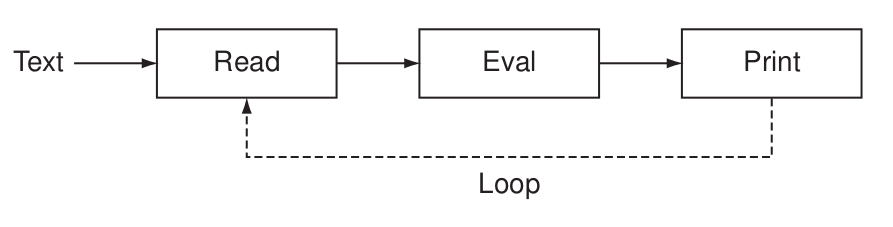
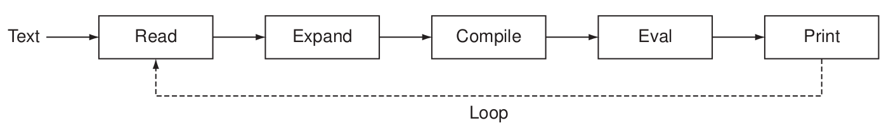

class: center, up

# Conceptes Avançats de Programació


**Jordi Delgado**, **Gerard Escudero**,

**Curs 2024-25**


---

# Conceptes Avançats de Programació

## Guió (provisional): <ins>Programació funcional</ins> (en Clojure)

* Setmanes 1 i 2: **Clojure: Introducció**

* Setmanes 3 i 4: **Programació funcional: Funcions first-class**

* Setmanes 5 i 6: **Programació funcional: Closures - Model d'entorns**

* Setmanes 7 i 9: **Programació funcional: Programació funcions ordre superior**

* Setmana 8: _Parcial_

* Setmana 10: **Programació funcional: Immutabilitat EDs**

* Setmana 11: **Programació funcional: Avaluació mandrosa**

* Setmanes 12 i 13: **Macros**

## Llegiu la [guia docent](https://www.fib.upc.edu/ca/estudis/graus/grau-en-enginyeria-informatica/pla-destudis/assignatures/CAP)

---

# Conceptes Avançats de Programació

## Teoria:

**Classes magistrals** amb recolzament de transparències (pensades com a guió de la sessió, no com a apunts), basades en:

* **The Joy of Clojure - 2nd edition**, Fogus, Michael; Houser, Chris, Manning, 2014. ISBN: 9781617291418

* **Clojure Programming: Practical Lisp for the Java World**, Emerick, Chas; Carper, Brian; Grand, Christophe, O'Reilly Media, 2012. ISBN: 9781449394707

* **Mastering Clojure Macros: Write Cleaner, Faster, Smarter Code**, Jones, Colin, The Pragmatic Programmers, 2014. ISBN: 1941222226

Aquests llibres _haurien_ d'estar a la biblioteca 😭 😭 😭

### Avaluació teoria: 

Un examen parcial i un examen final. **Nota de teoria**: .blue[MAX(final, (parcial + final)/2)]

---

# Conceptes Avançats de Programació

## Laboratori:

### Jutge -  [https://jutge.org](https://jutge.org)

Cal que us registreu amb el vostre correu **@estudiantat.upc.edu**

Apunteu-vos al curs **Problemes en Clojure**

### Avaluació laboratori: 

.cyan[==> **_PER DEFINIR_**]

---

# Conceptes Avançats de Programació

## CAP <ins>NO</ins> és un curs de Clojure

Clojure és un llenguatge de programació molt gran, adequat al _món
real_. 

Nosaltres triarem el **subconjunt que ens convingui**.

## Aspectes de Clojure que no veurem, o només per sobre:

* Namespaces
* Java interop
* Specs
* Concurrència/Multi-Threading: refs & STM, Agents
* Protocols i Datatypes: Interfaces, protocols, datatypes, records.
* Multimètodes
* Metadata
* ... i més coses

---

# Conceptes Avançats de Programació

## Treballar amb Clojure

* [the Clojure CLI](https://clojure.org/guides/install_clojure): És l'utilitat de línia de comandes per gestionar projectes en Clojure que farem servir a CAP.
  És una de les eines més utilitzades i _està instal·lada als laboratoris de la FIB_.

* També es fa servir molt una altra eina anomenada [leiningen](https://leiningen.org/). Quan busqueu informació
  _on-line_ sobre Clojure us la trobareu. La podeu fer servir també, si voleu.
  
## Editors

Qualsevol editor una mica actual té algún _plug-in_ o similar per poder editar Clojure amb comoditat. Per exemple:

* [Calva](https://calva.io/) per a [_Visual Studio Code_](https://vscodium.com/).

* [Cider](https://cider.mx/) per a [_Emacs_](https://www.gnu.org/software/emacs/).

---

# Conceptes Avançats de Programació

## Treballar amb Clojure

És habitual fer servir el **REPL** (_Read, Eval, Print Loop_) en treballar amb Clojure. Provem les
funcions que definim fent-ne prototipus i les testem. Accedirem al **REPL** via terminal o 
via editor/IDE. Sigui com sigui, nosaltres el farem servir molt.

.center[]

encara que en realitat el que fa és:

.center[]

---

# Conceptes Avançats de Programació

## Expressions, avaluació, valors

Un programa funcional (no trivial) està format d'**_expressions_**, que s'**_avaluen_**, i retornen un **_valor_**.

Si aquest programa està escrit en un llenguatge funcional _pur_ (p.ex. Haskell), això és tot. En canvi
si el llenguatge de programació no és funcional pur (p.ex. Clojure), aquestes expressions poden tenir
_side effects_.

Hi ha expressions que es poden considerar _constants_, és a dir, valors l'avaluació dels quals 
és precisament ells mateixos:

.cols5050[
.col1[
```Clojure
$ clj
Clojure 1.11.4
user=> 
(require '[clojure.math :as math])
nil
user=> 
math/PI
3.141592653589793
user=> 
2356785874320357840840324758576859043N
2356785874320357840840324758576859043N
user=>
```
]
.col2[
```Clojure
user=> 
1567843
1567843
user=> 
\t
\t
user=> 
:clau
:clau
user=> 
true
true
```
]]

---

# Conceptes Avançats de Programació

## Expressions, avaluació, valors

En general, però, una **_expressió_** `(f e1 e2 ... eN)` en Clojure té la forma d'una **_llista_**,  on:

* L'expressió `f` és una **_funció_**, un **_símbol_** que s'avalui en una funció, 
  una [**_special form_**](https://clojure.org/reference/special_forms) o el nom d'una **_macro_**.
  
* Si l'expressió `f` és una **_funció_** o un **_símbol_** que
  s'avalua en una funció, el resultat d'aquesta avaluació és un
  **_valor-funció_**, que anomenarem `fv`. Les expressions `e1 e2 ...
  eN` s'avaluen i resulten en valors `v1 v2 ... vN`. En aquest cas, el
  resultat de l'expressió és l'aplicació del valor-funció sobre els valors que es passen com a arguments:
  `fv(v1 v2 ... vN)`.

* Si l'expressió `f` és una [**_special
  form_**](https://clojure.org/reference/special_forms) o el nom d'una
  **_macro_**, els arguments no tenen per què avaluar-se i cal veure com es defineix
  l'**_special form_** o la macro en qüestió.
  
---

# Conceptes Avançats de Programació

## Expressions, avaluació, valors

* Si l'expressió `f` és una **_funció_** o un **_símbol_** que
  s'avalua en una funció, el resultat d'aquesta avaluació és un
  **_valor-funció_**, que anomenarem `fv`. Les expressions `e1 e2 ...
  eN` s'avaluen i resulten en valors `v1 v2 ... vN`. En aquest cas, el
  resultat de l'expressió és l'aplicació del valor-funció sobre els valors que es passen com a arguments:
  `fv(v1 v2 ... vN)`.

Per exemple,

```Clojure
$ clj
Clojure 1.11.4 
user=> 
(+ 10 20 30 40) ;; el símbol '+' s'avalua en el valor-funció de la funció de suma
100
user=> 
(+ 1)
1
user=> 
(+)
0
user=> 
(max (+ 3 4) (* (- 4 2) (+ 8 10)) 10) ;; altres expressions com a arguments
36
user=> 
```

---

# Conceptes Avançats de Programació

## Expressions, avaluació, valors

* Si l'expressió `f` és una [**_special
  form_**](https://clojure.org/reference/special_forms) o el nom d'una
  **_macro_**, els arguments no tenen per què avaluar-se i cal veure com es defineix
  l'**_special form_** o la macro en qüestió.

Exemple: La **_special form_** `def`. 

Per lligar (_bind_) valors a noms (símbols) fem servir la _special form_ `def`.

`(def s (max (+ 23 10) (- 100 85)))` lliga el símbol `s` al valor `33`. Podem veure que 
`def` avalua el seu segon argument, però <ins>NO</ins> avalua el primer argument, 
que ha de ser un símbol.

---

# Conceptes Avançats de Programació

## Expressions, avaluació, valors

A Clojure tenim **Nombres** (enters, reals, també tenim fraccions), **Caràcters** (notació `\a`), **Booleans**,
**_keywords_** (notació `:s`), **símbols** i **_strings_** (que també són col·leccions).

Operacions _habituals_ on la seva funcionalitat hauria de ser òbvia: `+`, `-`, `*`, `/`, `quot`, `rem`, `mod`, `inc`, `dec`,
 `==`, `=`, `<`, `<=`, `>`, `>=`, `zero?`, `pos?`, `neg?`, `number?`, `min`, `max`, `not`, `and`, `or`, `print`,
 `println`, `char`, `keyword`, `keyword?`, `str`, `subs`, `string?`

**Exercici**: Obriu un _repl_ de Clojure i feu-les servir. Exploreu.

.cols5050[
.col1[
```Clojure
$ clj
Clojure 1.11.4
user=> 
(- 10 9 8)
-7
user=> 
(/ 100 10 2)
5
user=> 
(number? "no")
false
user=> 
```
]
.col2[
```Clojure
$ clj
Clojure 1.11.4
user=>
(def v 7)
#'user/v
user=> 
(inc v)
8
user=> 
v
7
user=>
```
]]

---

# Conceptes Avançats de Programació

## Expressions, avaluació, valors

